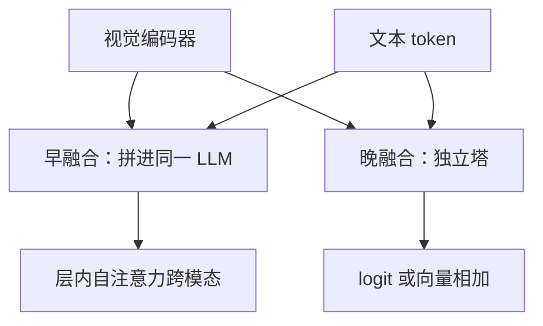

# Early vs late fusion

早融合把模态放进同一段自注意力里一起算；晚融合让各模态先走完自己的塔，只在决策口把分数或向量加起来。

<footer>—— 对照 Flamingo / LLaVA 式序列融合，与经典双塔检索、晚融合分类器</footer>

[上一课](/llm/ocr-vlm)把文档页当成高分辨率视觉 token 送进同一个解码器，这已经是早融合的一种。本课把「图和字在哪一层开始共享计算」收成明确的轴，好让后面的语音、视频课有共同词汇。缺口不是再讲 OCR，而是：连接器之后究竟是**同一 Transformer 里的交错 token**，还是**两条独立塔在 logit 上相加**。后课默认早 / 晚指这一层接口，不再把 CLIP 双塔误叫成 LLaVA。

## 问题

[CLIP 对齐](/llm/clip) 是双塔：图像编码与文本编码分开，只在对比损失里见面——这是非常晚的融合（训练目标上融合，推理检索时甚至只比余弦）。[LLaVA 投影器](/llm/llava-projector) 把视觉 token 写进 LLM 的嵌入流，之后每一层自注意力都在跨模态混——这是早（或中早）融合。[Flamingo](/llm/flamingo) 的交叉注意力插在冻结 LLM 层之间，图以块条件出现，文本自注意力仍主要看字：介于两者之间。

文档、对话、工具调用要的是「这句话里的『上述表格』绑定到某段视觉 token」。晚融合的双塔没有逐步绑定的内部状态，只能在最终向量上说「整图与整段文本相近」。早融合有绑定能力，但把视觉长度永久写进上下文，二次注意力与 KV 随 [视觉 token 压缩](/llm/vision-token-compression) 之前的 $N_{\mathrm{vis}}$ 涨。问题是任务要哪种绑定，以及付得起多少序列税。

### 中融合不是折中口号

「中」应落实为：哪一层开始出现跨模态边。Q-Former 式瓶颈在进入 LLM 前就把视觉压成固定查询，融合发生在窄接口上，LLM 内部仍是早融合，只是 $N_{\mathrm{vis}}$ 被卡死。交叉注意力层让文本 query 读视觉 key，边是层内局部的，不是全序列一块 softmax。点名接口，不要点名形容词。语音里「晚融合」常指 ASR 文本再送 LLM；「早融合」指音频 token 与文本进同一解码器。和视觉双塔不是同一套实现，但决策口相同：共享自注意力之前，模态是否已经变成同一种残差流上的符号。

## 方法

### 两条最小实现

早融合的最小实现：编码器（可冻）→ 连接器 → 把 $H_v$ 当作特殊 token 与 $H_t$ 拼接 → 标准因果（或前缀）LM。融合深度等于 LLM 层数。晚融合的最小实现：模态各有分类头或嵌入，推理时 $s=\alpha s_v+(1-\alpha)s_t$，或双塔点积检索。训练可以仍用各自损失，不必有联合 Transformer。

需要部分绑定时，用**分层融合**：底层两塔分离，顶上 $L$ 层共享；或每隔几层插一次跨模态注意力。Flamingo 的门控交叉注意力属于后者。评测绑定（指代、读图算数、文档格子）应主要压在「开始共享的那一层之后还能走多深」。

## 机制

早融合让梯度从文本损失直接进视觉连接器乃至 ViT（若解冻）。这对 OCR 与指令跟随必要：错字的监督来自下一个 token。晚融合的文本塔往往看不到像素级误差，视觉塔也看不到句法，对齐只能发生在全局描述空间——适合检索与粗分类，不适合「把第三列求和」。

KV 缓存与前缀复用也不同。早融合下同一张图的视觉前缀可跨问题缓存，多轮只追加文本，这是 LLaVA 相对每问一变的 Q-Former 的服务优势。晚融合没有视觉前缀，缓存更轻，但每轮若要重新结合，必须再跑一次融合头。产品上的「多轮看图」几乎总逼你走向早融合或至少可缓存的视觉前缀。

「Early fusion」在经典多模态文献里还指输入层就把原始特征拼起来（像素与词嵌入直接 concat）。LLM 时代很少有人把生像素送进词嵌入矩阵。本课采用当代用法：融合发生在 Transformer 计算图的何处，而不是「有没有预处理」。

### 文档任务暴露融合过晚

[OCR 文档课](/llm/ocr-vlm) 的格子与读序是空间绑定。若只在 CLIP 全局向量上晚融合，表格塌成一张「像发票」的嵌入，字段对不准。这不是分辨率不够（分辨率是编码器的事），是融合深度不够：没有层内注意力去把「税额」query 对准右上角 patch。升分辨率却保持双塔，仍解不了读序。

## 边界与工程取舍

早融合的失败模式是模态霸权：视觉 token 远多于文本时，注意力质量被图占满，指令被稀释；音频帧率更高时更严重。必须配合压缩、分层 RoPE、或把视觉放进可定位的前缀区。晚融合的失败模式是过早承诺：分类头在各自模态上已经做掉决策，融合层没有内部状态可改口。

训练稳定性上，早融合要把视觉与文本的嵌入尺度对齐，否则 softmax 被一侧霸占；晚融合要校准两塔分数的量纲，否则 $\alpha$ 失去意义。不要用检索召回率去选对话 VLM 的融合深度，也不要用 VQA 准确率去选双塔检索模型——指标绑错，会选出错误的接口。

交错网页数据是早融合的数据形态；成对字幕更偏双塔。数据与架构要匹配：用成对数据训很深的早融合，模型会假设「图总在前、文总在后」，指代词仍学不会。下一单元的交错训练会补数据这一侧。

## 小结

- 早融合：模态进入同一自注意力残差流；晚融合：独立塔在决策口相加或点积。
- 绑定、指代、文档格子需要早（或层内交叉）融合；检索与粗分类可以晚。
- 中融合要说清跨模态边从哪一层出现，以及是否经过固定查询瓶颈。
- 早融合付序列与 KV 税，换可缓存的视觉前缀与逐步绑定。
- 指标必须匹配接口：不要用召回去选对话融合深度。
- 出处：CLIP 双塔；Flamingo 交叉注意；LLaVA / Qwen-VL 序列融合。
