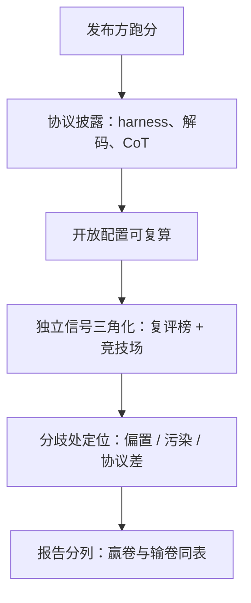
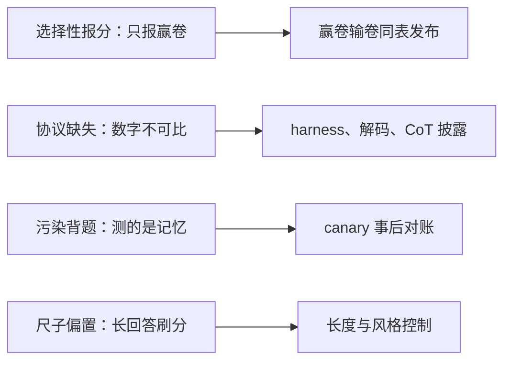

# 社区基准的公信力

公信力是复算成本的反函数：第三方重算你的数字越便宜，你的分数越可信。

<footer>—— 据 AlpacaEval 2 与 Arena-Hard 的长度控制、开放评测框架与社区榜单实践整理</footer>

[上一课](/llm/eco-release-versioning)把版本钉死，数字从此有了锚。但发布方报出的数字天生带着动机——没人会在标题里写自己输了的那张卷子。社区怎么决定信谁的分数，是本课的问题：基准的公信力从哪来，怎么被侵蚀，发布方怎么做才能让数字站住。[基准饱和](/llm/benchmark-saturation)已经写过「老卷会背」的降级逻辑，[Arena-Hard 与 AlpacaEval 2](/llm/arena-hard) 已经写过裁判与长度的坑；本课把它们装进发布流程，写报分的纪律。

## 问题

发布方报分的公信力缺口有四个来源。**选择性**：挑赢的基准报，输的不提，读者没有损失函数无从察觉。**协议缺失**：只给数字不给 harness 版本、解码参数、是否思维链，同一个模型换个协议名次能差出十几位。**污染与背题**：训练语料见过公开测试集，分数测的是记忆；饱和卷继续挂榜让这个问题放大。**尺子偏置**：早期偏好类榜单的胜率可以被更长的回答推高，风格讨喜与能力领先混在一个数里。每一个来源都曾被真实榜单付过学费，社区的反制也由此长出来。

## 方法

报分纪律三条，与四个缺口一一对应。**协议完整披露**：每个数字带 harness 与版本、解码参数、是否 CoT、测试集版本——这是上一课版本纪律在评测面的应用。**可复算**：用开放评测框架跑分并放出配置，让第三方一条命令重算；基座与指令模型分开报，自家协议与社区标准协议两列并列，输的那列也放出来。**独立信号三角化**：静态基准之外，交叉引用盲测竞技场这类发布方无法直接操作的信号，并说明其口径——竞技场测的是偏好强度，不测事实正确。「三角化」借自测量学：一个点只用一把尺子量会有系统误差，用两把原理不同的尺子各量一次，交叉验证后才敢下结论。这里静态卷是「卷面考试」，竞技场是「真人盲测投票」，两者口径完全不同，结论一致时可信度才真正抬升——只信其中一把尺子，就会被它的盲区单方面说服。社区榜单的分工也在此：固定 harness 的批量复评统一协议，竞技场提供分布外的真实流量，两者 disagree 的地方往往比 agree 的地方信息量大。

## 机制

公信力机制的核心是把「信任发布方」替换成「信任可重复的过程」。协议披露把复算成本从「逆向你的评测脚本」降到「装好框架、填配置」；可复算让任何一篇质疑都能落成一个具体的差异点——是版本、是解码还是测试集不同。长度与风格控制是尺子自身的修正：长度控制后的胜率把「答得多」从「答得好」里剥出去，这是偏好类指标能上发布物的前提。污染自证在训练侧完成：语料里的 [canary 字符串](/llm/canary-strings)让「见过没有」可以事后对账。三角化不是求平均，而是利用分歧：静态卷上的领先若在竞技场上消失，先查污染与协议，再谈能力。

四个缺口各自长出了对应的反制手段，合起来构成一张「侵蚀—修复」对照表：

长度偏置有多真实？假设两个模型回答质量相同，A 每条都比 B 长两百字，未控制的胜率里这两百字会全被记成「更好」——裁判（人或模型）天然偏爱内容显得更充实的答案。长度控制就是把这笔虚账减掉：按长度差修正胜率后，「答得多」才不再冒充「答得好」。看任何偏好榜，先问一句这把尺子对长度打折了没。

AlpacaEval 2 引入长度控制胜率、Arena-Hard 控制风格影响，直接原因就是早期版本可以靠「更长、更格式化」刷胜率——发布分数前先问：这把尺子对长度打折了吗。

## 边界

没有任何单一数字收编全部能力：固定协议的榜单会漏新能力，竞技场的用户分布不代表你的目标用户，「社区公认」本身可以被营销预算部分制造。报分纪律约束发布方，也约束引用者：转发一张榜前先看它有没有协议列，没有协议的排行榜只是宣传物料。初学者容易以为「同一模型在不同榜单分数接近，说明两边都测准了」，实际上恰恰相反：不同 harness 下同名模型的名次能差出十几位，分数接近可能只是协议碰巧相同。想自己复现一个分数时，第一步不是下载模型，而是核对协议四件套——框架版本、解码参数、是否思维链、测试集版本，缺一样复算就是盲跑。饱和卷要在卡上降级——这不是可选项，[模型卡](/llm/model-cards)的分栏要求早已写明。最后，公信力的上限由发布方的报告决定：分数之外，配方与负结果怎么写、承诺到哪一层，是下一课的主题。

## 小结

- 公信力四个侵蚀源：选择性报分、协议缺失、污染背题、尺子偏置；报分纪律三条与之对应。
- 协议完整披露是版本纪律在评测面的应用：harness 版本、解码、CoT、测试集版本随数字走。
- 开放配置可复算，把信任从「信人」换成「信可重复的过程」；输卷与赢卷同表。
- 偏好类数字必须过长度与风格控制；污染自证靠训练侧 canary。
- 静态榜与竞技场三角化，分歧处的信息量大于一致处。
- 出处：AlpacaEval 2 与 Arena-Hard 论文口径；开放评测框架与社区榜单实践，按本课程整理。
