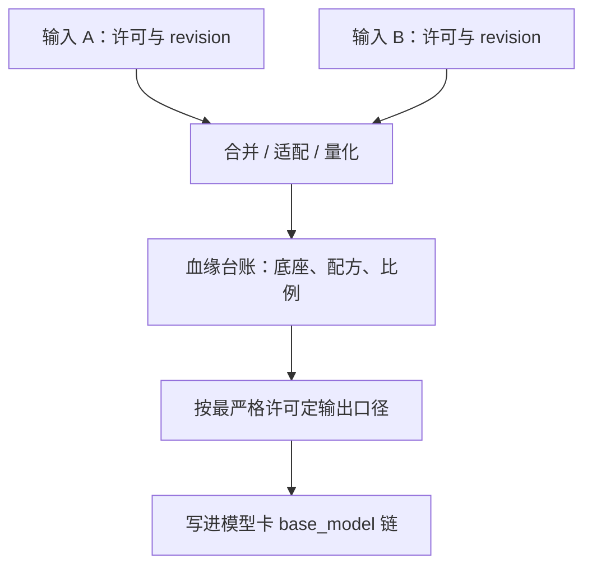

# 衍生与合并的许可

参数空间的距离量不出法律距离：两个权重文件插值一次，同时带着两份许可的出处走进下游。

<footer>—— 据 MergeKit 类合并工具与 Llama 社区许可、Apache 2.0 对衍生作品条款的对照整理</footer>

[上一课](/llm/eco-weight-license-terms)给了五段读法，让你能拆开一份许可。权重一旦被公开，下游立刻会做的事是改它：LoRA 适配器、全参微调、多模型合并、量化再发布、蒸馏小模型。每条产线的输出该挂什么许可，谁背什么义务，本课记账。后课的模型卡要把这笔账写进发布物，所以先在这里把规则立起来。

## 问题

合并两条权重的产物挂什么许可，是社区里最常见也最容易被含糊带过的问题。一个 Llama 系底座加一个 Apache 2.0 底座线性插值，模型卡上随手写 Apache 2.0 的例子并不少见。类似的问题沿产线分布：在 Llama 底座上训练的 LoRA 适配器能不能单独按宽松许可发布？把某个开源权重蒸馏进自己从零训练的小模型，算不算衍生？把权重量化成 GGUF 再分发，义务跟着变不变？这些问题没有一个统一的「社区惯例」答案，缺口是一套保守、可执行的记账规则。

## 方法

规则只有一条骨架：**输出继承输入中最严格的那份许可**。两份权重合并，输出同时携带两边的出处，合规口径按更严格的那份走——一边是 Llama 社区许可，输出就按它的命名、规模与政策义务处理；两边都是 Apache 2.0，输出仍需保留 NOTICE 与修改声明。配套动作是**血缘台账**：记录底座模型与其 revision、适配器与其训练底座、合并配方与权重比、量化的源文件。发布时把血缘写进模型卡的 `base_model` 链，让下游自己也能算一遍。选型的前瞻规则放在台账之前：要出商业产品，就从宽松许可的底座出发，不要把改不动的依赖引进产线。

## 机制

这条骨架的版权学基础是「衍生作品」概念，但它的边界在权重上恰好是模糊的：线性插值 $\theta=\alpha\theta_A+(1-\alpha)\theta_B$ 是复制、改编还是新型使用，多数司法辖区没有成熟判例，本课不假装有定论。保守策略的理由正是模糊本身：定性未定时，按最严口径记账的成本是「多写几行声明」，按最宽口径记账的风险是整条产线的合规地基。蒸馏是另一条线：用输出训练新权重通常更接近「学习」而非「拷贝」，一般不产生衍生权重，但个别条款对输出的使用另有要求，仍要回到上一课的第四段逐条读。量化再分发是复制加格式转换，授予范围内的再分发义务原样继承——变化的是打包格式，不是义务。

在 Llama 底座上训练的 LoRA 适配器，单独发布时按社区口径通常随底座许可走；把它挂在 Apache 2.0 模型下「借壳」洗成宽松许可，是血缘台账要拦住的典型操作。

## 边界

本课的每一条都是工程策略，不是法律结论：合并的定性、蒸馏的定性、适配器独立作品的资格，都随法辖区与具体条款浮动。台账的价值在于无论结论怎么变，你能在一天内重算一遍口径，而不是面对「当时谁也说不清底座是哪个」的废墟。宽松许可之间的合并不等于零义务，NOTICE 与修改声明照样跟着走，这与[代码许可门](/llm/code-license-gate)里对依赖的处理同构。最后，最严口径解决的是「输出挂什么」，不解决「输入当年拿得干不干净」：底座本身的许可有瑕疵，台账只能暴露问题，不能治愈问题。下一课把这笔账连同数据卡一起写进发布物。

## 小结

- 记账骨架一条：输出继承输入中最严格的许可；配套血缘台账，发布时写进 `base_model` 链。
- 合并的版权定性在多数辖区无定论，保守口径的理由是模糊本身。
- 蒸馏通常不产生衍生权重，但个别条款对输出另有要求，逐条读第四段。
- 量化再分发继承原许可义务，格式转换不改变合规账。
- 商业产品从宽松底座出发，别引进改不动的依赖；代码侧同构规则见代码许可门。
- 出处：Llama 社区许可与 Apache 2.0 衍生条款对照；MergeKit 类工具社区口径，按本课程整理。
