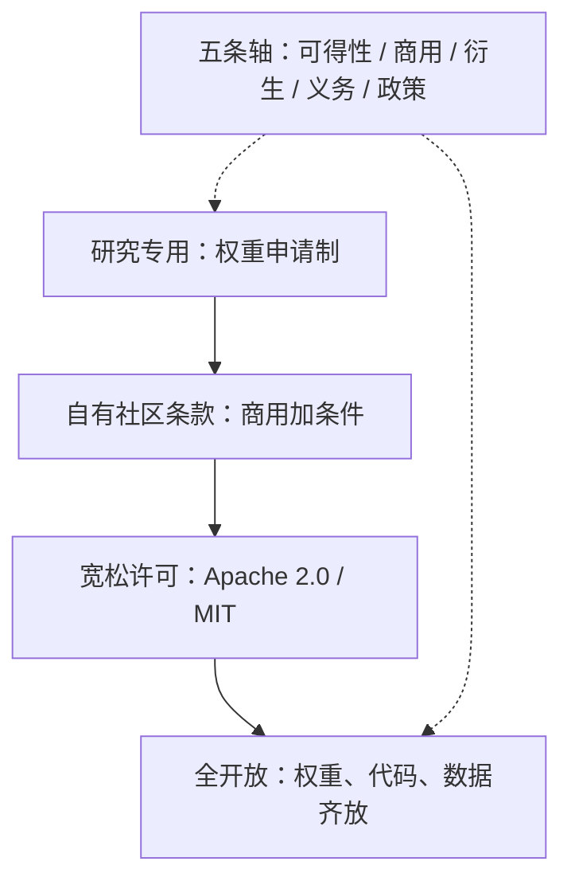

# 许可证谱系与选择

「开源」说的不是价格为零，而是使用、研究、修改与再分发的自由；一个模型可以权重随便下，却四项自由一项都不完整。

<footer>—— 据 Open Source Initiative 的开放源代码定义与自由软件基金会「四项自由」的口径整理</footer>

[上一课](/llm/pl-map)把推理时的规划与反思收成六族失败：答错先落到族，再用加预算恢复率判归推理侧还是训练侧，诊断先验证器、再搜索、再预算。失败可归因、门禁可画，模型就到了往外发的关口——权重以什么许可发出去，决定生态里谁能接手、接手后能做什么。本课是「开源生态与发布工程」的第一课：先把「开源模型」这个词拆成一条谱系，后课读条款、记衍生账、配卡、钉版本，都默认你已经会用这条谱系说话。

## 问题

社区把「开源模型」当成通用标签，实际这是一条四档谱系。第一档是研究专用：早期 Llama 1 的权重只放给申请过的研究者，商用不在授予范围内。第二档是自有社区条款：[Llama 2](/llm/llama-2) 起的 Llama 社区许可、Gemma 的使用条款，允许商用，但附加命名、规模门槛与使用政策。第三档是宽松许可：[Mistral 与 Mixtral](/llm/mistral-mixtral) 用 Apache 2.0，[Qwen](/llm/qwen3) 多数尺寸用 Apache 2.0，[DeepSeek-R1](/llm/deepseek-r1) 与 Phi 一族走更简的 MIT——这些是 OSI 意义上接近标准的许可。第四档是全开放：[OLMo](/llm/olmo-paper) 把数据、训练代码与权重一起放出，证据层级又高一截。缺口在于：选许可不是选一个名字，而是把「我给下游留下多少自由、保留多少控制」画清楚。

## 方法

从两个视角画这条谱系。发布者视角问：想保留什么控制？通常是三类——品牌（衍生模型必须怎么命名）、规模（多大的部署要回来谈）、滥用（把可接受使用政策并入条款）。使用者视角问：要什么自由？商用部署、再分发、拿权重继续训练、并进自己的产品，每一项都可能被某一档卡住。谱系的轴因此是五条：权重可得性、商用权、衍生权、附加义务、附加政策。

## 机制

为什么不是人人都选宽松许可？Apache 2.0 附带专利授权段与 NOTICE 要求，MIT 只要求保留版权声明，两者都把商用、修改、再分发的门槛降到最低——但发布者随之失去品牌控制，也失去用条款约束滥用的抓手。Llama 社区许可保留控制的方式是合同式条款：商用开放，但月活越过某个量级要另行申请，衍生模型要带指定命名与出处说明。反过来，为什么不是人人都收着发？生态的参与者按自由度投票：宽松许可的权重被更多框架、更多产品、更多后续研究采纳，形成标准位；收着的许可保住叙事，却把生态位让了出去。[Gemma](/llm/gemma) 与 DeepSeek 在谱系上的位置不同，但都在「控制」与「采用」之间做同一道题，只是答法不同。

Llama 社区许可里传播最广的一条：月活跃用户超过 7 亿需向 Meta 申请特别许可。这一条让「开源」的 Llama 在超大厂那里并不自动可用——读许可先读例外条款。

## 边界

谱系会漂移。Llama 1 是研究许可，Llama 2 起换成社区许可；个别厂商把初版的研究许可在后续版本放宽，也有反向收紧的例子。所以引用任何模型的许可都要带版本号，「它一直是 X 许可」是本课要消灭的说法。本课也不给法律意见：谱系是工程定位工具，签合之前读官方文本。最后，许可只约束权重文件与文档这些「作品」，不自动约束模型生成出来的行为——行为边界靠评测与使用政策，那是[对齐评测](/llm/aeval-map)已经处理过的另一条线。后课默认你已经能按这五条轴给任何新发布定位。

## 小结

- 「开源模型」是四档谱系：研究专用、自有社区条款、宽松许可（Apache 2.0 / MIT）、全开放（连数据与代码）。
- 定位一条许可用五条轴：权重可得性、商用权、衍生权、附加义务、附加政策。
- 发布者在「控制」（品牌、规模门槛、滥用约束）与「采用」（生态位）之间取舍；使用者按同样五条轴检查自己要的自由。
- 许可随版本漂移，引用必须带版本；谱系是工程定位，不是法律意见。
- 出处：Open Source Initiative 开源定义；Llama 社区许可、Gemma 使用条款、Apache 2.0、MIT 许可文本；OLMo、DeepSeek-R1、Qwen、Mistral 官方发布口径，按本课程整理。
