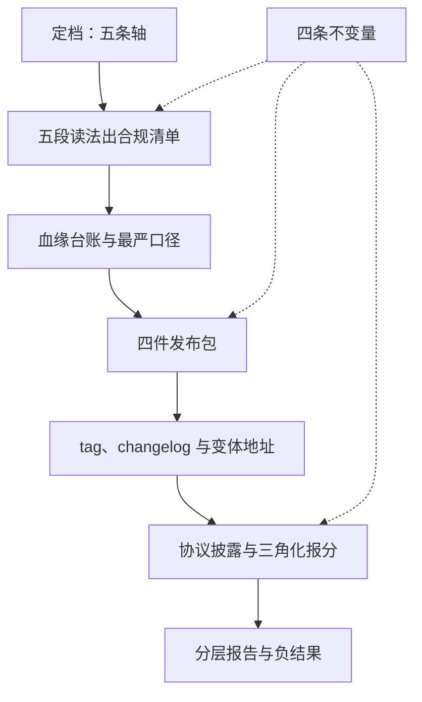

# 开源生态收束

发布不是把权重推上平台的那一天，而是生态里的陌生人此后每一次引用、合并与复算时，都还查得到账的那十几年。

<footer>—— 据 OSI 开源定义、各模型许可文本与 Llama 3、DeepSeek-V3、Qwen2.5、OLMo 发布实践，按本课程整理</footer>

[上一课](/llm/eco-repro-report-writing)把技术报告写成带声明层级的契约。至此零件齐了：谱系与五段读法管许可怎么选怎么读，血缘台账管衍生怎么记账，卡与元数据管发布包怎么配，版本与分支管地址怎么钉，报分纪律与三角化管数字怎么站住，报告模块管配方怎么承诺。本课把它们装配成一张地图与一张决策单。**本课程到此收束。**

## 问题

发布工程的决策散在七处：选哪一档许可、条款怎么读、合并产物挂什么、卡配到什么程度、版本怎么钉、分数怎么报、报告写到哪层。各自局部最优会互相拆台：没有台账的卡写不出血缘；没有版本纪律的报分无从复算；没有层级声明的报告让下游把复述当复现。收束要给的是先后顺序与跨版本不动的部分——许可会改版、榜单会换代、平台会换界面，地图的骨架得比这些都活得久。

## 方法

**发布方决策单**，按依赖排序：

1. **定档**：按控制与采用五条轴选许可档位，自定义条款先想维护成本。
2. **写清单**：对官方文本跑五段读法，合规清单进仓库。
3. **立台账**：血缘、revision、量化源成对登记，口径按最严输入。
4. **配发布包**：权重、元数据、模型卡、数据卡四件齐，`license` 字段与文本一致。
5. **钉版本**：tag 与 changelog，变体各占地址，破坏性变更单独发版。
6. **报分**：协议披露、开放配置、输赢同表，独立信号交叉引用。
7. **写报告**：声明层级先行，模块 diff 演进，负结果进附录。

使用方把同一张单倒过来读：先查 license 字段与条款文本、再查血缘与 revision、再验报分协议，最后才决定接不接。

## 机制

地图的骨架是四条不变量。**许可一致性**：卡上的字段、正文与条款文本必须互相印证，任何一处打架，下游的自动化管线会替你选最坏的那种解读。**最严传播**：血缘里最严格的输入定义输出口径，模糊不是豁免而是风险。**不可变锚**：评测、回滚、卡的对应全靠 revision 哈希，追 main 的管线没有资格谈复现。**协议披露**：每个对外数字带 harness 与解码，复算成本决定公信力。谱系会漂移——Llama 从研究许可走到社区条款，榜单从裸胜率走到长度控制——参数全换，这四条不动。若只做三件事：生产与评测一律 pin 哈希；`license` 字段与条款文本对齐；每个对外数字带协议列。本课程见过的大多数发布翻车，在这三步就被拦住。

把七步决策单贴进发布 checklist 仓库，与合规清单、血缘台账同一处维护——散在群聊里的发布决策，半年后就成了没人认领的账。

## 边界

这张地图有它不覆盖的两翼：托管 API 的服务条款与权重许可是两套合同，本课程只管后者；跨境部署、专利与商标的交叉是专业法律审查的事，五段读法不替代律师。地图也不断言任何一份具体许可「安全」：法辖区与个案能把稳妥变冒险，地图给的是流程，不是结论。发布之后的另一半生态——下游怎么用这些权重做微调、合并与蒸馏——属于训练课程的范围；本课程把账记清、把地址钉牢，让那边的人接得动。发布工程做到头，是把「信任发布方」换成「任何人可审计」：许可有谱系、条款有清单、数字有协议、配方有层级，生态才长得动。

## 小结

- 发布方七步决策单：定档、清单、台账、发布包、版本、报分、报告；使用方倒着读同一张单。
- 四条不变量：许可一致性、最严传播、不可变锚、协议披露；参数换代，顺序不动。
- 三件高频拦错事：pin 哈希、对齐 license 字段、报分带协议列。
- 模糊不是豁免：血缘按最严输入记账，缺失的章节按「不可审计」处理。
- 本课程管权重许可与发布，不管 API 服务条款，也不替代法律审查。
- 出处：OSI 开源定义；Llama 社区许可、Gemma 条款、Apache 2.0、MIT 文本；Llama 3、DeepSeek-V3、Qwen2.5、OLMo 发布物，按本课程整理。
