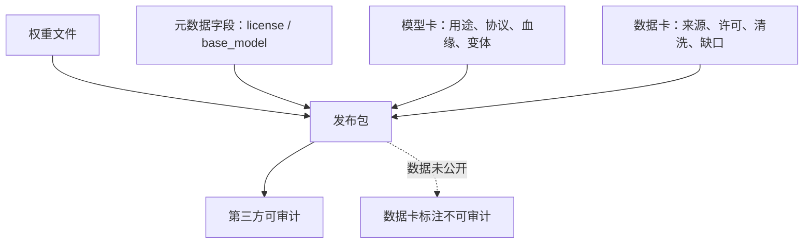
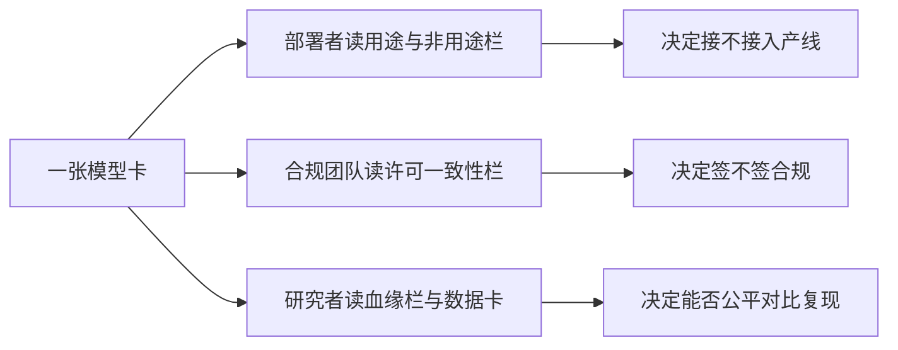

# 模型卡与数据卡规范

发布物不是权重一个文件，而是权重、元数据、模型卡与数据卡的一组契约；缺一张卡，下游就多一层猜测。

<footer>—— 据 Mitchell 等的模型卡、Gebru 等的数据表与 Pushkarna 等的数据卡口径整理</footer>

[上一课](/llm/eco-derivative-merge-license)把衍生链的账记在血缘台账里，但台账只有你自己看得见。发布要让第三方能审计：这份权重从哪来、能干什么、数据是什么口径。模型卡的内容规范——栏目怎么设、分数怎么配协议——[模型卡与报告](/llm/model-cards)已经写过；本课站在发布工程一侧，写开放权重发布特有的卡义务：机器可读元数据、数据卡、以及「开放权重」与「开放数据」的证据落差。后课的版本与分支，都要以卡为锚登记。

## 问题

开放权重发布最常被指着鼻子的问题不是分数低，而是说不清：训练数据是什么、许可字段为什么与条款文本对不上、这个量化变体出自哪个底座 revision。缺口有两层。第一层是机器层：托管平台的元数据字段（`license`、`base_model`、`tags`）被下游的检索器与审计工具批量解析，字段错了比正文错了传得远——正文靠人读，字段直接进管线。第二层是证据层：绝大多数开放权重发布只放权重，训练数据不公开，数据卡就只能写「不可审计」；把「权重公开」说成「全开放」，是证据层级的常见滑坡。

## 方法

模型卡在发布语境下加三栏。**许可一致性栏**：元数据 `license` 字段必须与许可文本一致——自定义条款写 `other` 并用 `license_name` 与 `license_link` 指向官方文本，正文不得出现与字段冲突的「可随意商用」表述。**血缘栏**：写上一课的台账摘要——底座、revision、适配器、合并配方，让下游能复算合规口径。**变体栏**：每个量化或指令变体单独标注来源与差异，不共用一张卡。数据卡按 Gebru 等的数据表与 Pushkarna 等的数据卡口径列最小栏目：来源与采集方式、许可与授权链、清洗与过滤操作、个人信息处理、已知缺口与偏差。数据未公开时，栏目照列、值写「不可审计」，而不是删栏目——声明边界本身就是信息。初学者容易以为发布页面是「给人看的」，正文写得漂亮就行。实际上企业入库、平台检索、合规扫描这些自动化管线只读元数据字段，根本不读正文——`license` 字段一旦写错，下游会整批误采信，等到纠正时每一家下游都要单独通知，成本沿传播链成倍放大。

## 机制

卡之所以是契约，是因为它的读者要做决策：部署者据「用途与非用途」决定接不接，合规团队据许可一致性决定签不签，研究者据数据卡决定能不能比。机器层优先是因为自动化：平台检索、企业入库扫描、审计工具都先读字段再读正文，一个错误的 `license: apache-2.0` 会被批量采信，纠正成本沿下游指数放大。这也是[模型卡与报告](/llm/model-cards)里「更新权重要发新卡」规则的发布版：卡与权重的对应关系靠 revision 锚定，锚没了，卡就成了漂移的营销页。证据层级上，[OLMo](/llm/olmo-paper) 连数据、代码与训练日志一起放出，数据卡可以写实；只放权重的发布，卡的诚实写法是明说哪些环节外人无法复核。

发布训练数据时给语料注入 canary 字符串，是数据卡的自证工具：能证明「这份权重见过我的语料」，也能在污染检测里对账，见 Canary 字符串课。

卡是契约，因为不同读者各取所需、各做决策：

可以把证据层级想成菜谱的透明度：只放权重，是给你一份成品菜，你只能尝味道；连数据、代码与训练日志一起放，是连菜谱、食材来源和火候记录都给你，你能重做这道菜、验证每一步。「能品尝」与「能复做」是两个等级的证据——「开放权重」与「全开放」的落差正在这里。

## 边界

卡不替代法律审查：许可一致性栏保证的是「卡与条款不打架」，条款本身适不适合你的场景，仍走[条款细读](/llm/eco-weight-license-terms)那五段。数据卡在数据不公开时天然只能到「声明的边界」，读者要把它当自述而非证据。「不可审计」不是说「没做检查」，而是说「这一步外人无法复核」。数据不公开时，清洗规则、个人信息处理这些环节第三方只能听发布方自述。如实写出来反而加分：读者能精确区分哪些话是承诺、哪些话是证据，比一栏含糊的「数据经过严格清洗」可信得多。变体多、血缘深时卡会变长，压缩的正确方向是结构化元数据加链接台账，不是删栏目。最后，卡是发布方写的，可信度最终由下一课的社区基准与复算决定——卡承诺的数字，要经得起第三方按协议重跑。

## 小结

- 发布包四件：权重、机器可读元数据、模型卡、数据卡；元数据字段被下游管线批量解析，错了比正文传得远。
- `license` 字段与条款文本必须一致，自定义条款走 `other` 加名称与链接。
- 模型卡加血缘栏与变体栏，承接上一课台账；卡随 revision 锚定，更新权重即发新卡。
- 数据卡按来源、许可、清洗、缺口列栏目；数据未公开就写「不可审计」，不删栏目。
- 开放权重不等于开放数据；全开放要连数据与代码一起放，证据层级才有质变。
- 出处：Mitchell 等 2019（模型卡）；Gebru 等 2021（数据表）；Pushkarna 等 2022（数据卡）；OLMo 发布物，按本课程整理。
