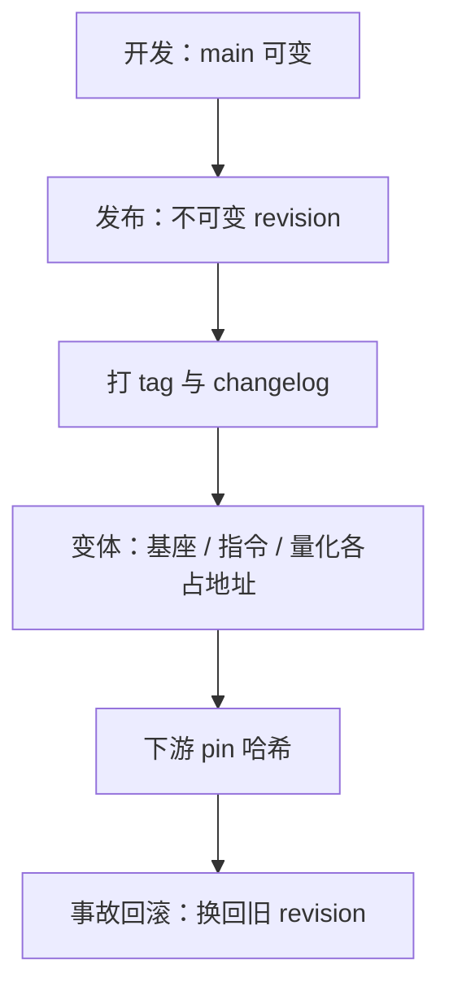

# 发布工程：版本与分支

「模型更新了」不是一条发布信息；能让下游精确钉住、评测可锚、事故可回滚的那一串哈希才是。

<footer>—— 据 Hugging Face Hub 的 revision 机制与 Llama、Qwen 两族的版本命名实践整理</footer>

[上一课](/llm/eco-model-data-cards)把发布包配齐，卡与权重的对应靠 revision 锚定——「锚定」这个词还没展开。模型会持续更新：大版本重训，小版本续训，变体矩阵越铺越宽，量化文件成倍增加。本课写发布工程的版本语义：revision、tag、变体命名与弃用，让[模型卡](/llm/eco-model-data-cards)承诺的每一格都钉在不可变的地址上。后课的基准公信力，要靠这里的版本纪律才有资格谈比较。

## 问题

下游最常见的翻车是「追 main」：生产管线永远拉最新 revision，某天 tokenizer 或聊天模板悄悄变了，同一个提示的输出漂移，而没人动过配置。第二类翻车是变体歧义：写 `llama-3` 到底指 8B 基座还是 70B 指令版、哪个量化、哪次更新？第三类是回滚困境：出了事故想退回上一版，发现旧文件被覆盖，或者「上一版」只是记忆里的一个名字。缺的是一套让地址不可变、语义可查、变更可追溯的发布约定。

## 方法

四条约定。**revision 不可变**：托管平台按内容寻址，任何一次上传都是一个哈希；发布时在不可变 revision 上打 tag，生产管线 pin 哈希而不追 main。**语义命名**：族名加大版本加大版本内序号加变体后缀——Llama 3 之后是 3.1、3.2、3.3，[Qwen](/llm/qwen-evolution) 从 1.5、2 走到 2.5，同一套模式：小数点版本延续 tokenizer 与大部分配方，大版本才换 tokenizer 与重训。基座、指令、专用变体用后缀分开，基座与指令模型永远不共用一个地址。**变更分级**：加文件是小改；改聊天模板、改 tokenizer、改推荐解码参数是破坏性变更，单独发版并在 changelog 写明。**弃用政策**：旧 revision 保留多久、哪个 tag 会删，写进文档，别让下游的 pin 悄悄失效。

## 机制

版本工程的本质是给评测与回滚一个**不可变锚**。评测协议是模型、harness、解码、套件四位一体，版本钉住第一位，比较才有差分；这也是为什么权重文件用 [safetensors](/llm/safetensors-format) 这类带完整性校验的格式，分片索引与哈希随 revision 走，钉哈希等于钉内容。回滚同理：事故处置是「把指针换回旧 revision」，不是「重新生成一份差不多的」，前者分钟级且可审计，后者是二次事故。量化变体让矩阵再乘一个维度：[GGUF](/llm/gguf) 的每个量化等级都对应源权重的某个 revision，发布时成对登记，丢了对，下游拿到的量化就成了无源之水。

Llama 3 到 3.1 扩上下文并加入 405B，3.2 加小尺寸与视觉，3.3 更新 70B：小数点版本在同一 tokenizer 与配方系内演进。版本号的语义要写进卡，不能指望读者从号段猜。

## 边界

权重发布不是软件语义化版本：模型没有「接口不变」的承诺，输出分布随任何一次更新漂移，pin 了哈希也只保证内容一致，不保证行为一致——行为变化靠评测回归兜底，那是下一课的事。版本号的含义由发布方定义，本课给的只是社区已收敛的模式，读者遇到新族先读 changelog 再用。内部开发分支可以激进，发布面必须收敛：main 上的实验 checkpoint 一旦被外部引用，就从「临时」变成「事实上的版本」，撤回成本极高。最后，版本纪律约束的是发布方；下游不 pin 哈希，再好的发布工程也救不了生产管线。

## 小结

- 四条约定：revision 不可变、发布打 tag、变体各占地址、弃用写明政策。
- 生产 pin 哈希不追 main；版本语义（小数点延续配方、大版本重训换 tokenizer）写进 changelog 与卡。
- 破坏性变更——聊天模板、tokenizer、推荐解码——单独发版。
- 评测与回滚都依赖不可变锚：钉哈希保证内容一致，行为一致靠评测回归。
- safetensors 的校验与 GGUF 量化的源 revision 成对登记，量化文件不能成无源之水。
- 出处：Hugging Face Hub revision 机制；Llama 3.x 与 Qwen 1.5–2.5 版本命名实践，按本课程整理。
