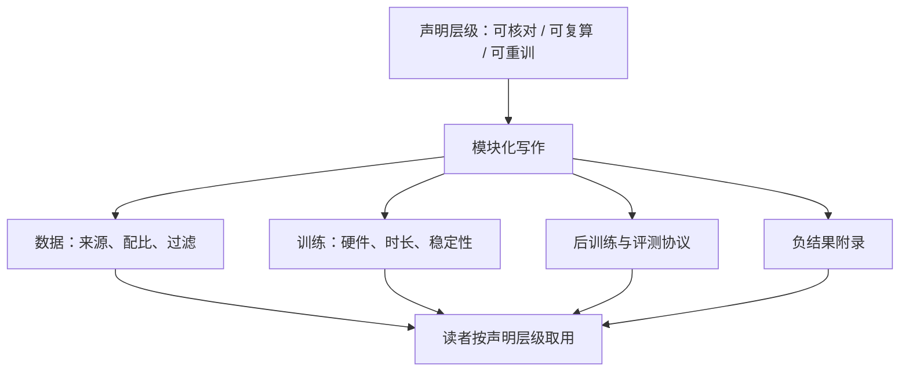
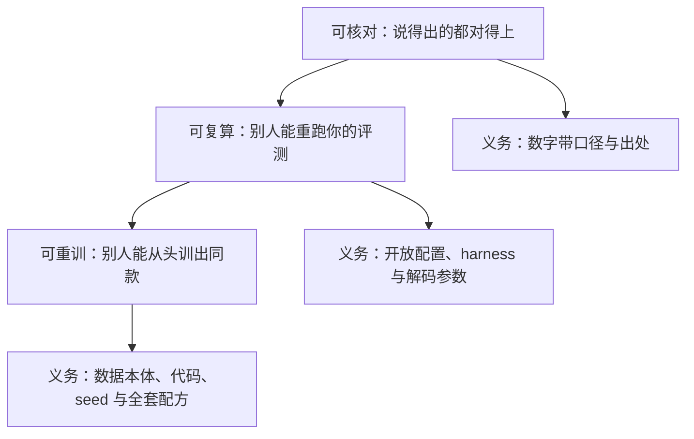

# 复现报告的写作

复现的最低要求是让别人能核对，更高一层是让别人能重跑；大部分技术报告停在第一层，却常被读者按第二层引用。

<footer>—— 据 Peng 在计算科学中对可复现研究分层的提法与各模型技术报告实践整理</footer>

[上一课](/llm/eco-community-benchmark-credibility)管住了数字的报法，但数字背后还有配方：数据怎么配、训练怎么跑、什么被放弃了。技术报告是发布方与生态之间的公共接口，下游据它决定接不接、信不信、能不能在上面盖楼。本课写复现报告的结构与承诺层级，参照 [Llama 3 技术报告](/llm/llama3-report)、[DeepSeek-V3](/llm/deepseek-v3)、[Qwen2.5 技术报告](/llm/qwen25-report)与[OLMo](/llm/olmo-paper) 的发布实践。这也是本课程倒数第二课：报告写完，下一课收束。

## 问题

报告的失效方式有两种。**复述当复现**：报告写了「用了约 15T token 的高质量数据」，读者把它当成可复现的配方，实际这行字既没有配比也没有来源口径，任何人都无法据此重跑——能核对声明，不等于能重跑过程。**承诺过载**：报告为了显得开放，写了超出维护能力的细节，后续实现与文本对不上时，整个发布方的公信力折价。两个失效共享一个根源：写报告前没想清楚承诺层级——这份报告是要「可核对」，还是要「可复算」，还是要「可重训」。层级不同，该写的章节与该担的责任完全不同。

## 方法

结构按模块写，每模块先声明层级再给内容。**数据**：来源类别、配比、过滤操作、规模、截止时间——全开放发布给出数据集本体与下载口径，权重发布给出类别统计与口径声明。**架构与训练**：架构改动、tokenizer、硬件与时长、稳定性事件与处置——DeepSeek-V3 公布 FP8 混合精度训练的细节与整体约 279 万 H800 GPU 时的成本口径，就是把「训练可核对」做到数值级。**后训练**：SFT 与 RL 的配方结构、偏好数据口径，能到哪层声明到哪层。**评测**：沿用上一课的协议纪律，赢卷输卷同表。**安全与许可**：对齐评测摘要指向[对齐评测课](/llm/aeval-map)那一套，许可与使用边界指向[条款细读](/llm/eco-weight-license-terms)的五段。**负结果**：放弃的配方、失败的超参、找到的坑——再生产价值最高、发布方写得最少的部分，哪怕是几行，也放进附录。「约 15T token」是多大的量？1T 是一万亿，15T 就是十五万亿——按一本中文书约二十万 token 折算，相当于七千多万本书。但只有总量、没有配比与来源口径，读者只能核对「确实是这个量级」，没法检查每一部分从哪来、怎么混——这正是「可核对」与「可复算」之间差的那一层。

## 机制

报告是一种承诺结构：写出的每个数字都在邀请第三方按声明的方式核对它，核对失败的成本由发布方全部承担。所以「声明层级先行」不是文风问题，而是责任边界——写「约 15T token」就是声明可核对到规模量级，写配比表就是声明可复算到数据结构，两者的核对义务差一个数量级。模块化与层级声明共同支撑跨版本演进：下一版报告只要对上一版的模块做 diff，读者就能定位「这次改的是数据配比还是后训练」，这正是[版本工程](/llm/eco-release-versioning)在文档面的延续。负结果之所以珍贵，是因为它压缩了后人的搜索空间：一条「这个配比在 1B 上崩了」能替整个社区省掉一轮昂贵的消融，而它恰恰不写不会有人发现。

DeepSeek-V3 报告把训练成本写成「约 279 万 H800 GPU 时」的口径并给出构成，成为被引用最多的单条信息之一——成本数字是报告里复算成本最低、传播力最高的承诺。

三个声明层级各自要交出什么，可以排成一把阶梯：

初学者容易把「报告写得详细」当成「能复现」。判断标准不是篇幅而是承诺层级：写了数据配比表才是可复算，只写「高质量数据」就是复述；给了数据本体与代码才谈得上可重训。引用一篇报告前，先看每句话站在哪一层，引用时别把自己需要的那一层读进去。

## 边界

大多数开放权重发布止于「可复述加可核对」：报告够写论文、够支撑选型，不够重训——这不是缺陷而是商业与技术约束下的定位，问题只在定位要诚实标注。报告不替代制品：说「数据可审计」就得有血缘台账与数据卡兜底，说「协议可复算」就得有上一课的开放配置，文本与制品对不上时按制品算。商业机密、安全顾虑与许可约束会合法地挡住部分章节，正确做法是写明「此处不披露及原因」，而不是用模糊措辞冒充细节。负结果为什么常被认为最高价值？正面结果只告诉你「这条路通」，负结果告诉你「哪条路不通」——「这个配比在 1B 上崩了」一行字，能替别人省掉一整轮几万 GPU 时的消融实验。它不写出来外人永远不会知道，所以只能靠发布方主动交出；这也是判断一份报告诚意与否的快指针。最后，报告的生命周期比模型长：权重下架多年后，被引用的还是那份 PDF——把它当成要维护十年的文档来写。

## 小结

- 报告先定声明层级：可核对、可复算、可重训；层级决定章节与责任，禁止复述冒充复现。
- 模块化结构：数据、架构与训练、后训练、评测协议、安全与许可、负结果附录。
- 数字即承诺：写出的量级与口径都要经得起核对，成本数字传播力最高也最被较真。
- 跨版本用模块 diff 表达变更，是版本纪律在文档面的延续。
- 负结果是再生产价值最高的章节，至少给几行；不披露的章节写明原因，不模糊冒充。
- 出处：Peng 2011（可复现研究）；Llama 3、DeepSeek-V3、Qwen2.5 技术报告与 OLMo 发布物，按本课程整理。
