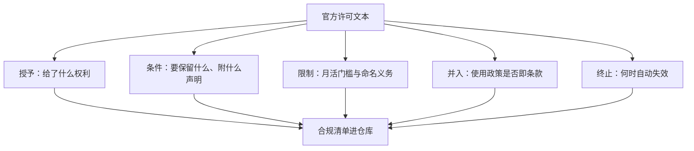

# 权重许可条款细读

许可读的是「授予了什么、限制了什么、并入了什么、何时终止」，FAQ 读的是营销；两者长得像，法律效力完全不同。

<footer>—— 据 Llama 社区许可、Gemma 使用条款、Apache 2.0 与 MIT 许可文本的结构整理</footer>

[上一课](/llm/eco-license-spectrum)把许可画成四档谱系、五条轴，那是对外发言用的地图。落到你手上的一份权重，还得把条款文本本身读一遍：自有社区条款里的义务藏在长句里，宽松许可也不是没有条件。本课给一个通用的五段读法，拿 Llama 社区许可、Gemma 条款与 Apache 2.0 当解剖标本。后课处理衍生与合并时，要反复回到这几段。

## 问题

工程师读许可最常见的失败是只读摘要页。摘要会告诉你「可以商用」，但不会告诉你：衍生模型要怎么命名、多大规模要回来谈、使用政策是不是条款的一部分、违约时许可是否自动终止。这些恰恰是下游决策要用的部分。另一类失败是拿宽松许可的直觉去读自有条款——以为「权重公开 = 随便用」，结果在命名义务或政策并入处违约。缺口不是法律知识，而是一张固定的检查清单，让任何一份权重许可都能被系统地拆开。

## 方法

五段读法，顺序固定。第一段**授予**：许可给了什么权利——使用、复制、分发、再许可，是否区分研究与商用。第二段**条件**：行使权利要付出什么——保留版权与许可声明（MIT 的全部义务几乎都在这）、Apache 2.0 的 NOTICE 文件与修改声明。第三段**限制**：哪些事明确不给做——Llama 社区许可的月活门槛、衍生模型以 Llama 开头的命名要求，Gemma 条款对部分用途的排除。第四段**并入**：可接受使用政策是否「视为本许可的一部分」——并入意味着违反政策就是违约，而不是道德劝告。第五段**终止**：什么行为触发自动终止，终止后已分发副本的命运。读完五段，写成一张合规清单进仓库，而不是留在某个人脑子里。

## 机制

并入条款是自有社区许可与宽松许可最大的结构差异。Apache 2.0 与 MIT 不约束你拿模型去做什么：法律只管作品，不管用途。Llama 社区许可与 Gemma 条款把使用政策并进合同后，「用模型做政策禁止的事」从伦理问题变成违约问题，责任可能沿发布链传递。这就是上一课说的「附加政策」轴在文本层的落点。第二层机制是商标与著作权的分工：命名要求（衍生命名以 Llama 开头、随附出处说明）保护的其实是品牌，不是作品本身——违反它不等于「盗版」，但照样违约。把这两层分开，你才知道自己冒的是什么风险。

宽松许可也有条件：Apache 2.0 要求分发时保留 NOTICE 并注明你改过文件；MIT 要求保留版权与许可声明。它们不是「没条款」，只是条款短到容易被忽略。

## 边界

本课是工程读法，不是法律意见：具体交易、跨境部署、与专利和商标的交叉，交给专业审查。条款文本随版本漂移，同一族模型的许可会在大版本间改写，读的必须是你下载那一刻附带的文本——这也是第五段要留意「以哪个版本为准」的原因。下载动作在很多条款里即视为接受，团队先把权重拉下来再补合规审查，顺序本身就是风险。最后，五段读法只处理许可文本；模型卡上另写的自愿性使用指引不是条款，违反它不违约，但会被[模型卡](/llm/model-cards)的读者当成承诺对照。后课的衍生与合并，每一步都要回到这张清单打勾。

## 小结

- 五段读法：授予、条件、限制、并入、终止；读完落成仓库里的合规清单。
- 并入使用政策是自有条款与宽松许可的最大结构差异：用途从伦理问题变成违约问题。
- 命名与出处义务是商标层控制，与著作权限制分开理解。
- 宽松许可仍有条件：NOTICE、修改声明、保留版权声明，短不等于没有。
- 以下载那一刻的文本为准；下载即接受，合规审查要赶在拉权重之前。
- 出处：Llama 社区许可、Gemma 使用条款、Apache License 2.0、MIT 许可官方文本，按本课程整理。
