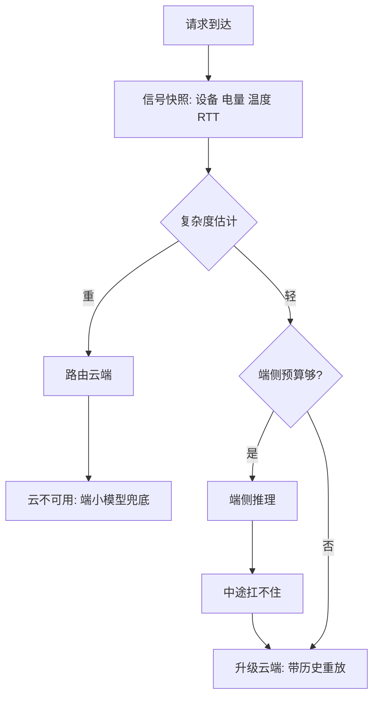
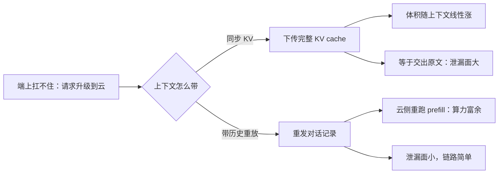

# 端云协同

端云协同的难点不是把计算切开，是决定「谁来决定」：路由器要有证据、有兜底，还能被追问为什么。

<footer>—— 据 Kang et al., Neurosurgeon, ASPLOS 2017 与端侧路由产品实践整理</footer>

[上一课](/llm/edge-energy-budget)把端侧的可持续功率与焦耳每 token 记成了账。主干课[端云协同](/llm/edge-cloud-split)已经把切点分了类——阶段、层、草稿/目标——并算清了 KV 下发的体积账。本课不重写切点，写生产系统的另一半：一个请求怎么路由到端或云、路由错了怎么升级与降级、端云两套模型怎么保持一套行为。前几课给了预算，本课让预算变成决策。

## 问题

切点回答「一段计算放哪」，生产系统还要答三问。一问证据：凭什么判断这个请求该端侧扛——设备档位是静态的，电量、温度、内存水位、网络 RTT 是动态的，请求复杂度又是另一个维度；信号不分优先级，规则就调不出来。二问纠错：端上跑到一半扛不住，把请求升级到云，上下文怎么带走、已经流出去的半截回复怎么算——[停用词与 stop sequences](/llm/stop-sequences) 的 finish_reason 语义在这里复用：升级要给客户端一个显式的中断原因，不能静默换模型续写。三问一致：端上 4-bit 小模型与云端大模型同场服务，语气、拒答边界、工具协议若有版本差，用户立刻觉得「换了个人」。

### 路由器的设计

路由器三层：静态规则打底（设备档位、功能开关、模型清单）；动态信号修正（电量、温度、内存水位、RTT 探测）；复杂度估计选档（短分类器或规则，把长上下文、多约束、工具重的请求直接派云）。每个决策打点：请求特征、信号快照、选择结果，出问题能回放归因。三层可以类比机场分流：静态规则是「按舱位定柜台」——设备档位、功能开关，装机时就定好；动态信号是「看实时人流开通道」——电量、温度、RTT 随时变；复杂度估计是「看行李多大决定走哪」——长上下文、工具重的请求直接派云。三层各管一层变化，混在一起写就调不出来了。

## 方法

升级路径选「带历史重放」而不是「同步 KV」：KV 体积随上下文线性涨，而且把完整 KV 下发云端等于把原文交出去（隐私账下一课算）；重发的代价只是云上重跑 prefill，云的算力正富余，可靠且泄漏面小。回复流中途升级时，已生成的文本以显式中断原因收尾，衔接由客户端层做，模型层不假装没断过。降级是镜像操作：云不可用或超时，端上小模型顶上，产品层声明能力降级——「现在答得差」比「假装答得好」便宜。草稿/目标协同是精细化的一条：端侧小模型给云上目标打草稿，省的是往返次数，接受率口径见[端侧投机解码](/llm/on-device-speculative)。

升级时上下文怎么带走，两条路的代价差一个量级：

初学者容易把中途升级想成「无缝续写」：换个模型接着往下生成就行。实际上两个模型的输出分布不同，静默续写会出现语气断裂、自相矛盾甚至重复已说过的话；正确做法是用显式中断原因收尾、把衔接交给客户端层——宁可让用户知道「换了个人在答」，也不假装没断过。

蜂窝网络 RTT 中位数在几十毫秒、尾部数百毫秒：「每生成一个 token 往返一次云」要从架构选项里划掉，这是端云协同的第一条铁律——可选择的只有批量往返或不往返。

## 机制

一致性的机理是把端云差异当配置问题而非模型问题：系统提示、工具协议、安全策略、分词器版本在端云两侧由同一份配置下发，并与模型版本绑定，更新同步走。做不到对齐的能力差异，在路由层显式声明——哪些功能只在云可用，让产品层兜住，而不是让用户自己撞上。这步做错用户立刻能感知：「刚才还挺耐心，突然变冷淡了」——4-bit 小模型和云端大模型挂的系统提示或安全策略版本不一致时就是这样。把配置与模型版本绑定、两侧同步下发，是让端和云「像同一个产品」成本最低的手段；靠各端自己维护副本，迟早漂移。回放的机理同审计：路由是信号与规则的游戏，必然有错分；错分不可归因就无法改进，所以决策日志的 schema 要与模型清单一起版本化。

## 边界

切点的性能模型与 KV 下发的体积账在主干课已算清，本课不再推导；隐私分级怎么进路由是下一课；草稿接受率的理论在投机课。路由规则不要做成黑盒模型：可解释、可回放、可一键回退到静态规则，是它作为「决策者」的资格线。

## 小结

- 路由三层：静态规则、动态信号、复杂度选档；每个决策打点可回放。
- 升级带历史重放优于同步 KV：体积小、泄漏面小、云算力富余。
- 中途升级给显式中断原因，模型层不假装连续。
- 端云行为一致靠配置与版本绑定；能力差异在路由层显式声明。
- 出处：Kang et al., Neurosurgeon, ASPLOS 2017；Patel et al., Splitwise 的阶段拆分口径；按本课程工程实践整理。
