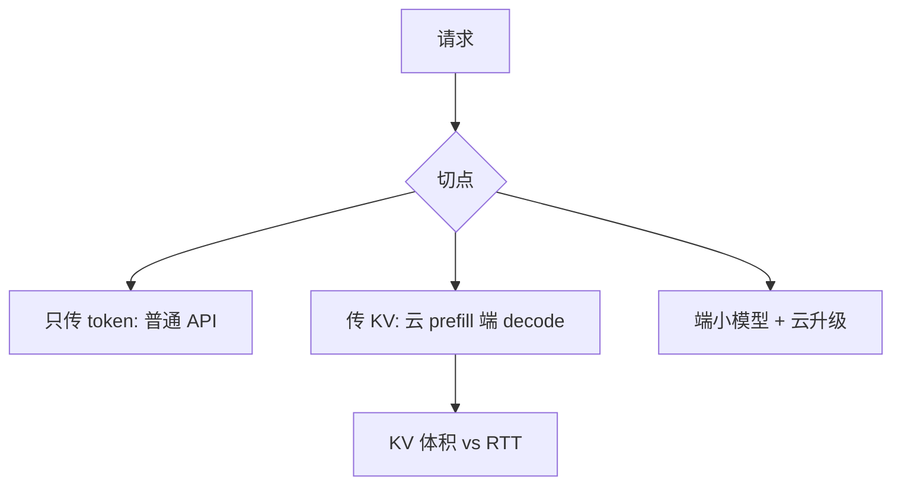

# 端云协同

把 prefill 放在算力型机器上、decode 放在带宽型或端侧，是同一条屋顶线在空间上的拆分；切错阶段，两边都付全价。

<footer>—— Patel et al., Splitwise：生成式 LLM 推理的阶段拆分；端侧切分的古典对照见 Kang et al., Neurosurgeon, ASPLOS 2017</footer>

[上一课](/llm/cpu-inference-quant)表明端侧能跑小模型逐步。云侧有 HBM 与连续批。本课把请求切开：哪一段在端、哪一段在云。Splitwise 在数据中心内拆 prefill/decode 机器；Neurosurgeon 更早把 DNN 层切到端云。LLM 的合法切点是阶段（prefill vs decode）、层（浅层在端）、或草稿/目标（投机）。切点必须对齐 KV 传输：若云做完 prefill 把 KV 送到端上 decode，传输体积是 $\mathrm{KV}(n_{\mathrm{prompt}})$，可能比再跑一遍小模型 prefill 更贵。

## 问题

端侧弱在 prefill 二次项与大权重；云贵在 decode 占用 HBM 槽位的时间。直觉「云做难题、端做简单」没有定义切点。缺口是：传输的是 token、KV，还是层激活。传 token 最轻，等于普通 API。传 KV 能让端接着 decode，但 KV 体积按公式线性于 $n$，长提示上是炸弹。传激活切层，要层间形状契约，类似流水线并行，延迟加 RTT。

隐私：端上 prefill 本地数据、只把非敏感摘要送云，是产品切分，不是性能切分。两者常被混谈，必须分开写 SLA 与威胁模型。

RTT 对 decode 逐步不可接受（每 token 一次云往返）。端云协同若把逐步留在云，端只是瘦客户端；若逐步留在端，云只能帮忙 prefill 或草稿。

## 方法

三种可组合方案：（1）云 prefill，KV 不下发，端只显示流——即普通服务；（2）云 prefill，下发 KV，端 decode——只在 $n_{\mathrm{prompt}}$ 小、KV 量化后体积小于再计算时；（3）端上小模型全程，云只在难例升级——路由。投机是（3）的精细版，下一课专写。Splitwise 是云内（1）的机器分型：prefill 池买算力卡，decode 池买显存带宽卡，用 KV 在高速互连上搬——数据中心内才划算。

## 机制

成本模型：云 decode 占用槽位的时间贵；端 decode 电与延迟受 DRAM 限制。最优切分随 $n$、$N$、是否长思维链变。长思维链在端上会先撞容量；应云侧 decode 或缩短链。视觉编码可留端（隐私）或留云（算力），见[视觉流水](/llm/vision-encoder-pipeline)。

## 边界与工程取舍

不要为长文档下发满 KV。不要逐步 token 往返云。安全：KV 含提示信息，下发等于泄漏上下文。下一课：端侧投机——用本地草稿减云上目标的逐步次数。

出处：Patel et al., Splitwise；Kang et al., ASPLOS 2017。不发明 arXiv。

## 小结

- 切的是阶段、层或草稿/目标；逐步不能每 token 往返。
- 下发 KV 只在体积小于再计算且 $n$ 小时。
- 云内 Splitwise 用高速互连搬 KV，端云 RTT 不成立同一假设。
- 隐私切分与性能切分分开设计。
- 长思维链倾向留云或缩短。
- 下一课：端侧投机解码。
- 出处：Patel et al., Splitwise；Kang et al., 2017。
