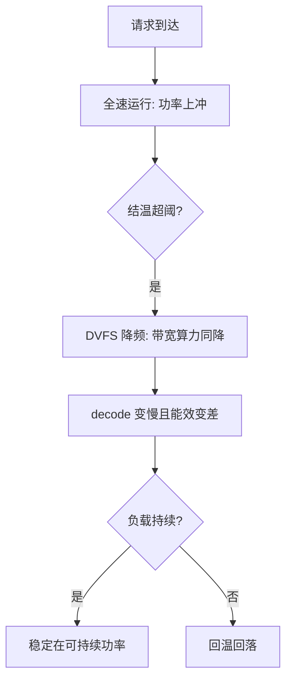
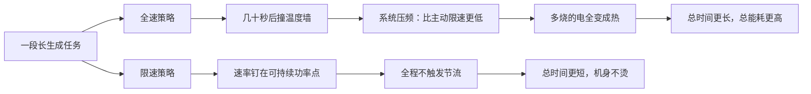

# 能耗预算

端侧性能的上限不是峰值算力，是散热能持续带走的那点热：首 token 快，不等于第二十秒还快。

<footer>—— 据 Horowitz, Computing's Energy Problem, ISSCC 2014 的能耗口径整理</footer>

[上一课](/llm/edge-memory-management)把内存按峰值管起来；另一份按持续时间管的账是能耗与热。移动 SoC 的持续功率只有峰值的一个零头，降频一来带宽与算力同时缩水，前几课算的时间下界全部要重算。本课写能耗账怎么记、热节流怎么改写性能、以及「限速反而更快跑完」的工程含义。

## 问题

能耗账的最小单元是每 token 能耗：$E = P \cdot t_{\mathrm{decode}}$。decode 被字节搬运钉死，所以能耗大头不是乘加，是每 token 把几个 GB 的权重从 DRAM 读一遍——[解码的算术强度](/llm/arithmetic-intensity-decode)的同一结论在能耗上重演。Horowitz 的经典口径把片外 DRAM 访问的能耗放在片上 SRAM 约两个数量级之上：搬运即能耗，量化省字节同时就是省电。热的约束更直接：SoC 峰值功率能到十瓦级，皮肤温度允许的持续功率只有一两瓦，超了就降频。于是短跑与长跑差出数倍：冷启动跑分漂亮，两分钟后降频把速率砍半，用户说的「越用越卡」一半是它。把 $E = P \cdot t_{\mathrm{decode}}$ 代入具体数：解码稳定在 2 瓦、生成一千个 token 花了 50 秒，这次能耗就是 2 W × 50 s = 100 焦耳，约合 28 毫瓦时——按一块 4000 mAh 手机电池约 15 瓦时计，占千分之二不到。单次不起眼，但连续对话一小时就是肉眼可见的掉电，这就是要用「毫瓦时每千 token」记账的原因。

### 记账单位

记账单位建议用毫瓦时每千 token，而不是 token 每秒：前者能跨设备比续航、能折算成「一次对话耗掉电池的百分比」，后者只是峰值速度，还随温度漂。测量分两级：软件侧用系统耗电归因（Android 的 perfetto 与 Battery Historian、iOS 的能耗日志）定位到进程；标定与验收用外接功率计——软件归因的绝对值不可信，趋势可用。

## 方法

策略按收益排。第一是量化：少读字节直接省电，上一课的 4-bit 在能耗账上再赚一次。第二是热点放 NPU：能效高的执行单元做同样的搬运与计算花更少的焦耳，但必须以实测的毫瓦时每千 token 验收，不认 TOPS/W 宣传值。第三是限速：把生成速率钉在可持续功率对应的速率上，避免「全速—节流—全速」的振荡。第四是调度：prefill 批着做，UI 把非急迫的计算挪到充电或低温场景。每条策略都要能回答「省的是哪一项」：字节、焦耳，还是峰值功率。

## 机制

「限速反而更快」的机理在能效曲线：DVFS 的能效最优点不在最高频，电压随频率超线性上涨，同样的计算在高频下花更多焦耳。全速运行先撞温度墙，再被系统压到比主动限速更低的速率，期间多烧的电全变成了热。把速率钉在稳态点，总时间更短、总能耗更低、机身不烫。运行时的监控回路因此长成：以结温或功率为信号，调节生成速率与上下文长度，把稳态速率当运行参数而不是宣传数字。

同一台设备夏季空调房与冬季口袋里、金属壳与塑料壳下，持续功率能差三成：稳态速率不是常量，要按温度带标定，或让运行时用温度反馈自调。

同一段长生成任务，「全速」与「限速」两条策略走出来的路径：

DVFS（动态电压频率调节）是 SoC 的自动油门：温度高或负载变化时降频率、降电压来省电降温。关键在电压随频率超线性上涨——频率提 20%，电压可能要提 30%，而功率大致按电压平方涨，于是同样的计算放到高频下更费电。这就是「能效最优点不在最高频率」的来源，也是限速能又快又省的物理根据。

## 边界

本课不写电池化学与充电策略。不同 SoC 的能效曲线差异大，任何数字都要在目标设备实测；外接功率计是标定源，软件归因只做定位。NPU 的能效优势在稀疏、低精度峰值下宣传值虚高，一律按实测焦耳每 token 记账。初学者容易被「NPU 算力 xx TOPS」的宣传数字说服。TOPS 是峰值算力，实际推理受内存带宽和散热双重限制，真实能效要看实测的毫瓦时每千 token——就像买汽车看等速油耗比看最大马力更贴近日常体验。验收时用外接功率计实测，不认 datasheet 上的 TOPS/W。车载与可穿戴的散热形态不同，方法同构但预算另列。

## 小结

- 能耗账的最小单元是焦耳每 token，大头是 DRAM 搬运；量化省字节即省电。
- 热节流让持续性能远低于峰值，长跑与跑分差数倍是常态而非异常。
- 记账用毫瓦时每千 token；软件归因定位、功率计标定。
- 限速运行在能效稳态点，比全速—节流振荡更快、更省、不烫手。
- 出处：Horowitz, Computing's Energy Problem, ISSCC 2014 的能耗口径；系统级耗电归因工具文档；按本课程实测方法整理。
