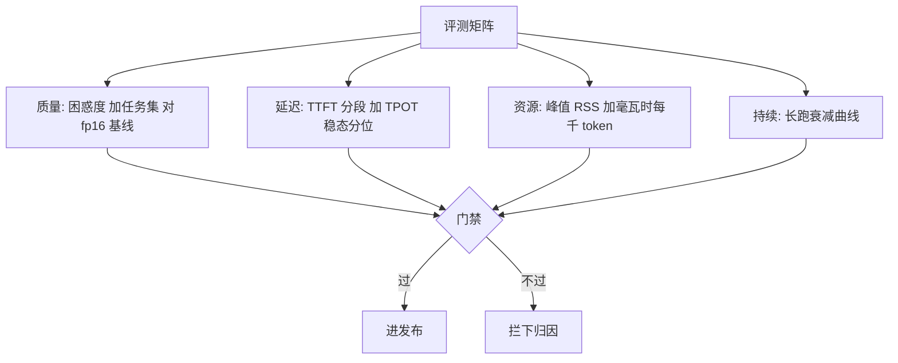
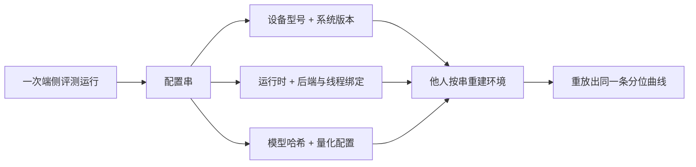

# 端侧评测

端侧评测要答两个问题：模型对不对，机器扛不扛得住；只答第一个的评测，在端侧等于没测。

<footer>—— 据 MLCommons MLPerf Mobile 与端侧基准实践口径整理</footer>

[上一课](/llm/edge-privacy-localization)把数据等级接进路由，产品形态已齐：模型、预算、路由、隐私都定了，上线前剩一道闸——评测。云端评测主要答「质量与吞吐」；端侧多出三个维度：延迟的分位、资源的峰值、热节流后的持续性，而且质量本身也要重测：量化与设备端数值路径都会移动输出分布。本课写这张二维试卷怎么出、怎么考、怎么判卷。

## 问题

质量侧：同一份权重，fp16 与 4-bit 在同一任务集上不是同一个模型；不同后端——CPU、GPU、NPU——的累加顺序与精度也不同。退化要用[量化误差度量](/llm/quant-error-metrics)的指标对 fp16 基线量化，形态对照[量化后退化模式](/llm/quant-eval-degradation)识别；长尾任务先坏是常见形态，平均分盖不住它。资源侧：TTFT 要把模型加载与预热分开计，TPOT 取稳态分位，峰值 RSS 与毫瓦时每千 token 各占一行。TTFT 是 time to first token：从发请求到吐出第一个字的时间，决定「响应快不快」的体感；TPOT 是 time per output token：之后每个字之间的平均间隔，决定「打字机快不快」。两者必须分开报——模型加载拖慢的是 TTFT、不影响 TPOT，混成一个平均数就再也找不到问题出在哪一段。持续性侧：冷启动跑分是峰值幻觉，热节流让第一分钟与第十分钟差数倍——不测长跑等于没测 decode。

### 评测矩阵

设备档位、后端、量化配置、场景——冷启动、稳态、长会话——四个轴各取代表点；矩阵不必全积，但每个档位的旗舰与低端都要覆盖。控制变量三件：环境温度、电量段、后台负载。真机优先，模拟器只做功能验证：模拟器的数值路径、内存压力与 DVFS 行为都不是目标设备的行为。

## 方法

判卷靠配置串：设备型号、系统版本、运行时版本、模型哈希、量化配置、线程与后端绑定——缺一项的数字不可比也不可复现，端侧评测的公信力全在这串里。分数取分位不取均值：TTFT 报 P50 与 P90，长跑报速率衰减曲线而不是平均速率。质量与资源放同一张表判：一个「快但变笨」的量化配置和一个「聪明但撑不过十分钟」的配置，都过不了门禁。阈值由上一版发布物定基线：判相对回归，不判绝对值。初学者容易用平均延迟判断体验好坏，实际用户对「偶尔卡一下」极其敏感：P50 是 200 毫秒、P90 却是 2 秒的服务，平均值看着体面，但每十次请求就有一次明显卡顿。报分位（P50/P90）而不是均值，就是把「最差的那批体验」逼到台面上——平均值会体面地藏起它。

## 机制

为什么门禁要挂在发布流程上（下一课展开）：设备碎片化让实验室矩阵永远盖不全长尾，能守住的是「已知配置不回退」，长尾交给灰度遥测。为什么质量要在真机复测而不只信云端同款：后端数值路径不同，采样行为的差异在长生成里被放大，云端测过的任务集在端上重跑，常能抓出「平均分没掉、长答案先坏」的配置。评测对开发的接口是「可复现的配置串加分位数」：工程师拿到一条失败，能在自己桌上重放出同一条曲线，评测才有工程价值。

报告里「Q4 8B 在某机型每秒 12 token」这种句子必须带完整配置串与环境温度，否则无法复现——同一台机器冬夏之间、不同后台负载下能差出三成。

一条配置串如何支撑「失败可重放」：

为什么长尾交给灰度遥测？实验室矩阵像考前押题，只能覆盖代表性机型；灰度发布后成千上万台真实设备自动替你考完整张卷子——温度、电量、后台负载的组合实验室永远造不全。分工由此清楚：门禁守住「已知配置不回退」，遥测去抓未知的坑，两者缺一不可。

## 边界

本课不测竞品排行：那是市场口径，不是回归口径。评测不能替代灰度与线上遥测，后者是免费的真机矩阵。用户感知延迟与毫秒数的关系（什么算「卡」）是产品题，本课只供分位数据。基准集污染与刷榜的防排在主干评测各课，本课只补端侧维度。

## 小结

- 两个问题都要答：质量对不对、机器扛不扛得住；长跑与分位是端侧必答题。
- 质量在真机对 fp16 基线复测，退化按形态识别，平均分会掩盖长尾先坏。
- 判卷靠配置串：型号、系统、运行时、模型哈希、量化配置缺一不可。
- 门禁以上一版为基线判相对回归，挂进发布流程。
- 出处：MLCommons MLPerf Mobile 口径；本站量化误差度量与量化后退化模式课；按本课程实测方法整理。
