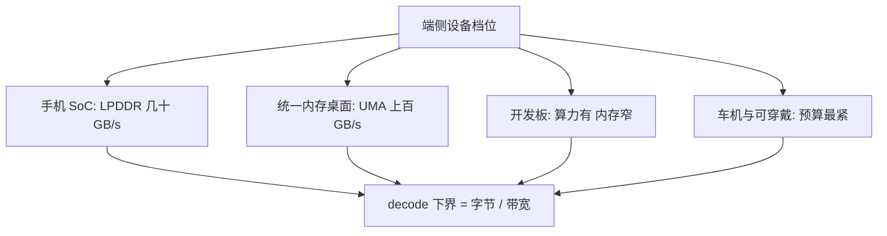

# 端侧硬件谱系

端侧不是一台缩小版服务器：同一块 SoC 上 CPU、GPU、NPU 各拿各的预算，选错执行单元，带宽账从第一层就错。

<footer>—— 据 Apple、Qualcomm、MediaTek 公开 SoC 规格与屋顶线分析口径整理</footer>

[上一课](/llm/diff-map)把扩散生成的服务化收成一条成本公式——前向次数 × 单前向成本 ÷ 批效率，加固定段——和一套「症状到层、层到旋钮」的排查协议，算的都是数据中心里的加速卡。权重一旦发布，还要落到另一类机器：用户手里的设备。本课程把视角移到后者。端侧推理深入的第一课先钉坐标系：手机、笔记本、开发板、车机的预算在哪些维度上差出数量级，后课的工具链、量化、内存与能耗预算都在这套坐标系里取值。后课默认已经读完本课。

## 问题

云端把内存、带宽、算力都当可扩容资源，不够就换卡。端侧三者焊死在 SoC 上，还有第四条约束：散热与电池决定「能持续多久」。缺口因此不是「哪颗芯片快」，而是把 8 GB 内存手机、统一内存的轻薄本、带 GPU 的开发板放进同一张表：内存容量、内存带宽、峰值算力、支持的数值精度、持续功耗。decode 的时间下界由权重搬运给出：$t_{\mathrm{decode}} \gt N_{\mathrm{bytes}} / B$，$B$ 是有效带宽。4 GB 的 4-bit 八十亿参数模型，在 50 GB/s 的手机内存上每 token 至少 80 ms；[解码的算术强度](/llm/arithmetic-intensity-decode)已解释为何这一项压不住算力。prefill 才偏算力：$t_{\mathrm{prefill}} \approx 2 N_{\mathrm{params}} \cdot n / F$。两个阶段绑两种资源，端侧把这两种饥饿压在同一块发热的芯片上。

## 方法

谱系分四档。手机 SoC：大小核 CPU、GPU、NPU 并存，LPDDR 带宽几十 GB/s，内存 6–16 GB，[移动端 NPU 部署](/llm/mobile-npu-deploy)已给出它的执行单元分工。第二档是统一内存桌面：Apple Silicon 与带 NPU 的 x86 笔记本，容量与带宽高一个档位，[Apple MLX](/llm/mlx-apple) 正是利用统一内存免去拷贝。第三档是嵌入式与开发板：GPU 有算力但内存共享且带宽窄。第四档车机与可穿戴，预算再降。每档对应不同的可行模型规模与切分策略，后课不再重复这张表。

## 机制

带宽是第一约束的机理：每生成一个 token，权重都要从内存完整读一遍，参数读不进片上缓存；算力却能靠量化、稀疏与好 kernel 省。所以选设备的正确顺序是先看容量与带宽，再看 TOPS。把 TOPS 当唯一指标必然错：NPU 宣传的峰值算力是稀疏、低精度下的理论值，与「每秒能搬多少字节」无关——一颗四十几 TOPS 的 NPU 配三十几 GB/s 的内存，decode 速度仍由后者决定。统一内存的价值同理：不只是带宽更高，而是 CPU、GPU、NPU 共享同一份物理页，权重不必复制，换执行单元不用搬数据。

数量级锚点：HBM3 带宽约 3 TB/s，旗舰手机 LPDDR5X 约 50–100 GB/s，差三四十倍。同一个 8B 模型云端每秒几百 token、手机每秒十几 token，主要不是算力差这么多，是搬运差这么多。

## 边界

本课给坐标系，不给芯片排行：具体型号迭代太快，数量级关系才稳定。散热为什么让「持续性能」低于「峰值性能」，留给能耗预算课；同一颗芯片上模型能不能编译进 NPU，留给下一课的工具链。云侧对应的带宽与显存账在 KV 与调度各课已算过，本课不重复。

## 小结

- 端侧第一约束是内存容量与带宽，decode 下界 $N_{\mathrm{bytes}}/B$；TOPS 是第二位指标。
- 谱系四档：手机 SoC、统一内存桌面、开发板、车机穿戴，每档对应不同可行规模。
- prefill 偏算力、decode 偏带宽，端侧把两种饥饿压在同一个散热约束下。
- 统一内存省的是拷贝与物理页复制，不只是带宽数字。
- 出处：据 Apple、Qualcomm、MediaTek 公开 SoC 规格与屋顶线分析口径整理；执行单元分工见本站移动端 NPU 部署课。
