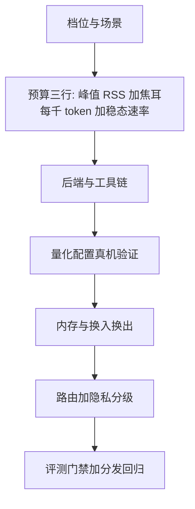
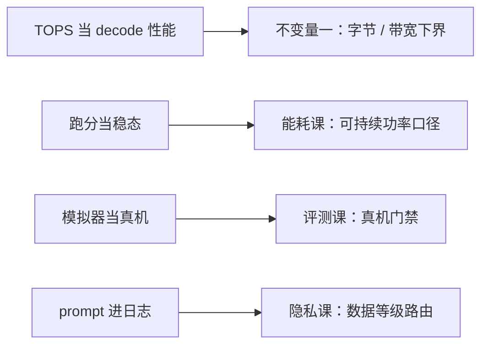

# 端侧收束

端侧工程的全部决策，是把数量级账算完之后不反悔：预算先行，锚点不可变，只认可持续态。

<footer>—— 据本课程十课整理</footer>

[上一课](/llm/edge-packaging-regression)把评测门禁挂进分发链路，端侧推理深入的课程到此收束。九课从硬件坐标系走到发布门禁，本课不添新内容，把决策收成一张单：新项目按单走一遍，老项目拿单来对账。

## 问题

端侧推理的失败很少是「模型不行」，多数是预算错位：内存按均值算而不是峰值，能耗按峰值算而不是稳态，质量只测了云端同款，跑分只测了冷启动。为什么内存不能按「平均占用」算？系统杀进程看的是峰值：模型权重加 KV 加运行时缓冲，再叠加换入换出的临时副本，峰值可以比均值高出一大截。按均值报预算的系统，上线后就是在等一次长会话把进程直接杀掉——事故报告里写「内存不足」，根因其实在第某步的算式里。四类错位对应四类现场事故：长会话被杀、两分钟后降频、灰度后「模型变笨」、发布会演示与用户实况两回事。收束课的任务是把每类事故倒推回它该被拦住的那一课。

### 决策单

七步按依赖排。第一步定档位与场景，坐标系是[端侧硬件谱系](/llm/edge-hardware-spectrum)的五维：容量、带宽、算力、精度、功耗。第二步定预算三行：峰值 RSS、毫瓦时每千 token、稳态 token 速率，口径出自内存管理与能耗预算两课。第三步选后端与工具链，检查单在[移动 NPU 工具链](/llm/edge-npu-toolchain)。第四步定量化配置并在真机验证，决策树在[端侧量化实践](/llm/edge-quantization-practice)。第五步内存与换入换出，压力响应顺序固定。第六步路由与隐私分级，信号快照里加数据等级一列。第七步评测门禁接分发回归，配置串与配对断言钉死。

## 方法

三条不变量横贯七步。第一条：decode 下界是字节除以带宽，任何优化要能答出「省的是哪一项」——少读字节、少拷贝、还是少一次跨边界；答不出的优化是仪式。第二条：KV 随上下文线性，上下文上限是产品规格的一部分，改它就是改内存预算，要走变更评审。第三条：配置串不全的数字不可比——内部报表、对外宣传、issue 附带数据，用同一把尺。高频拦错事四件：把 TOPS 当 decode 性能；把跑分当稳态；把模拟器当真机；让 prompt 进日志。这四件在九课里各占一课的份量，收束时并成一排。

四件高频错误，各自会被哪条不变量在哪一步拦住：

「不变量」像航海里的北极星：工具链、芯片型号这些「知识点」会过时，但「字节除以带宽」「KV 随上下文线性」这类数量级关系十年不变。新项目先把这几条线画进设计文档，之后芯片换代只需要重新填数字，判断框架不用动——这就是收束课敢说「决策不反悔」的底气。

## 机制

为什么按「决策单、不变量、拦错事」收，而不是按章节复述：课程的知识点会过时——工具链换代、芯片换代——但数量级关系与记账口径稳定得久。七步的依赖顺序就是事故的传播路径：预算错在第二步，第六步的路由怎么调都在还债；量化没在真机验，第七步的门禁天天拦人。对账因此从后往前问：门禁拦了什么、路由为什么这么派、内存为什么这么让——每一步都能指回前一步的数字，这套系统才算真的算过账。

对账的硬指标：拿线上一次真实 OOM 或一次「变笨」事故回放，能否在十分钟内指出它违反了哪条不变量、该在哪一步被拦住——指不出来，说明决策单没有真的在跑。

## 边界

本课程管端侧推理的预算与生产链路，不管端侧训练与联邦学习，也不替代设备安全与法律合规的专门判断。数字会过时：带宽、容量、能效的绝对值随代际翻新，课程钉的是数量级、口径与依赖顺序。「上下文上限是产品规格」值得算一遍：8B 级模型 16K 上下文的 KV 约占 2 GB，32K 就是 4 GB。产品文档里轻飘飘一句「支持长文档」，等于让工程团队凭空多背几个 GB 的峰值内存。所以改上下文上限必须走变更评审——它改的不是一句文案，是内存预算。云端对应的预算与调度在服务各课程里，两条线在端云协同交汇一次，各自收束。

## 小结

- 决策单七步：档位、预算三行、工具链、量化真机验、内存策略、路由与分级、门禁与回归。
- 三条不变量：字节除以带宽的下界、KV 线性进规格、配置串不全不可比。
- 四件高频拦错事：TOPS 当性能、跑分当稳态、模拟器当真机、prompt 进日志。
- 失败多是预算错位而非模型不行；对账从门禁往回指，每一步要有数。
- 出处：按本课程十课整理；数量级口径见各课出处行。
