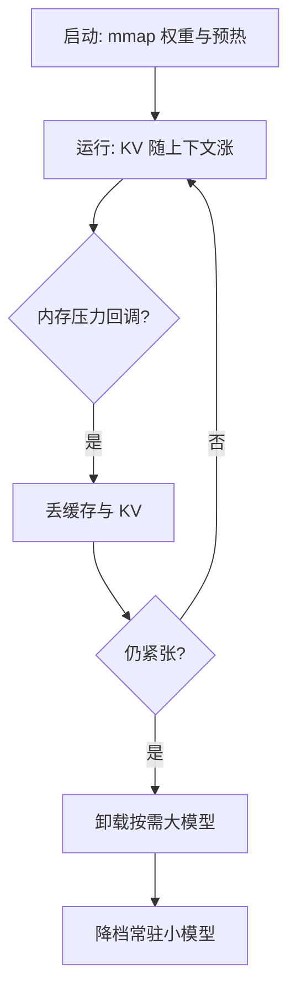

# 内存管理与换入换出

端侧的 OOM 不发生在加载失败那一下，发生在第三个会话的第 400 个 token：内存要按峰值记账，不按均值。

<footer>—— 据 Apple Jetsam 与 Android lowmemorykiller、onTrimMemory 机制文档整理</footer>

[上一课](/llm/edge-quantization-practice)把模型压到四五 GB 并在真机上验证，但「装得下」是瞬时判断：操作系统并不把标称内存全交给应用，会话在变长、KV 在涨、别的应用在抢。本课写内存作为长期受管资源：账怎么算、压力来了怎么让、多模型怎么换入换出。后课的能耗与路由都以这里的峰值账为输入。

## 问题

账有四项：权重常驻、KV 随上下文线性涨、激活与工作缓冲、运行时自身。KV 一项最容易被漏算：GQA 八十亿参数级模型、fp16 存储，每 token 约十万字节量级，四千上下文就是半 GB——上下文上限不写进产品规格，上线后一定在长会话上撞墙。系统侧的真实可用量又远小于标称：iOS 的 jetsam 与 Android 的 lowmemorykiller 都按进程优先级与全局水位杀进程，应用能稳定持有的常常只有标称的一半，后台与扩展进程的限额更低。拿「文件大小小于标称内存」做可行性判断，是端侧最常见的第一宗罪。

### 记账与让路

换算锚点：GQA 8B 级模型 fp16 KV 每 token 约 128 KB，4K 上下文约 0.5 GB。把上下文上限、KV 单价、峰值 RSS 三行写进发布规格，内存争议就结束了。

方法按层递进。mmap 加载是地基：权重只读、按需缺页、页可回收，[GGUF](/llm/gguf) 容器就是为 mmap 与跨版本分发设计的，[llama.cpp / ggml](/llm/llamacpp) 把这套实践在桌面与端上跑通。mmap 之后，「换入换出」的第一层由操作系统免费提供：内存紧张时页被回收，下次访问再从盘上读回。第二层才是应用策略：收到内存压力回调（onTrimMemory 的各级）就按序让路——先丢可重建的缓存与 KV，再卸载按需大模型，最后降档到常驻小模型。顺序要写死，不能在 OOM 边缘临场决定。

## 方法

多模型按「常驻/按需」分档：常驻小模型负责兜底与路由，按需大模型切换进来。切换成本是页面导入时间，冷启动的第一个 token 会明显变慢，所以预热要做成显式步骤——跑一个空 token 扫一遍热层，或对权重热页做锁定与预读；代价是别的工作集变小，两边都记进账。会话结束的清理同理：KV 立即释放；大模型保留与否看下次请求到达的概率，按 LRU 记账即可，不必发明新策略。

## 机制

为什么 mmap 是对的而「自己管一块大内存」通常是错的：权重访问模式是每 token 全量扫一遍，缺页由内核按全局水位统一调度，应用自己把内存锁死，系统就去杀别的进程或干脆杀你。KV 的增长是剩余的碎片源：按上下文上限一次分配到位，或按桶增长，别每 token 重新分配。预热与延迟加载的平衡点用实测定：预读省下的首 token 延迟，换来的是启动时更高的内存峰值，被系统盯上的风险也跟着涨。

## 边界

本课不写压缩换入换出：解压的 CPU 与能耗代价把它挤出了热路径。iOS 扩展进程的限额差异只提示到「更严」为止，具体数值随系统版本变。多进程共享只读页省的是物理内存，记账要按共享口径。进程保活的对抗手段不写：那是在和操作系统抢资源，赢不了也不该赢。

## 小结

- 内存账四项：权重、KV、激活缓冲、运行时；按峰值口径，KV 按上下文上限预提。
- mmap 是地基：缺页、回收与第一层换入换出由内核免费提供。
- 压力响应按固定顺序让路：丢缓存与 KV、卸大模型、降档小模型。
- 常驻与按需分档加显式预热，把切换成本变成受控的工程量。
- 出处：Apple Jetsam 与 Android lowmemorykiller、onTrimMemory 机制文档；GGUF 容器设计说明；按本课程口径整理。
