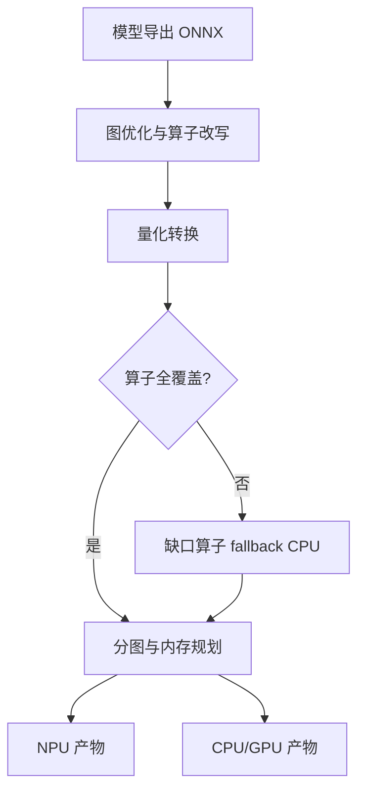

# 移动 NPU 工具链

NPU 的性能不在芯片里，在编译器里：内存规划在编译期一次做完，动态 shape 是它唯一的天敌。

<footer>—— 据高通 QNN、MediaTek NeuroPilot、Apple Core ML 与 OpenVINO 官方文档口径整理</footer>

[上一课](/llm/edge-hardware-spectrum)把端侧硬件排进「容量、带宽、算力、精度、功耗」的坐标系，并指出 NPU 的 TOPS 只有在模型真正编译进 NPU 之后才存在。缺口正是这一步：把一张 LLM 计算图变成 NPU 上可执行的产物，中间隔着图导入、量化转换、分图与内存规划几道工序。本课写工具链怎么走完这些工序、LLM 的动态 shape 卡在哪、以及分图边界的隐性成本。后课的量化实践以本课的「后端吃什么格式」为输入。

## 问题

NPU 不是通用处理器，而是数据流加速器：片上缓冲怎么分、算子怎么排程，都在编译期定死。通用流程五步：模型导出（ONNX 或框架 trace）、图优化（算子融合、布局变换）、量化转换、分图（把图切成 NPU/CPU/GPU 三段，即 delegate 模式）、逐后端生成与打包。每步都有检查单：算子覆盖表决定哪些算子 fallback 到 CPU（哪些算子天然对 NPU 友好，[NPU 友好算子](/llm/npu-friendly-ops)已经分过类）；量化格式决定后面整条链（下一课展开）；内存规划报告给出峰值缓冲，超了就得砍上下文或批大小。

LLM 的特殊困难是自回归：序列长度每步加一，KV 随之增长，而 NPU 编译期要静态 shape。三条出路：序列长度分桶，pad 到档位，用浪费的算力换静态；prefill 与 decode 分工——prefill 形状虽长但一次性、可静态编译，decode 循环留 CPU/GPU，这是[移动端 NPU 部署](/llm/mobile-npu-deploy)的主流结论；或改用支持动态 shape 的新一代运行时。选哪条不是品味问题，取决于这条产品最看重首 token 还是每个 token。

## 方法

工具按硬件阵营对号：Hexagon 用 QNN，天玑用 NeuroPilot，Apple 用 Core ML 配 [Apple MLX](/llm/mlx-apple)，PC 端 NPU 用 [OpenVINO](/llm/openvino)，瑞芯微用 RKNN。选型期查三件事：目标模型在该工具链上的算子覆盖率；量化粒度与格式的支持程度，per-channel 与 group-wise 的支持差异极大；KV 与动态 shape 的官方方案是什么。集成后再查一件：逐段计时。端到端延迟会掩盖分图边界的成本——每跨一次 NPU/CPU 边界，激活要拷贝一次，精度常要转换一次，热路径上多来几次，NPU 省下的时间就全吐回去了。

## 机制

为什么动态 shape 是天敌：tiling 大小、片上缓冲与 DMA 排程都是编译期常数，序列长度一变成符号量，这些就得推迟到运行时，而 NPU 恰恰靠编译期的确定性吃饭。所以工程上「静态化」无处不在：上下文上限、长度分桶、KV 留在 CPU 内存而 NPU 只消费定长窗口。这些决定一旦写进产品，比如上下文上限四千，动它就要连内存预算一起动。fallback 链同理：它不是异常路径，是常态路径，每个 fallback 点都要有计时与精度核对，否则性能与质量会一起悄悄漏走。

分图边界是最大的隐性成本：一次跨界等于一次内存拷贝加一次精度转换，fp16 与 int8 缓冲来回变换，足以让「算子在 NPU 上更快」变成「端到端更慢」。覆盖表要在选型期查，不是集成后期补。

## 边界

本课不评各家工具链的版本与跑分，那类数字半年一换；OpenVINO 与 MLX 的推理细节在各自课里，本课只借它们讲阵营差异。量化格式与校准的具体做法是下一课的主题。数值一致性问题——同一份权重在 NPU 与 CPU 上输出不完全一致——留到端侧评测课统一处理。

## 小结

- NPU 工具链五步：导出、图优化、量化转换、分图、逐后端生成，每步一张检查单。
- LLM 的动态 shape 靠分桶、prefill 与 decode 分工、或动态运行时化解。
- 分图边界有拷贝与精度转换成本，逐段计时是唯一可靠的验收方式。
- 算子覆盖与量化格式支持在选型期查；fallback 是常态路径而非异常。
- 出处：据 QNN、NeuroPilot、Core ML、OpenVINO、RKNN 官方文档口径整理；执行单元分工见本站移动端 NPU 部署课。
