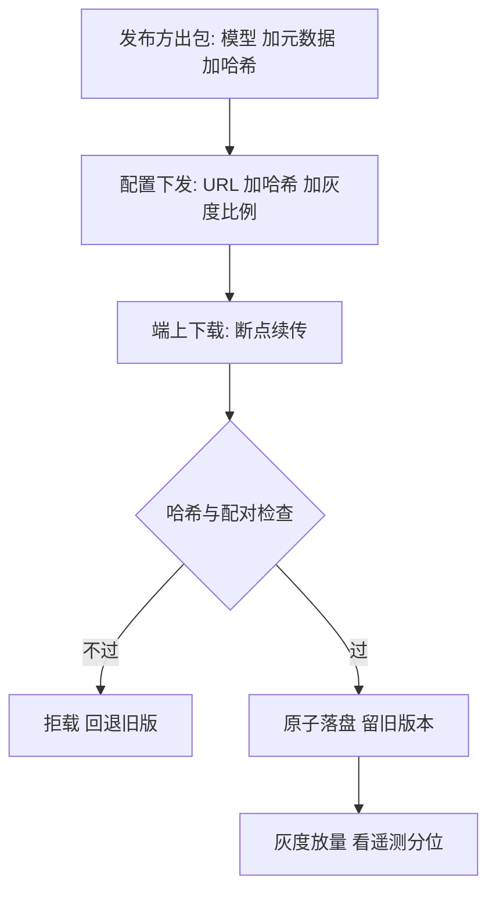

# 打包分发与性能回归

模型是资产，分发是供应链：哈希、配对、回滚三件齐了，性能回归门禁才挂得住。

<footer>—— 据应用商店分发规范与本站开源生态收束课的发布口径整理</footer>

[上一课](/llm/edge-eval)把评测立成门禁：质量、延迟、资源、持续性四张卷子都要过。本课写门禁挂在哪里——打包与分发链路。模型文件以 GB 计，随应用包分发不现实，首次启动下载是常态；下载、校验、版本配对、灰度、回滚，每一环的失败模式都不崩但变糟，比崩溃难抓得多。

## 问题

分发链路五环，每环有坑。体积环：包里只放最小常驻模型，大模型首次启动或按功能下载；应用市场对包体与下载各有历史限制，模型版本还要与应用版本解耦更新，否则一次模型修复要陪一次应用审核。完整性环：mmap 让权重文件被原地读，下载中断、磁盘损坏、被替换的文件直接进计算——校验必须哈希 pin 到发布方，而不是只看下载器报成功。配对环：模型、分词器、运行时三者必须版本配对；分词器错配的失败是「不崩但变蠢」，用户说不清、监控抓不到，是最阴的一类回归。回滚环：新模型灰度出问题，要能几分钟内指回旧版，旧文件与旧配置都要留。节奏环：模型更新走远程配置——新 URL、哈希、灰度比例；应用更新只管运行时。

## 方法

发布物三件套：模型文件、元数据（架构、量化配置、分词器版本、最低运行时版本、期望的内存与能耗档）、校验哈希。元数据的字段口径沿用[开源生态收束](/llm/eco-map)的发布包清单，把「不可变锚」从发布方仓库延伸到设备端。端上下载器四件事：断点续传；哈希校验后原子落盘，校验不过不进主路径；旧版本保留一份作回滚；加载时启动检查，哈希与分词器版本不匹配就拒载。回归门禁两道：模型变更过上一课的评测矩阵；运行时变更——升后端、换工具链版本——过同一矩阵，运行时同样改数值行为，只测模型等于门只锁了一半。灰度按设备档位分批放量，遥测看真机分位，指标与门禁用同一套。

配对检查写成加载时的硬断言：模型哈希、分词器版本、运行时最低版本三项任一不匹配即拒绝启动并回退——比上线后排查「为什么这批用户觉得模型变笨了」便宜两个数量级。

## 机制

为什么哈希与配对是地基：mmap 的性能红利把文件变成计算路径的一部分，文件层的任何损坏或替换都直接进数值；分词器错配不抛异常，只是每个 token 都错一点，只能靠质量遥测的反常分位捞出来，预防比检测便宜。为什么门禁要在设备矩阵跑而不是云端同款：上一课的结论原样适用——数值路径不同，回归只在目标硬件上显形。为什么回滚要留旧文件：配置指回旧版本的前提是旧文件还在设备上，重新下载一个 GB 级文件不是回滚，是二次发布。

## 边界

模型加密与 DRM 不在本课：它防不了越狱设备，也与开放权重生态相抵触，工程上通常止步于哈希与签名。应用商店审核细节与各市场政策差异不展开。A/B 实验的统计功效不展开，灰度只按「先小批后放量」的工程口径走。

## 小结

- 模型与应用版本解耦：模型走配置下发，运行时随应用走。
- 三件套发布物加哈希 pin；校验后原子落盘，旧版留一份作回滚。
- 加载时硬断言配对：哈希、分词器版本、最低运行时，不符即拒载。
- 门禁两道：模型变更与运行时变更过同一评测矩阵，灰度按档位放量。
- 出处：应用商店分发规范；本站开源生态收束课的发布包口径；按本课程工程实践整理。
