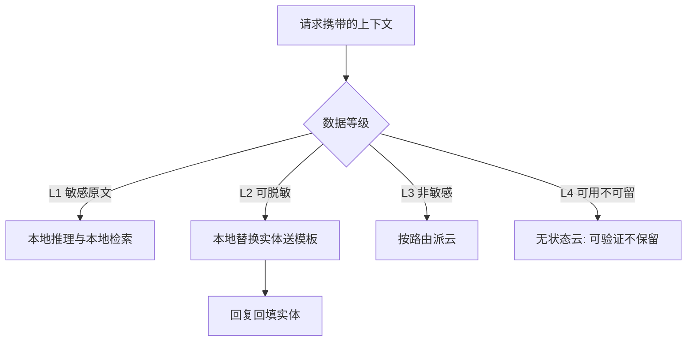

# 隐私与本地化

本地化的价值不是端侧更快，是有些上下文只有本地能合法地读：先给数据分级，再谈模型放哪。

<footer>—— 据 GDPR 数据最小化原则与 Apple Private Cloud Compute, 2024 架构文档整理</footer>

[上一课](/llm/edge-cloud-collaboration)把路由、升级与降级铺成系统，但路由表里还少一列：数据等级。邮件、消息、照片、健康记录这类上下文，用户与法规都不愿其原文离开设备；而「全部本地」既不现实——端侧模型能力有上限——也不必要，多数请求并不携带敏感上下文。本课写隐私如何反过来决定架构：数据分几级、每级配什么技术件、「云可用但不可保留」怎么工程化。

## 问题

分级表四行。L1：原文敏感——本地推理、本地索引、本地检索，原文不出进程。L2：脱敏后可用——本地识别实体并替换成占位符，把模板送云，回复再把实体回填。L3：非敏感——按上一课的路由自由派云。L4：原文可上云但不可保留——由云侧架构承诺。威胁模型要先写清：这一套防的是网络窃听、服务方保留与二次利用，防不了已越狱设备上的恶意应用与物理接触，超出部分是系统安全课的题。分级表的典型错误形态是把「脱敏」当万能：上下文一丰富，占位符周围的线索足以重识别，L2 就悄悄失效了。

### L2 的边界

脱敏可信的前提是「单点实体、无交叉上下文」：替换一个手机号是安全的；替换一段病历叙述里的多处实体，残缺信息仍可能拼回。所以 L2 的规则要保守：只对模板化、结构性强的文本开放；自由文本降级为 L1 或 L4，不硬走脱敏。

## 方法

技术件按等级配。L1：检索留端、KV 不出设备、会话历史只落本地存储。L2：实体识别与占位符表都在端上保管，回填之后才进会话历史，云端只见模板。L3：走通用路由，无额外件。L4：云侧做无状态推理——请求处理完即丢、不接持久存储、镜像可被第三方核验；Apple Private Cloud Compute 的公开架构是这一级的工程参照：本地不可行时上云，但云侧承诺不保留且承诺可验证。通用件两件：遥测脱敏，报延迟与计数、不报内容；日志审计——crash 报告与性能日志是最常见的 prompt 泄漏通道，把提示与生成文本从日志面排除，是本地化改造里收益最大的一步。

## 机制

为什么分级先行而不是架构先行：哪些组件放在端上，决定这一代产品的能力上限，改架构的成本远高于改路由；法规与用户预期会变，新等级出现时应当改路由表与配置，而不是搬组件。所以把数据等级做成路由器的一等信号，与设备档位、电量、RTT 并列——上一课的信号快照加一列。L4 的机理是「可验证的无状态」：无状态使保留在技术上不可行而非政策上不允许，可验证让承诺可审计；这两点把「我们承诺不保留」从一句文案变成一条可以验的属性。

检查泄漏通道时按数据流走一遍：prompt、检索原文、生成文本各自出现在哪些日志、缓存与上报里——端侧推理省下的隐私，常被一行 crash 日志送出去。

## 边界

本课不写端侧训练与联邦学习；不给合规结论，法律判断不在工程课范围内；PCC 的密码学证明细节超出本课，只取架构口径。L2 的重识别风险随模型能力上升而变大，规则要定期复评。跨区域的数据出境要求按区域配置，放进路由的静态规则层，不放动态信号层。

## 小结

- 数据分四级：敏感原文留端、脱敏模板、非敏感上云、可用不可留。
- L2 只对单点实体与模板化文本可信，自由文本降级处理。
- L4 的工程口径是无状态加可验证，PCC 是公开参照。
- 遥测与 crash 日志是最大泄漏通道，先封它再谈架构。
- 出处：GDPR 数据最小化原则；Apple Private Cloud Compute, 2024 架构文档；按本课程口径整理。
