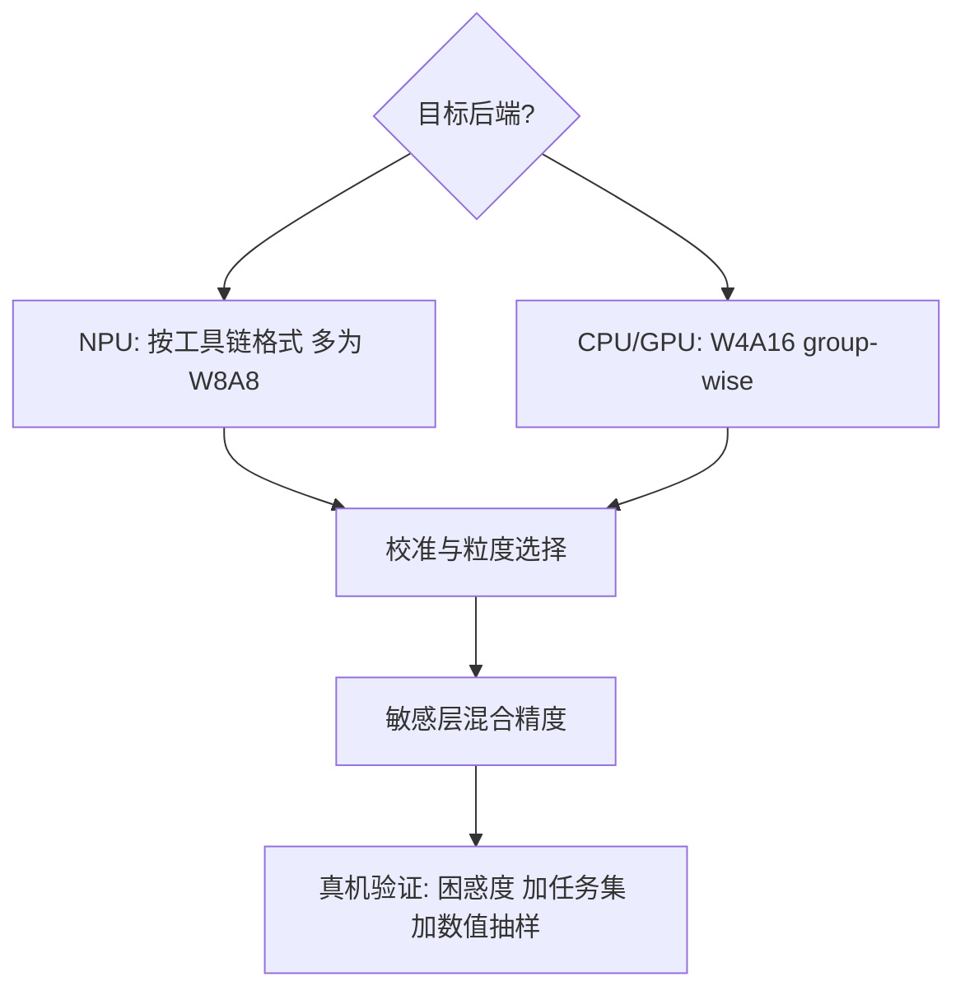
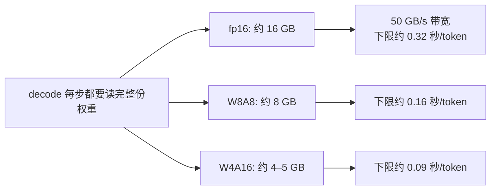

# 端侧量化实践

端侧量化的第一问不是压到几比特，而是目标后端到底吃什么：权重 4-bit 喂不进只认激活整数的 NPU。

<footer>—— 据 GGUF/k-quants 文档与 Frantar et al., GPTQ, ICLR 2023；Lin et al., AWQ, MLSys 2024 整理</footer>

[上一课](/llm/edge-npu-toolchain)把工具链五步走完，其中「量化转换」一步留了输入没填：后端支持什么格式，决定量化怎么做。本课填这一步。[GPTQ](/llm/gptq)、[AWQ](/llm/awq)、[SmoothQuant](/llm/smoothquant) 这些算法本身在各自课里已经讲透，本课不重推公式，只写端侧怎么选、怎么验：容量、带宽、能耗三个目标如何落成一份配置，以及在真机上怎么证明「没压坏」。

## 问题

服务器量化的目标是吞吐与精度的折中；端侧多出两条硬目标：装进设备内存、把每 token 要读的字节降下来——[CPU 推理与量化](/llm/cpu-inference-quant)已证明 decode 绑权重读取。主流答案因此分成两支。CPU/GPU 后端选 W4A16：权重 4-bit、激活保持 fp16；decode 的时间下界是字节除以带宽，权重砍到四分之一，延迟与能耗跟着砍。NPU 后端常要求 W8A8 或工具链自定义的 group 格式：整数单元吃的是激活量化，格式不匹配就整体 fallback。W4A16 这类记法当公式读：W 是权重（Weight）、A 是激活（Activation），后面的数字是各自的比特数。W4A16 = 权重压到 4 比特、激活保持 16 比特；W8A8 = 两边都压到 8 比特。看懂这套代号，工具链文档里的格式要求就不难对号入座。选错支路的错误很典型：拿着 W4A16 的模型去编译 NPU，工具链要么拒绝，要么把逐算子反量化插进图里，收益清零。

## 方法

决策顺序：先后端格式，再粒度，再混合精度。粒度上 group-wise（group size 32–128）是端侧默认，[per-tensor / channel / group](/llm/quant-granularity) 已给出粒度与精度的关系；group size 64 的意思是：每 64 个权重共用一对（scale，min）统计量，反量化时用本组的 scale 还原。组越小组内数值越接近、误差越小，但元数据越多——group size 从 128 收到 32，元数据量翻 4 倍，精度却只小幅上升，所以端侧默认取 32–128 这个中间档。校准用小样本即可，激活感知的方法——AWQ 保护显著权重、SmoothQuant 迁移激活尺度——在端侧同样适用。混合精度把首末层与测出敏感的层留在 fp16，其余压到 4-bit，敏感度用[量化误差度量](/llm/quant-error-metrics)的指标逐层测。

## 机制

W4A16 在 CPU 上是甜点的机理：decode 算术强度低，时间被字节搬运的下界钉死，权重 4-bit 直接把下界除四；激活不做量化，省去激活尺度的维护。Dettmers 与 Zettlemoyer 的缩放分析给出同一结论的另一面：固定内存预算下，4-bit 是精度与规模的最优折中点，压到 3-bit 掉的精度超过多装参数赚回来的。k-quants 的分块方案把 scale 与 min 存进每个块，[GGUF](/llm/gguf) 容器再把量化方案与元数据一起分发，「一份文件、多后端可跑」由此成立；端上最广的这套实践就是 [llama.cpp / ggml](/llm/llamacpp) 跑通的。

体积锚点：8B 模型 fp16 约 16 GB，主流 4-bit 配置约 4–5 GB。但「装得下」的判据是运行期峰值 RSS 而非文件大小：KV、激活缓冲与运行时开销都要算进去，一台 8 GB 内存的手机不会给你 5 GB。

验证在真机做，顺序固定：困惑度对 fp16 基线、任务集对云端同款、数值抽样看分布漂移，退化形态对照[量化后退化模式](/llm/quant-eval-degradation)识别。模拟器与云上同款芯片不算数：不同后端累加顺序不同，退化必须在目标硬件上重现才算数，否则门禁后面会漏。

## 边界

本课不重讲量化算法与 Hessian 推导；KV 的量化与权重量化是两本账，前者归 KV 各课。1.58-bit 与 BitNet 路线需要重训练，不是训练后量化，端侧按训练成本暂排除在实践之外。量化配置一旦进产品就是发布物的一部分：哈希与元数据怎么随包走，留给打包分发课。初学者容易以为「量化就是砍掉小数点后几位」。实际是先用统计量（scale/min）把数值范围映射到一排整数格点再存整数，还原值只能落在格点上，误差来自格点间距而非简单截断——所以校准数据选得好不好，直接决定这些格点划在哪里，也就决定了精度损失多少。

## 小结

- 先定后端格式再定比特数：CPU/GPU 主流 W4A16，NPU 按工具链要求多为 W8A8。
- group-wise 粒度加敏感层混合精度是端侧默认配置。
- 4-bit 甜点有两条独立证据：搬运下界与精度-规模缩放分析。
- 验证必须在真机：困惑度、任务集、数值抽样三样对着 fp16 基线做。
- 出处：GGUF/k-quants 文档；Frantar et al., GPTQ, ICLR 2023；Lin et al., AWQ, MLSys 2024；Dettmers & Zettlemoyer, ICML 2023；按本课程口径整理。
