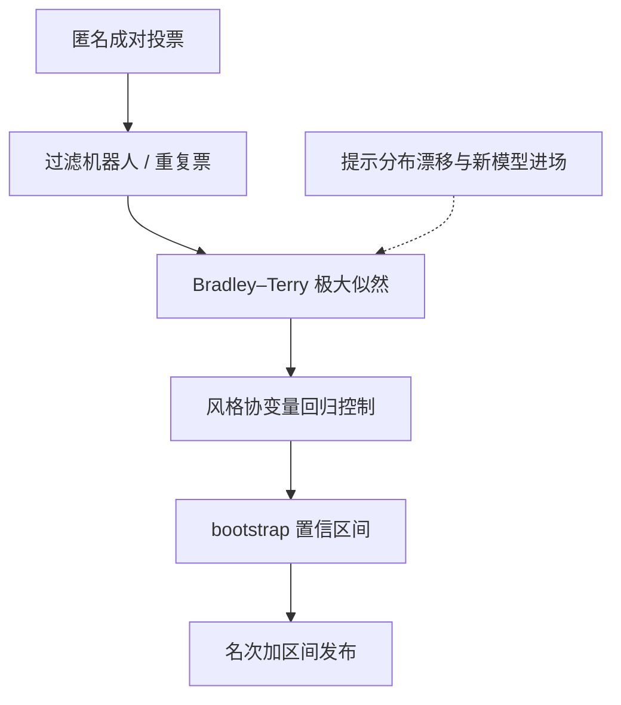

# 竞技场方法学

竞技场不是「投完票算个 Elo」，而是一次对人类偏好分布的抽样调查：怎么配对、票怎么过滤、分数怎么估、区间多宽，每一步都在决定名次的资格。

<footer>—— 据 Bradley 与 Terry 1952、Chiang 等 2024、Dubois 等 2024、Balduzzi 等 2018 整理</footer>

[上一课](/llm/ef-llm-judge-deep)把法官标定成仪器，但法官仍是代理人，真票在人手里。[Arena 课](/llm/lmsys-arena)写了滑动 Elo 的机制，[Arena-Hard](/llm/arena-hard)写了怎么用法官代理它。本课深化竞技场本身的方法学：偏好票在什么模型下聚合、风格怎么控制、非平稳怎么处理、名次带多宽的区间。缺口是：同一堆票，用在线 Elo 还是批量似然、控不控长度，名次会不同——方法学就是把这些选择从默认变成声明。

## 问题

一票是「匿名模型 A、B 各答一题，人选一个或平局」。把它变成名次需要三件事：一个胜率模型、一个估计量、一个抽样设计。朴素做法逐场更新 Elo，简单但对样本顺序与场次分配敏感；题目分布是「来什么答什么」，混进了不打算用于比较的流量；长度、标题、列表这些与能力无关的协变量在系统性加分。没有区间的一万名次变化，可能只是一周的投票波动，也可能只是风格红利。

## 方法

**聚合**：Bradley–Terry 模型把每场对战写成 $P(i\ \text{胜}\ j)=\sigma(\beta_i-\beta_j)$，对全部票做极大似然，一次估出强度 $\beta_i$；在线 Elo 是它的一阶随机近似，适合滚动榜但保留顺序敏感性。**区间**：对题目与人做 bootstrap，每个名次报置信区间；区间相交的名次差不下结论——这与[跨模型比较的陷阱](/llm/aeval-crossmodel-pitfalls)的钉协议是同一条纪律。**风格控制**：把回答长度、标题数、列表数当协变量放进回归，估「控住风格后仍赢的概率」，Dubois 等的长度控制胜率是标准做法。**抽样**：主动配对让强度相近的模型多打，机器人与重复票先过滤，被猜破匿名的模型要标记并降权。

## 机制

BT 模型假设可传递性：A 常胜 B、B 常胜 C，就推出 A 常胜 C。真实偏好存在非传递循环——用户各有所爱、论域不同——单标量会把这个循环压扁，投影损失是真的；Balduzzi 等因此建议至少分域报强度，而不是一个总 Elo 吃下所有论域。风格控制的机制是扣除可观测协变量的贡献：控制后的胜率回答「若两边一样长，谁赢」；它修不了不可观测的风格（语气、族谱腔），所以仍要与人票对表。非平稳的机制是投票流本身在换：提示分布随产品与时间漂移，新模型进场改变对手池，于是要么给旧对战时间衰减，要么在版本冻结的窗口内重估——跨窗口的分数不可直接相减。

主动配对的道理同测验选题：两个强度差很远的模型对战，胜率接近 0 或 1，一场几乎不改变估计；把预算花在 $\beta_i\approx\beta_j$ 的配对上，同样票数下区间更窄。

## 边界

竞技场测的是「这批投票者在这些提示上的偏好」，不是能力：数学对错投票者未必判得了，[可程序判定的任务](/llm/human-vs-auto-eval)不要进 Arena。提示分布与你的产品分布不同时，名次对外部场景没有效度——「与 Arena 相关」是协议、题集、法官三者的联合性质。匿名性是脆的：新模型常被从腔调猜出，票里混进粉丝效应，发布方至少要做去匿名哨兵检查。开放榜还会被策略性投票与提示瞄准，公开名次永远带这条警戒线。

## 小结

- 票到名次的三件事：胜率模型、估计量、抽样设计；每件都要声明而不是默认。
- 批量 BT 加区间是主尺，在线 Elo 只作滚动参考；区间相交不下名次结论。
- 风格控制扣除可观测协变量，修不了不可观测的偏好，人票对表不可省。
- 非传递与非平稳是单标量的两处投影损失；跨窗口分数不可直接减。
- 出处：Bradley 与 Terry 1952；Elo 1978；Chiang 等 2024（Chatbot Arena）；Dubois 等 2024（长度控制 AlpacaEval）；Balduzzi 等 2018。
