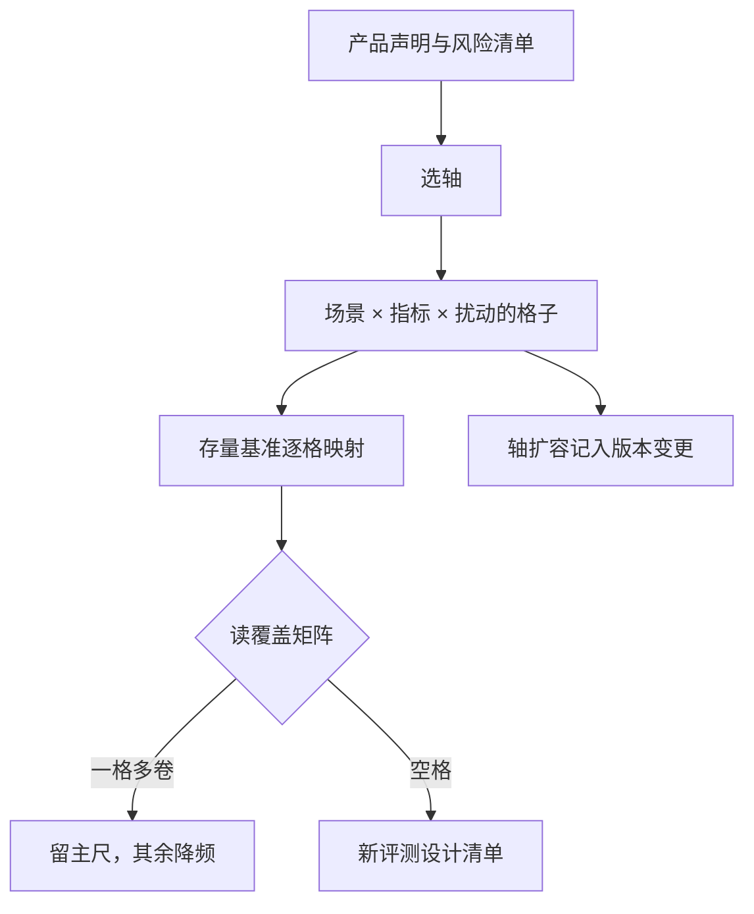
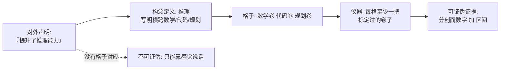

# 能力维度的体系

维度体系不是分类学游戏：它决定哪些声明有对应的仪器。没有格子的声明，就只能靠感觉说话。

<footer>—— 据 Liang 等 HELM 2022、Srivastava 等 BIG-bench 2022、Ribeiro 等 CheckList 2020 整理</footer>

[上一课](/llm/ef-arena-methodology)给了名次及其区间，但一个聚合标量回答不了「强在哪、弱在哪」。本课写能力维度的体系：轴从哪来、怎么操作化成格子、覆盖矩阵怎么读。主干已有散点的维度课——[长上下文](/llm/long-context-eval)、[危险能力](/llm/dangerous-capability-eval)、对齐深钻的三根轴；本课不重讲某一轴，写的是把它们装配成体系的规则。下一课的新任务设计默认你已经在矩阵上找到了空格。

## 问题

单一总分的三宗罪：加权平均掩盖短板——代码满分可以补齐安全挂零；轴之间相关但不等价——数学分高不等于推理好，可能只是背了题；声明失去落点——「我们提升了推理能力」这句话若没有一格卷子对着，就不可证伪。各家榜单各带一把尺，同一模型在不同体系的名次差好几位，因为体系本身在测不同的构念组合。「构念」是心理测量学的行话，指看不见摸不着、只能靠一组题目间接测量的抽象能力，比如「推理」「鲁棒性」。卷子之于构念，就像温度计读数之于温度——读数本身不是温度，是间接证据。所以先想清楚构念是什么，再挑卷子，顺序反了就变成「手里有什么卷子就宣称测什么」。缺口是：把散落的基准映射到一张自家的覆盖矩阵上，让每个对外声明都能指到行与列。

## 方法

HELM 的三维格是可抄的骨架：**场景**（任务 × 领域 × 语言）× **指标**（准确、校准、鲁棒、公平、效率）× **扰动**（同义改写、格式变化、干扰项）。扰动一格长什么样：把「请总结这篇文章」改写成「帮我概括一下上文」再考同一道题，或把表格从竖排改成横排。如果准确率从 90% 掉到 55%，说明模型背下来的是格式而不是能力——这种「换个说法就露馅」的脆弱性，正是扰动维度要抓的东西。落地成四步。第一步**选轴**：从产品声明与风险清单倒推——做客服就先有指令服从、多轮状态、拒答分寸，做研究助手先有长文档与引用；危险能力与安全轴按[危险能力评测](/llm/dangerous-capability-eval)的单轴规范单列。第二步**映射存量**：把现有基准逐个填进格子，一格多卷正常，注明各自口径。第三步**读矩阵**：一格多卷且高相关的，留一把主尺；多格空缺的，就是新卷子的清单——接下一课的设计流程。第四步**版本化**：轴会扩容（智能体、多模态都是后来者），每次扩容写进体系变更记录，跨版本的剖面不可直接减。

## 机制

体系的价值来自**构念—仪器—声明**的对齐链：每个声明对应一个构念，每个构念至少一格，每格至少一把标定过的仪器。加权总分为什么该弃用：权重是隐式的价值声明，把「客服场景的安全」和「竞赛数学」放进同一加权，等于宣称二者可互相补偿；分剖面把补偿的可能拿掉，短板自己会站出来。扰动维度的机制来自 CheckList：能力不是在干净样例上的准确率，而是同义改写后还稳不稳——把扰动当一列格子，鲁棒就从「附带观察」变成「可发布的数字」。轴的相关性还要定期重算：模型族换代后，原本高相关的两轴可能解耦，昨天的冗余卷子今天是独立证据。

一格多卷不是浪费：两把卷子相关 0.95 时，另一把降频作对表；相关 0.5 时，它们是两个构念，格子应该一分为二。相关性矩阵是体系健康的年度体检。

## 边界

体系会膨胀成新的官僚：格子多到没人跑得完，矩阵就从地图变成装饰——覆盖矩阵必须与下一课的功效预算联动，空格按声明优先级排队，不是先来先填。构念重叠是常态：「推理」横跨数学、代码、规划，一格一轴的整洁是假象，要在构念定义里写明重叠处归谁。体系也不裁决真值：它只保证「测什么」被钉死，「测得多准」归统计功效课，「对齐类轴怎么测」归对齐深钻课。最后，长尾格子（低资源语言、罕见领域）可能长期空着，声明里就不要出现它们。「矩阵变官僚」不是修辞：假设 30 个格子、每格 2000 题、每次发布全量跑一遍，评测算力很快超过一次小模型微调的成本。所以空格必须按对外声明的优先级排队——先补要拿来发声明的格子，而不是谁先提出谁先进矩阵。

## 小结

- 维度体系把声明钉到格子：场景 × 指标 × 扰动，HELM 三维是可抄的骨架。
- 轴从产品声明与风险清单倒推，不从「别人有什么基准」顺推。
- 弃用加权总分，发布分剖面；短板与补偿关系由读者看见。
- 一格多卷看相关性定主尺；空格接新任务设计，扩容记版本。
- 出处：Liang 等 HELM 2022；Srivastava 等 BIG-bench 2022；Ribeiro 等 CheckList 2020，按本课程整理。
