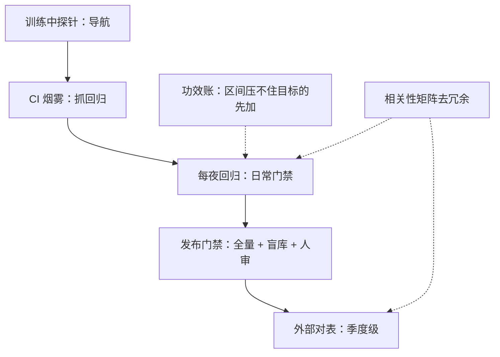

# 评测组合的策略

评测组合像投资组合：每张卷子有成本、延迟与信噪，目标是覆盖全部声明，而不是把任何一个分数推到最高。

<footer>—— 据 HELM 多场景口径与 lm-evaluation-harness 实践，按本课程各课协议整理</footer>

[上一课](/llm/ef-private-eval-build)建成了自家的烟雾集、回归集与盲库。本课把它们与公开卷、动态卷、人评、法官、环境化任务装配成一个**组合**：分层、预算、去冗余、再平衡。零件都在：[训练中评测](/llm/in-training-eval)管高频探针，[智能体协议](/llm/agent-eval-protocol)管环境化任务，[动态基准](/llm/live-benchmarks)管换血，[人机分工](/llm/human-vs-auto-eval)管谁该上人。缺口是组合层面的决策：哪张卷降频、哪张卷退役、预算往哪加——单张卷的优化回答不了。

## 问题

没有组合观的团队有两种典型病。**肥胖病**：历史上引入的每张卷都全量跑到底，评测税吃掉两位数比例的算力，但没有一张卷因为「不再携带信息」而退役。**裸奔病**：门禁只有一张总分卷，构念覆盖与功效账都没算过，模型换代时才发现某个声明从头到尾没有仪器。两种病同根：卷子的进出没有决策规则。组合策略要给的就是规则——进（哪个空格必须补仪器）、留（哪张卷值得全量）、退（哪张卷降频或退役）。

## 方法

**分层金字塔**，从下往上：训练中高频探针（分钟级、便宜、会被背题，只作导航不作门禁）→ CI 烟雾（每次提交，抓回归）→ 每夜回归（主门禁的日常形态）→ 发布门禁（全量 + 盲库 + 人评或标定法官抽审）→ 低频外部对表（公开卷与文献坐标，季度级）。**预算按功效分配**：每层每指标先过[功效分析](/llm/ef-statistical-power)，算力加给「区间还压不住目标差」的仪器，而不是加给已经饱和的卷。**去冗余靠相关性**：两张卷在同一批模型上的名次相关 0.95 以上，只留一把主尺全量，另一把降频对表；判别标准不是相关性本身，而是「抽掉这张卷后，有没有哪个声明失去仪器」。**保留异质尺**：程序判、标定法官、人评、环境化任务至少各留一把——它们失效的模式不同，同时失灵的概率小。

## 机制

组合的机制目标不是分数最大化而是**声明空间的最小覆盖**：每个对外声明至少一把合格仪器，每把仪器有明确的 $\delta$、区间与失效模式。冗余的机制要辩证看：高相关卷子是免费的稳健性检查（两把尺同时翻车说明协议坏了），不是纯浪费——降频不等于删除。再平衡的机制触发器有三类：模型族换代（轴间相关性重算，上一课的年度体检）、产品分布迁移（私有卷抽样框跟着变）、外部环境变化（公开卷被污染、动态卷题源枯竭）。每类触发器都写进组合的运维日历，而不是靠某次事故想起。

评测税有个经验量级：回归与门禁的总算力若超过训练预算的一成，通常说明卷子该退役而不该加机器。先把「每张卷回答哪个声明」写下来，税单自然瘦身。

## 边界

组合不能治愈无效仪器：把失效的法官、背题的公开卷留在一层，只会让分层显得体面。层与层的结果冲突要有裁决规则：烟雾红、门禁绿时按协议处理（通常是环境或解码配置漂移，先查[评测方差](/llm/eval-variance-seed)的 $\xi$），而不是各层各说各话。组合本身也会被优化：团队知道哪张卷进门禁，压力就会集中到那张卷上——门禁层的构成要定期轮换，这也是再平衡的一部分。最后，外部榜永远在组合的最外层：可参考、可对表、不进门禁——它的公信力问题（谁维护、谁付钱、换尺史）在引用其数字时一并披露。

## 小结

- 组合规则三件：进（空格补仪器）、留（功效账定预算）、退（去冗余与换血）。
- 五层金字塔：探针 → 烟雾 → 回归 → 门禁 → 外部对表；只有门禁层决定发布。
- 相关 0.95 以上的卷留一把主尺，其余降频；判退役看声明是否失去仪器。
- 至少保留四类异质尺：程序判、标定法官、人评、环境化任务。
- 出处：据 HELM 多场景口径与 lm-evaluation-harness 实践，按本课程各课协议整理。
