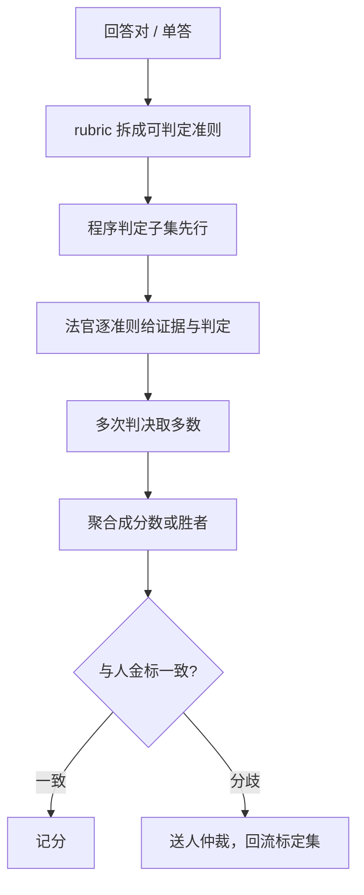
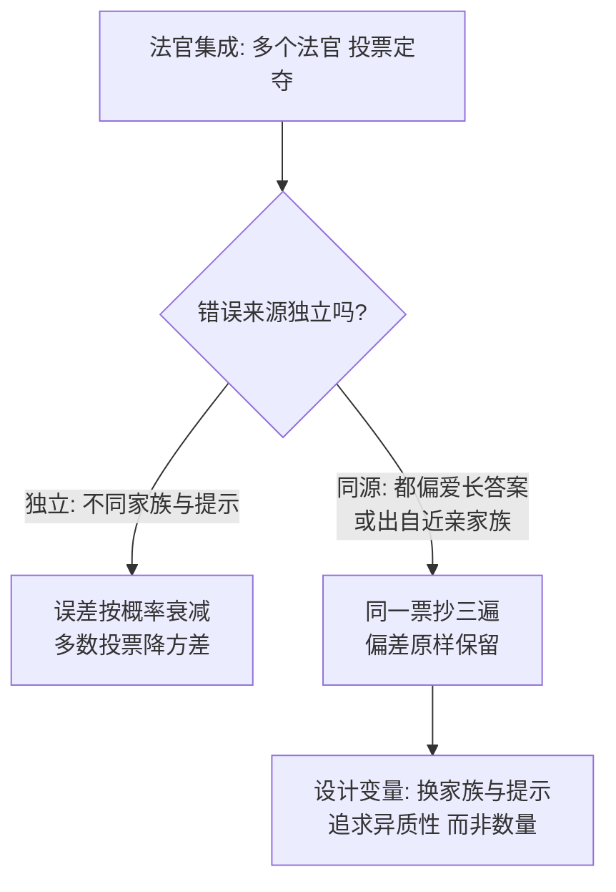

# LLM-as-judge 的深化

换序与控长只是让法官不作弊；把法官当仪器深化，是让它可标定：准则可操作、判决可拆解、一致率对人有交代。

<footer>—— 据 Zheng 等 2023、Zhu 等 JudgeLM 2023、Kim 等 Prometheus 2023、Li 等 Auto-J 2023 整理</footer>

[上一课](/llm/ade-map)把对齐数据工程收在一条主线上：定义写成锚，锚经数据变成边界，策略把边界放大成行为；数据的版本管理决定行为的漂移。边界立好、策略放大之后，行为的量法仍未解决：法官仍是一只被审计过的黑盒——[偏差课](/llm/llm-judge-bias)给了换序、控长、双族对照这些最低工程，[MT-Bench](/llm/mt-bench)把法官当误差的显微镜。本课是「评测前沿方法」的第一课，写法官本身的深化：把「哪条更好」拆成可判定的准则、改造判决结构、训练与集成法官、对人标定。后课的竞技场、组合与训练协同都默认法官已经是标定过的仪器。

## 问题

未深化的法官只有一个输出：胜者或一个 1–10 分。它把事实、服从、文风、安全压成一次直觉判断，偏差无处归因：长回答赢了，不知赢在信息量还是排版；分数差零点几，不知是模型差还是法官抖。要优化的团队还会对法官直接做梯度上升——[裁判作奖励](/llm/llm-judge-reward)已警告这会被 PPO 放大。「对法官做梯度上升」就是把法官的打分当训练目标去优化被评的模型。风险在于法官自己也是语言模型、自带偏好：被评模型会学着专挑法官爱看的样子写（更长、更多列表、语气更自信），而不是真的变好——分数涨了，质量没涨。缺口不是再补一条偏差清单，而是把判决变成**可归因、可标定、可复算**的测量。

## 方法

**准则操作化**是第一步：把「更好」写成几条可独立判定的命题——事实是否与参考一致、是否覆盖任务的每个子要求、是否执行了格式约束、是否引入了要求之外的伤害。每条准则单独输出「满足 / 不满足 / 无法判定」加一句证据，再聚合。这与 [IFEval](/llm/ifeval) 同源：能程序判定的不交给语言直觉，法官只接程序判不了的部分。**判决结构**上，先让法官写证据再下结论，或对两答先各自评分再比较，避免把比较当第一反应；**自采样**取多次判决的多数，压随机抖动——但只压方差，不纠系统偏差。**标定**用人金标：留一批人与法官同判的样本，报一致率与 Cohen $\kappa$，Cohen $\kappa$ 可以这样读：从一致率里扣掉「纯属碰巧的一致」再归一。假如两人闭着眼乱判也能对上 50%，那表面 80% 的一致率其实只值 $\kappa\approx 0.6$。经验门槛：$\kappa$ 超过 0.8 算高度一致，0.4–0.6 算中等，低于 0.4 的法官不能上岗。分歧样本送人仲裁并回流标定集。**微调法官**（Prometheus 一类）用公开的 rubric 与反馈语料把评分行为固化进权重；**法官集成**让不同家族的法官各判一遍，分歧即升级。

## 机制

拆准则为什么有效：整体判断让法官同时做事实核对与文风偏好，注意力摊薄后系统性先验（长、列表、自信）占便宜；逐准则判定缩小了每个子任务的输入空间，先验能施加的面也随之变小。准则的本质是操作定义——「有帮助」没法判，「是否答了用户问的两个问题」可以判。拆分还带来可归因性：输在事实准则与输在格式准则，后续动作完全不同。

集成为什么降方差不纠偏差：若两个法官的错误独立，多数投票按误差概率衰减；若错误同源（都偏爱长答案、都出自近亲家族），投票只是把同一票抄三遍。所以集成的第一设计变量是**家族与提示的异质性**，不是数量。微调法官把一致性买在前面：权重固化后提示与温度的抖动变小，但它冻结了某个训练分布的审美，语料与产品换代时必须再标定，不能永续。

Prometheus 把 rubric 与人写反馈做成微调语料，用开源模型当法官，作者报告其与人评的一致率接近当时的 GPT-4。可复现性换到了，代价是评分尺度从此绑定那个训练分布。

## 边界

深化不修复无效的 rubric：准则若本身在量文风（「结构清晰」），拆得再细也是偏差的放大器。优化方会读你的准则清单并逐条拟合——Goodhart 在准则层面照样成立，门禁用的 rubric 要留盲层。为什么 rubric 要留盲层：门禁准则一旦公开，优化方会逐条拟合——你要求「包含三步解释」，回答里就长出三步凑数的废话。留一两把不公开的卷子，才分得清「真变好」与「学会应试」，道理同考试院不公布全部题库。成本也翻倍：逐准则加自采样，一次判决的前向是朴素法官的十倍量级，这笔预算要进组合课的账。最后，一致率高不等于测对了构念：法官与人可以在「都偏爱长答案」上一致；效度要靠准则与声明的对表，不是一致率单独能给的。

## 小结

- 法官深化的方向：准则操作化、判决结构化、对人标定；换序控长只是前提不是深化。
- 程序可判定的子集先行，法官只接直觉判不了的部分。
- 集成降方差靠异质性；微调法官固化尺度，换代要再标定。
- 一致率 $\kappa$ 是标定证据，不是效度证据；构念对表另行声明。
- 出处：Zheng 等 2023（MT-Bench 与法官偏差）；Zhu 等 JudgeLM 2023；Kim 等 Prometheus 2023；Li 等 Auto-J 2023，按本课程整理。
