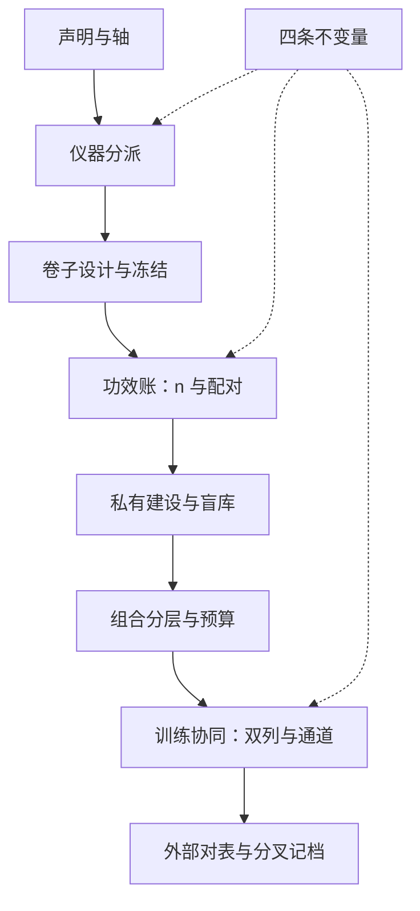
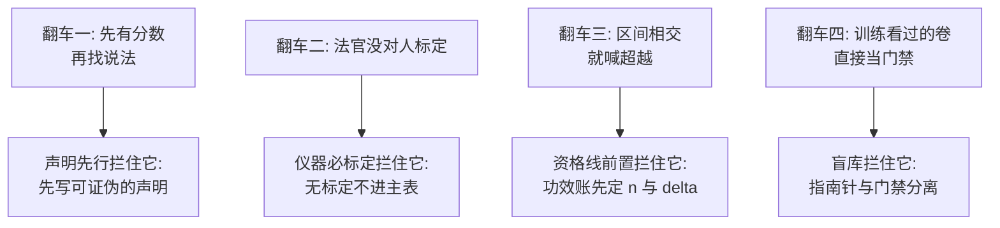

# 评测前沿收束

评测的前沿不是更多分数，而是每个分数都能回答三件事：测的什么声明、差多大才作数、谁校准的尺子。

<footer>—— 据 Zheng 等 2023、Liang 等 HELM 2022、Gao 等 2023 与本课程各课口径，按本课程整理</footer>

[上一课](/llm/ef-train-eval-synergy)把评测接回训练，双列表与单向通道给协同立了合同。至此零件齐了：法官的深化给开放任务一台可标定的仪器，竞技场方法学给人类偏好一条带区间的名次，维度体系把声明钉到格子，新任务设计把空格变成卷子，功效分析定样本量的资格，私有评测建成分层的机构能力，组合策略管仪器的进出与预算。本课把它们装配成一张决策单和几条不变量。**本课程到此收束。**

## 问题

九件事散在八处会互相拆台：没有轴就不知道补哪张卷；没有功效就不知道卷子该多大；没有盲库，组合里最好的尺子半年就被训练吃掉；没有归因通道，门禁失败只会变成重跑。收束要回答的是顺序与不变量——哪些选择先行、哪些参数可以换代而骨架不动。为什么顺序本身是内容：先把仪器配齐再算功效，可能发现样本量根本凑不够，设计推倒重来；先攒一堆卷子再立声明，卷子是照别人榜单挑的，跟自家产品对不上。顺序错了不是省事，是把返工推迟到更贵的环节。这与[对齐评测收束](/llm/aeval-map)同一层问题，但对象换成了全谱系的评测方法，而不只安全与对齐。

## 方法

**决策单**，按依赖排序：

1. **声明与轴**：从产品声明与风险清单倒推维度体系，空格即待办。
2. **仪器分派**：每个声明配仪器——程序判、标定法官、人评、环境化，异质尺至少各一把。
3. **卷子设计**：谓词、抽样框、判定器、试点、冻结，六步留档。
4. **功效账**：定 $\delta$、$\alpha$ 与功效，算出 $n$ 与配对方式，区间是产出的默认形态。
5. **私有建设**：渠道、三级分层、盲库与治理五条。
6. **组合分层**：探针 → 烟雾 → 回归 → 门禁 → 外部对表，按功效分配预算，按相关性去冗余。
7. **训练协同**：双列表与单向审批通道，KL 预算当合同。
8. **对外对表**：公开卷与竞技场坐标定期校准，分叉记档。

## 机制

骨架是四条不变量。**声明先行**：先有可证伪的声明，再选仪器；反过来先有分数再找说法，评测量产出的只是材料。**仪器必标定**：法官对人标定、卷子过试点、人评有协议——没有标定环节的仪器不进主表。**资格线前置**：名次差要在功效账里先取得作数的资格，区间相交不下结论；这条把「进步叙事」挡在统计之外。**指南针与门禁分离**：训练看得见的永远不当发布依据，盲库是组合里最贵也最值得的资产。「指南针」与「门禁」可用开车打比方：指南针是训练时随时瞄的仪表盘，告诉你方向对不对、允许有误差；门禁是上路前必须过的年检，标准严格，而且驾驶员不能提前知道考题。拿训练时盯着的卷子直接当年检，等于自己给自己发驾照。参数会换代——模型、法官、题面、榜全都会——这四条不动；换代的每一步走版本冻结与变更审批，跨版分数不直减。

若只做三件事：给每个对外声明绑一把标定过的仪器；给每个名次配区间并预先声明 $\delta$；把发布门禁放进训练组不可读的盲库。本课程见过的大多数评测翻车，在这三步就被拦住。

## 边界

这张地图有保鲜期：法官会换代、竞技场会被瞄准、轴会扩容（智能体与多模态都在涌入）、公开卷会背题——所以每张表带版本与日期，过期不续命。为什么每张表要带版本与日期：评测结论是条件句——「在当时的题、当时的法官、当时的对手池下」才成立。半年后法官换了、公开卷被背题了，旧分数就不能直接拿来比新模型。不带版本的分数如同没有生产日期的食品：不是一定坏了，是你没法知道它还能不能吃。地图之外留两翼：评测怎么进报告与披露，[报告规范](/llm/aeval-reporting-standard)接棒；评测之后模型怎么改，训练各课接棒。收束的口径是：评测工程交付的始终是同一件事——把「感觉更强」换成「在声明的构念上，差距的区间与标定来源可被任何人审计」。分数有资格说话的时候，评测才谈得上工程。

## 小结

- 决策单八步，依赖排序：声明与轴 → 仪器 → 卷子 → 功效 → 私有 → 组合 → 协同 → 对表。
- 四条不变量：声明先行、仪器必标定、资格线前置、指南针与门禁分离。
- 异质尺至少各一把；组合按功效分配预算，按相关性去冗余。
- 版本冻结跨所有参数换代；跨版分数不直减，分叉记档。
- 出处：Zheng 等 2023；Liang 等 HELM 2022；Gao 等 2023；Bradley 与 Terry 1952、Dubois 等 2024 与本课程各课口径，按本课程整理。
