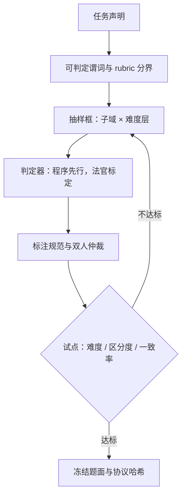

# 新任务的评测设计

一张新卷子不是「找些题」，而是把一句声明逐级翻译成可判定谓词、抽样框、标注规范与冻结版本；翻译走样一步，分数就测别的东西。

<footer>—— 据 Zhou 等 IFEval 2023、Cronbach 与 Meehl 1955、HELM 扰动设计口径整理</footer>

[上一课](/llm/ef-capability-taxonomy)的覆盖矩阵标出了空格。本课写怎么把一个空格变成一张能发布、能进回归的卷子。已有零件：[人评协议](/llm/human-eval-protocol)管标注规范与信度，[去污染](/llm/eval-contamination)管泄漏，[合成评测集](/llm/synthetic-eval-sets)管造题，[统计功效](/llm/eval-variance-seed)管噪声来源。本课补的是把它们串成一条**从声明到仪器**的设计流水线，并用试点数据决定卷子的生死。后课的功效分析与组合分层默认卷子已经按本课协议冻结。

## 问题

新任务评测最常见的死法有三种。一是**构念走样**：想测「多步规划」，题面却靠长阅读理解设难度，分数测的是找信息。二是**判定失效**：开放输出配了字符串精确匹配，正确答案因标点或同义被记错——错在仪器不在模型。三是**难度失控**：题全员满分或全员零分，这样的题不携带区分信息，卷子再大也测不出模型间差异。三者共同点是设计时没把「测什么、怎么判、判得动吗」钉成协议，事后无法审计。

## 方法

流水线六步，每步留档。**一、声明翻译**：把「更好地完成 X」写成可判定谓词——IFEval 的做法是指令类型可程序验证（它用约二十几种可验证指令把「服从」变成判定题），不可验证的部分划给 rubric 或人评。**二、抽样框**：题从哪个总体抽、覆盖哪些子域与难度层、许可与隐私边界在哪；抽样框写死，补题才算同一张卷。**三、判定器**：能程序的先程序（单测、schema 校验、正则），判不了的标定法官，两段比分栏。**四、标注规范**：判分标准写成人可执行的操作，双人标注仲裁，报一致率。**五、试点**：小样先跑——难度分布、区分度（题分与总分的点二列相关）、判定器一致率；不达标的题回炉而不是硬上。**六、冻结与版本**：题面、判定器、协议哈希一起冻结，发布表绑版本号，进回归集后改动要走变更审批。

## 机制

区分度是卷子命的机制：一道题的信息量取决于「能力不同的作答者在这道题上得分是否分得开」。全员满分的题把所有能力压成一个数，等效于把样本量乘了个零；试点阶段删掉负区分度的题，比事后堆题量便宜得多。构念效度的机制借用 Cronbach 与 Meehl 的口径：你在卷子上的分数要能沿**效度网络**接上其他已知测量——新规划卷的高分应伴随既有规划类任务的高分与无关任务的中性；若新卷分涨、旧行全部不动，先怀疑构念走样，再庆祝进步。判定器也一样：程序判与标定法官在同一批样本上的分歧率要报，分歧集中在哪类输出，就说明那一类还没被协议覆盖。

试点只需一两百题就能救一张卷：难度全集中在两端的卷子，跑再多样本也画不出模型间的剖面——区分度是设计期属性，不是样本量能补的。

## 边界

新卷子在发布的瞬间开始贬值：题面外流、题解上网，[去污染协议](/llm/eval-contamination)要同步生效，私有门禁卷与公开对表卷分开管。抽样框决定外部效度：来自内网的题对外部场景无发言权，反之亦然，报告口径要写清总体。人写难题贵且慢，合成补量时按[合成评测集](/llm/synthetic-eval-sets)的口径验证难度与多样性，别让合成器把难度均匀化。最后，协议冻结与「卷子永不迭代」是两件事：迭代走版本，新旧版本分数不做跨版直接比较——这一条与全课程的版本冻结纪律同源。

## 小结

- 新任务评测是把声明逐级翻译成谓词、抽样框、判定器、规范、版本，六步留档。
- 程序判定先行，法官只接判不了的部分；两段分歧率要报。
- 试点看三样：难度分布、区分度、判定一致率；不达标回炉。
- 构念效度靠效度网络对表，单一卷子的涨分不自动等于能力涨。
- 出处：Zhou 等 IFEval 2023；Cronbach 与 Meehl 1955（构念效度）；HELM 扰动设计口径，按本课程整理。
