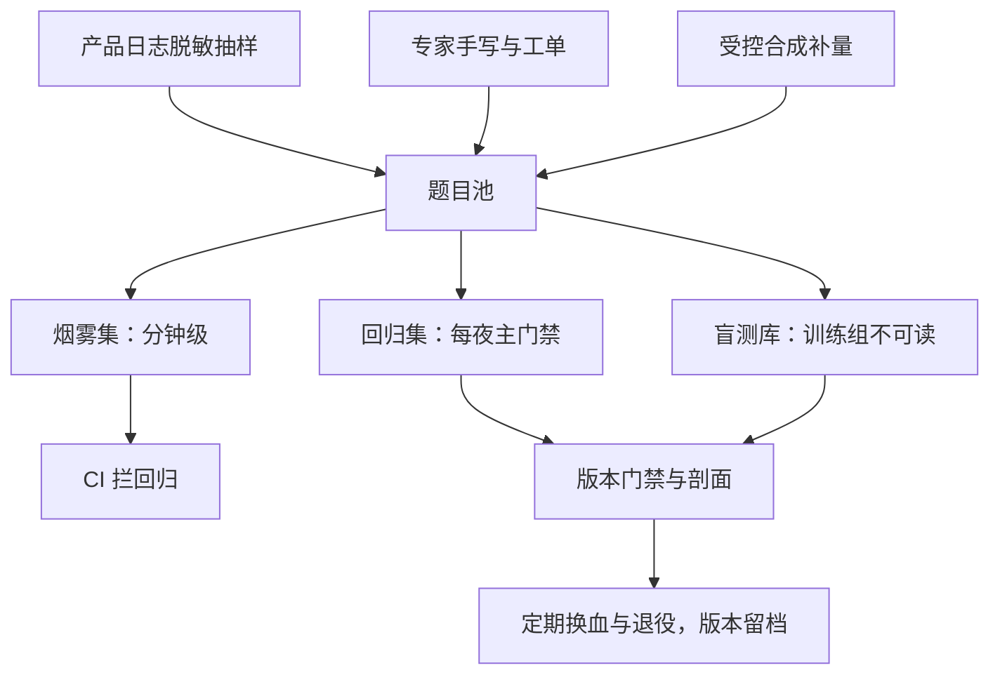
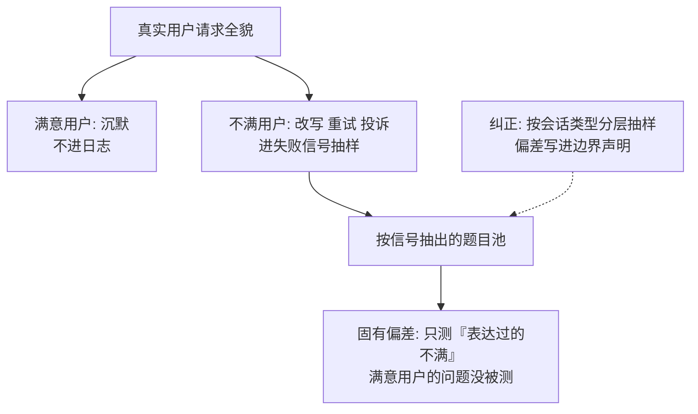

# 私有评测的建设

公开卷给你与文献对表的坐标，自家卷给你产品分布上的真话；私有评测是一门治理工程——渠道、分层、盲库、版本与权限，缺一样，数字就只是内部舆论。

<footer>—— 据 lm-evaluation-harness 口径、模型卡与报告规范，以及本课程各评测课协议整理</footer>

[上一课](/llm/ef-statistical-power)定了样本量与资格线，卷子本身还都是公开卷。本课转向自家卷的建设：怎么把产品日志、专家经验变成分层、可审计、能进门禁的私有评测。[合成评测集](/llm/synthetic-eval-sets)写过造题，[去污染](/llm/eval-contamination)写过剪泄漏，[报告规范](/llm/aeval-reporting-standard)写过五件套；本课补的是把它们组织成一个**可持续的机构能力**：谁供题、谁维护、谁能看、多久换血。下一课的组合策略默认私有评测已按本课建成。

## 问题

只有公开卷的团队会遇到三面墙。一是**分布墙**：榜单分数与自家产品表现脱节——用户问的是退换货与并发故障，卷子考的是奥数与历史；[Arena-Hard](/llm/arena-hard) 课已经警告过「与 Arena 相关」不迁移到你的提示分布。二是**背题墙**：公开卷进训练语料只是时间问题，分数越跑越好看而产品没变。三是**治理墙**：私有题散在个人 notebook 里，改一句题面没人记录，三次会议后没人说得清「上季度那 2 个点的提升」是在哪张卷、哪个版本上测的。「盲测库」可以类比药检的 B 瓶样本：平时封存、谁都不许碰，只在正式发布门禁时开封使用。训练组连题目都看不到，模型就没法提前背题——它防的正是「训练卷分涨了，产品一点没变」这类自我欺骗。私有评测要解决的就是这三堵墙，而第三堵最贵。

## 方法

**渠道四路**：产品日志（脱敏后按失败信号抽样——低采纳率、改写重试、用户投诉）、客服工单与内部专家手写（覆盖日志里没有的长尾与高危域）、受控合成（按[合成评测集](/llm/synthetic-eval-sets)口径造量并验证难度）、公开卷内化（重写题面做平行卷，用于与文献锚定）。**分层三级**：烟雾集（分钟级、跑在每次提交上，只抓回归不测能力）、回归集（小时级、每夜或每版本，主门禁在此）、盲测库（不进日常循环、训练组不可读，只在发布门禁解封）。**治理五条**：每张卷有所有者与变更审批；题面、判定器、协议哈希一起版本化；分数绑[五件套](/llm/aeval-reporting-standard)入库；脱敏与用户同意走隐私清单，PII 不进题面；PII 就是个人身份信息：姓名、手机号、身份证号、住址都算。题面入库前要把「张三 138xxxx 投诉物流慢」改写成「[用户] 投诉物流慢」，否则评测集本身就是一份泄漏的用户隐私库——评测数据一旦外流，后果与生产数据库泄露同级。负结果与失败题归档可检索。

## 机制

私有卷的价值机制是**分布对齐**：题抽样框与产品请求分布同源，分数的变化才能读成产品体验的变化；代价是失去外部对表，所以要留一条公开平行卷当锚——两边名次分叉时信自家卷，但要把分叉本身记档，它常常指出私有卷的抽样偏差。盲库的机制是**隔离 Goodhart**：训练能看见的卷子迟早被拟合，把发布门禁放进训练组不可读的库，拟合就失去了目标；盲库定期换血，退役的题降级进回归集继续服役。日志循环的机制性偏差要主动纠：日志只见幸存会话与不满用户，沉默的满意用户不在抽样里——按会话类型分层抽样，并接受「私有卷测的是表达过的不满」这一边界。

换血节奏比换血数量重要：盲库每年固定解封一两次，其余时间对训练侧只存在「存在性」，不泄露题面。解封后的分数与历史同表比较时，注明盲库版本。

## 边界

私有卷没有免费的午餐：小卷子撞上[功效](/llm/ef-statistical-power)约束，两个点的差可能测不动，别用小样本给大结论。脱敏会改变难度与语言分布，判定器在脱敏文本上的行为要单独验。组织成本是真实成本：没有所有者的卷子半年就烂，所有者离职要有交接清单。私有分数也不进对外宣传——它没有第三方可复核性，对外仍用[模型卡](/llm/model-cards)口径与公开卷说话。初学者容易以为「自家卷子分数高就能写进宣传稿」。实际私有卷没有第三方可复核性：题目不公开、判定器自定，数字只对内有效——不是自家数字不好，而是外人无法验证。对外宣传仍要走公开卷与模型卡口径，内外两套各说各的合法范围。

## 小结

- 私有评测解决三堵墙：分布对齐、背题、治理；治理最贵也最容易被跳过。
- 渠道四路：日志抽样、专家手写、受控合成、公开平行卷锚定。
- 分层三级：烟雾抓回归、回归做门禁、盲库防拟合；训练组不可读盲库。
- 分数绑五件套与协议哈希；负结果归档，版本留档可追溯。
- 出处：据 lm-evaluation-harness 口径、模型卡与报告规范，及本课程各评测课协议整理。
