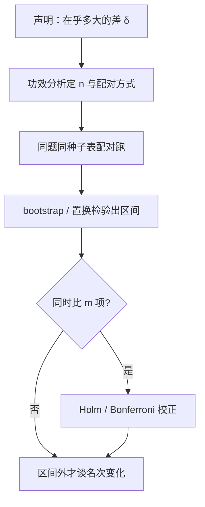
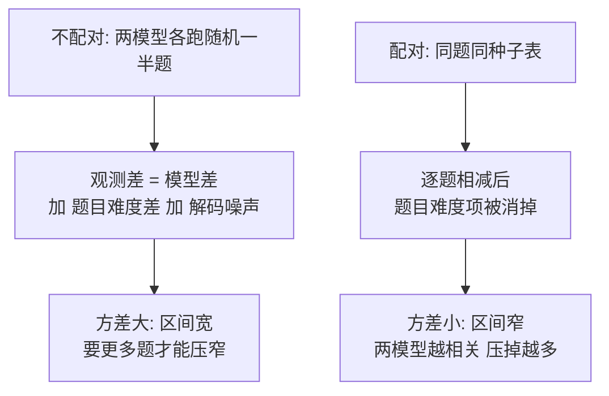

# 评测的统计功效

名次的资格不是跑出来的，是设计出来的：效应量、样本量、配对方式与多重比较，先于第一次评测就定了几分之差才算数。

<footer>—— 据 Dietterich 1998、Rodriguez 等 2021、Benavoli 等 2017 与 bootstrap 传统整理</footer>

[上一课](/llm/ef-newtask-design)把卷子按区分度设计完。本课回答另一半问题：跑多少题、多少票，才配让一个名次说话。[种子与方差课](/llm/eval-variance-seed)拆过噪声来源 $S(\theta,\xi)$ 并规定重复方式；[跨模型陷阱课](/llm/aeval-crossmodel-pitfalls)给过「换序、配对、区间」四件套。本课往前挪一步，写**功效分析**：在花算力之前算出最小可检测差与所需样本量，并给名次变化立统计资格线。组合课的每层预算都从这里出发。

## 问题

评测结论的失效大多是功效失效：两张卷各跑一次，A 高 B 一分，结论「A 更强」——这一分可能落在题目抽样或解码种子的噪声里。三种典型错误。一是**样本量与声明不匹配**：要在 2 个点上分辨模型，八百题的卷子根本不带这么窄的区间。二是**配对缺失**：两模型各用随机一半题，题目难度差被算进模型差；同一批题的配对设计能消掉这一项。三是**多重比较没人管**：扫二十个基准挑最好的报，星座对齐式的显著几乎必然出现——在 $\alpha=0.05$ 下扫二十次，期望假阳性约一次起。显著性水平 $\alpha=0.05$ 可以读成一句承诺：「我允许自己有 5% 的概率把『其实没差别』误报成『有差别』」。关键在于它是跑数据**之前**定下的误报预算——先定预算再看数据，与跑完数据再挑一个好看的说法，是科学与作弊的分界线。

## 方法

先声明**最小可检测差** $\delta$：产品或论文真正在乎的差距是多大？胜率比较按符号检验的样本量近似

$$
n \;\approx\; \frac{(z_{\alpha/2}+z_{\beta})^{2}\; p(1-p)}{\delta^{2}},
$$

$p$ 是胜率基线（约 0.5 最保守），$\alpha$ 是显著性水平，$1-\beta$ 是功效。连续分数用配对差值的 $t$ 检验或置换检验，区间用对题目的 bootstrap：重抽题不重抽模型，得分的分布就是题目抽样不确定度。**配对是默认**：同一批题、同一张种子表跑两个模型，逐题差值消掉题目难度项。**多重比较**：门禁若同时看 $m$ 个指标，用 Holm 或 Bonferroni 把每次的 $\alpha$ 收紧，Bonferroni 校正简单到一句话：同时比较 $m$ 项，就把每次的 $\alpha$ 除以 $m$。比如同时比 20 个指标，每次的门槛就从 0.05 收到 $0.05/20=0.0025$——单项更难「显著」，换来的是整族比较的误报率仍被压在 5% 附近，扫榜挑好看数字的路被堵死。或把一族比较报成联合声明。**省样本量**靠设计而非硬跑：IRT 类方法按题目信息量选题，Rodriguez 等显示按信息量加权或自适应选题可用少得多的题估出同样的名次。

## 机制

为什么配对能省一个数量级的题：不配对时方差是题目方差加解码方差，配对后只剩差值的方差，而同一道题上两个模型的得分高度相关，相关越高压掉越多。功效公式的机制在平方项：$\delta$ 收窄一半，$n$ 要翻四倍——「从差 5 个点变成在乎 2 个点」不是多跑一点，是换一个量级的预算。多次比较的机制在选择性：只报二十次比较里最显著的一次，等于把阈值私改成了 $\alpha/20$ 的别名；校正不是仪式，是把选择性买回来。区间还有个不对称用法：**区间内不结论，区间外才行动**——评测的产出从「谁第一」变成「谁能排除谁」，这与整个课程的区间纪律一致。

量级直觉：$p\approx 0.5$、$\alpha=0.05$、功效 0.8 时，检测 5 个点的胜率差约需八百对上下；收窄到 2 个点，就要五千对往上。八百题的卷子上吵 1 个点的名次，是在吵噪声。

## 边界

统计显著不等于工程显著：五万票上 0.3 个点的胜率差可以显著到没有意义，反过来工程在乎的差也可能因预算测不显著—— $\delta$ 该由决策成本定，不是由算力定。功效分析的前提是方差估计可信：小题集上 bootstrap 区间本身偏窄，先用历史方差或文献口径定先验。IRT 与自适应选题假设单维性，多维卷子上「高效」的子集会在构念上偏科，主尺慎用。初学者容易把「统计显著」当成「重要」。显著只回答「这个差是不是巧合」：五万票上 0.3 个点的差可以显著到毫无意义——差异是真的，但小到用户感知不到；而真正要紧的 2 个点差也可能因预算不够而测不出显著。重不重要由 $\delta$ 与决策成本回答，不由 p 值回答。最后，配对设计锁死了题集，公共题集用久了要按[动态基准](/llm/live-benchmarks)的口径补新题，功效账要连新题的预算一起算。

## 小结

- 先定最小可检测差 $\delta$ 与 $\alpha$、功效，再定 $n$；样本量是设计产物不是剩多少跑多少。
- 配对是默认：同题同种子表，逐题差值消掉题目方差。
- 区间用对题目的 bootstrap 或置换检验；同时比多项做多重比较校正。
- 区间内不下名次结论；评测产出是「能排除谁」，不是「谁第一」。
- 出处：Dietterich 1998；Rodriguez 等 2021（IRT 与题目信息量）；Benavoli 等 2017（贝叶斯比较）；Efron 与 Tibshirani 的 bootstrap，按本课程整理。
