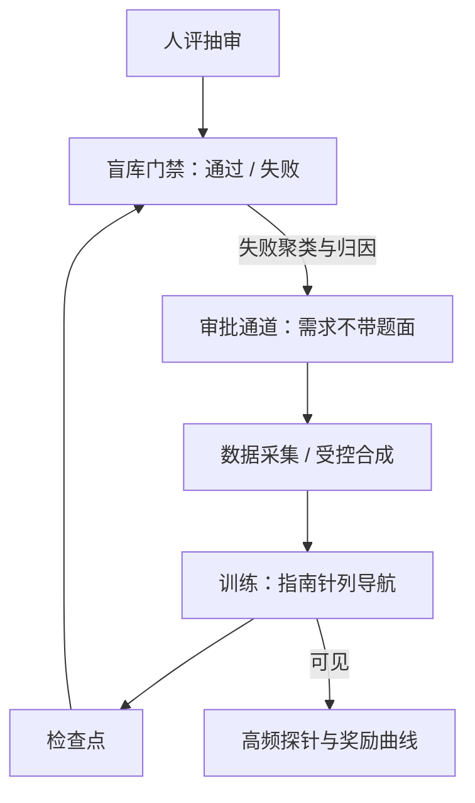

# 评测与训练的协同

指南针可以给训练看，门禁不能；当评测变成训练目标的那一刻，它就开始失去当评测的资格。

<footer>—— 据 Gao 等 2023（奖励过度优化）、Goodhart 定律口径与本课程评测课协议整理</footer>

[上一课](/llm/ef-eval-portfolio)把仪器装配成组合。本课处理组合与训练的关系：评测发现的差距怎么喂回数据与奖励，训练的进度怎么看而不被吃掉。零件已就位：[裁判作奖励](/llm/llm-judge-reward)写过法官进奖励的最低工程，[训练中评测](/llm/in-training-eval)写过探针的隔离与频率，[评测在环](/llm/rlsys-eval-in-loop)写过 RL 系统里的评测作业。本课补的是**双列结构**：哪些指标给训练当指南针、哪些锁进盲库当门禁，以及两列之间的信息通道该怎么开、怎么关。

## 问题

协同的失效有三种。**同源循环**：用同一张卷既指导训练又验收发布——模型对着它优化，分数涨而能力不涨，发布门禁形同虚设。**信号错位**：拿门禁指标当训练损失，每个梯度步都在啃评测集；或反过来拿粗糙探针当发布依据，噪声直接进了决策。**差距无处去**：门禁失败了，报告写「未通过」就完，失败没有聚类、没有归因，下一轮训练只是换个种子重跑。三种失效同根：评测与训练之间没有受控的信息通道。

## 方法

**双列表**是骨架。指南针列：训练可见、高频、便宜——训练损失分桶、去污染探针、[训练中评测](/llm/in-training-eval)的高频子集、RL 里的奖励曲线与 KL 散度；它们用来导航，明确声明「会被拟合」。门禁列：训练不可见——盲库、公开新卷、人评抽审；只输出通过或失败，不进梯度。**信息通道**单向且经审批：门禁的失败样本脱敏、聚类后转成训练侧的数据需求（哪类失败、哪个子域、多少量），再走[数据采集或合成](/llm/synthetic-eval-sets)补量；题面本身不过通道。**奖励侧的审慎**：法官或模型打分当奖励时，按[裁判作奖励](/llm/llm-judge-reward)的最低工程执行，并预算好过度优化——Gao 等的缩放律显示，代理奖励单调上涨时，金标奖励先升后降，峰值之后的训练是在制造分数而非能力。

## 机制

Goodhart 的机制版是：当代理指标 $\tilde{R}$ 成为优化目标，策略沿 $\tilde{R}$ 的梯度走出的分布离原先「$\tilde{R}$ 与真目标 $R$ 相关」的分布越来越远，相关性衰减，最后 $\tilde{R}$ 涨 $R$ 跌。Gao 等把它写成可预算的缩放律：给定 KL 预算，能算出金标奖励的峰值在哪，训练就该在哪附近收手——这给了「协同」一个定量抓手：**KL 预算是评测与训练之间的合同**。门禁失败聚类为什么必须走归因而不是重跑：失败样本是分布信息，聚类给出「能力差、格式差还是判分器误伤」的分解，其中只有第一类该回流成训练数据，第二类该改后处理，第三类该修判定器——不分解的回流会把判定器的 bug 训进模型。

Gao 等 2023 的曲线值得贴在墙上：横轴是代理奖励优化量，代理奖励一路上扬，金标奖励先升后越过一个峰——「训练得最卖力的检查点」与「最好的检查点」不是同一个。

## 边界

协同有天花板：门禁只能拒绝，不能指路——它告诉你在哪失败，不告诉你怎么修；把门禁当课程表逐题训练，等于把最后一面干净的尺子也交出去。指南针太弱则训练失明：全部探针都藏起来，训练侧只剩损失，导航不回产品——隔离的粒度是「题面不可见、需求可流通」，不是全面断联。组织边界同样真实：盲库的读权限、通道的审批人、失败样本的脱敏责任人，都要有名有姓。最后，这套双列在 RLHF、RLVR 与持续学习里形态各异，但[持续学习的评测协议](/llm/continual-eval-protocol)里「评测集不进训练存储」是同一条合同。

## 小结

- 双列结构：指南针列训练可见可拟合，门禁列锁盲库只输出通过或失败。
- 信息通道单向经审批：失败聚类与数据需求过通道，题面不过。
- KL 预算是评测与训练的合同；代理奖励的峰值靠缩放律预算，不靠感觉。
- 失败回流先归因：能力差改数据，格式差改后处理，判分误伤修判定器。
- 出处：Gao 等 2023（Scaling Laws for Reward Model Overoptimization）；Goodhart 定律口径；据本课程裁判作奖励、训练中评测与评测在环协议整理。
