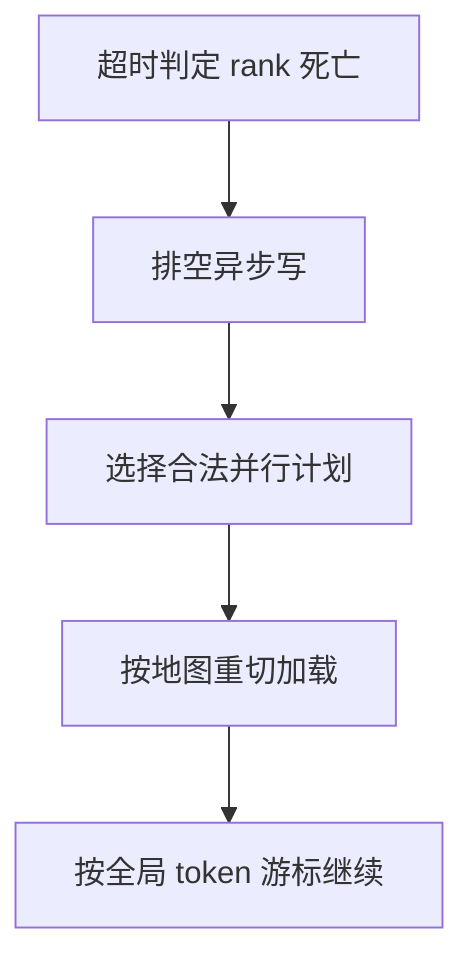

# 弹性训练与掉卡

故障不应当成整场作业的结束：世界缩小后按新的并行计划从上一完好检查点拉起，已训过的 token 尽量接着记账。

<footer>—— 据 Athlur 等 Varuna、PyTorch Elastic；对照 MegaScale / Llama 3 万卡故障处理整理</footer>

[上一课](/llm/distributed-ckpt-format)让权重能在新的 TP/PP/EP 度下重切。缺的是控制面：谁发现 rank 没了、如何排空异步 writer、如何选一个仍然合法的并行计划、如何让数据游标在缩小的世界里不重复不遗漏。本课不重讲张量地图字段。缺口是掉卡后的弹性续训。落后者是「还活着但很慢」；本课先处理「已经死了」。故障率课会给万卡的概率背景。

## 问题

同步集合通信把故障变成全组挂起：All-to-All 与 All-Reduce 没有「缺席默认值」。必须超时检测、中止、从检查点拉起。若每次掉卡都等人工改脚本，MTTR 以小时计，万卡作业的有效时间所剩无几。Varuna 一类系统把流水切分随可用机器数重算；torchelastic 提供进程组重建。工程缺口是与 1F1B / MoE EP 组的约束兼容：不是任意 $n$ 都能跑，合法世界大小是离散集合。

数据侧：弹性后 $n_{\mathrm{dp}}$ 变了，全局 $B$ 若要保持，就要改 $k$ 或 $b_{\mathrm{micro}}$，学习率会计跟着动。游标必须按「已消费 token」而不是按「每个 rank 的文件偏移」恢复，否则 DP 度变化会错位。

### 检测要快，但不能误杀

网络抖动与 GC 会造成短暂无响应。超时太短，弹性风暴；太长，空等。应结合 NCCL 健康、心跳、以及「是否卡在同一集合通信」来判定，而不是单 ping。

热备空闲节点可以缩短 MTTR，但要计入利用率。没有热备时，缩小世界继续训往往优于等维修。

## 方法

合法计划表：预先枚举若干 $(n_{\mathrm{dp}},n_{\mathrm{tp}},n_{\mathrm{pp}},n_{\mathrm{ep}})$ 组合，掉卡后选不超过当前存活数的最大可行点。从 latest 完好检查点加载，重切分片。排空或取消异步保存队列。重置 CUDA 上下文与通信组。加载器按全局 token 游标恢复，必要时丢掉当前未完成的全局 batch。日志把这次弹性记成一次「非确定性事件」，供重放课声明：弹性后的数值不必与从未掉卡的 run 逐 bit 相同，但 token 会计必须连续。

盒约束：EP 组大小变化时专家数仍要整除；否则拒绝该计划，继续缩小 DP 而不是强行改专家数。

### 与退火、评测

弹性发生在退火段时，配比版本号必须从检查点恢复，不能回到 $w_{\mathrm{main}}$。训练中评测的进程若与训练共享作业，应一并拉起或显式禁用，避免评测器对着半新权重写结果。

部分框架支持「换一批节点但保持世界大小」。这仍是弹性，只是计划不变、只换机器；检查点仍建议落一次，防止坏 GPU 内存污染。

## 机制

集合通信的进程组是静态的。弹性等于结束旧群、在新群上从一致快照重启优化器。丢失的是「上一检查点到故障」之间的梯度，不是整个 run。异步保存若把间隔压到分钟级，丢失可接受。这与数据去污染无关，但与可复现有关：随机数状态若只存在死掉的 rank 上，恢复后噪声不同。

## 边界

弹性不修复慢卡，只修复死卡。缩小世界会改变 $B$ 与通信模式，收敛曲线允许折一下，但应在报告里标注。下一课处理仍活着的慢节点：它们不会触发超时，却把每一步的墙钟拉到最差 rank。

## 小结

- 本课不重讲分片格式；只补掉卡后选计划、加载、接上 token 会计。
- 合法世界大小是离散表；EP 整除约束优先。
- 游标按全局 token；弹性事件要记账。
- 丢失窗口由异步检查点间隔决定。
- 出处：Athlur et al., Varuna, EuroSys 2022；PyTorch Elastic；Jiang et al., MegaScale。
