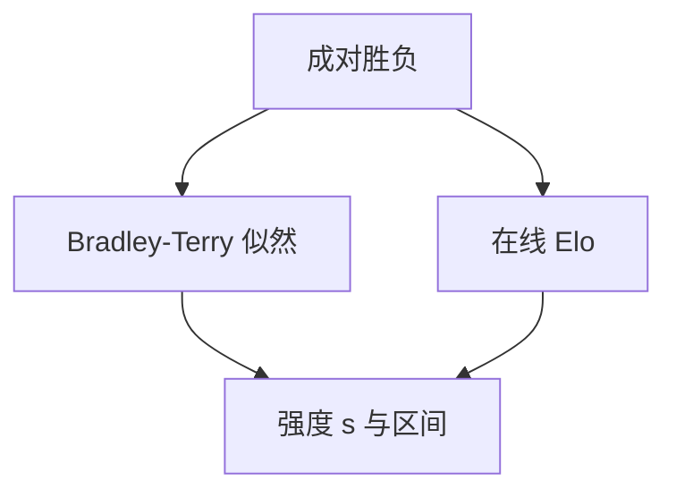

# Elo 与 BT 评分

胜负场次是观测，评分是对潜在强度的估计。场次不够时，名次只是噪声的一种排列。

<footer>—— Bradley-Terry 模型；Elo 作为在线近似；Arena 的用法见 [LMSYS](/llm/lmsys-arena)</footer>

[上一课](/llm/pairwise-vs-pointwise)把成对选作排名仪器。把许多对战收成一个可排序的标量，常用 Elo 或 Bradley-Terry（BT）。主干 Arena 课已写产品形态；本课补评测进阶里的估计含义。缺口是把「榜上差 20 Elo」当成物理单位。后课风格控制默认：Elo 差可以来自长度，而不是来自强度。

## 问题

BT 假设 $P(i\succ j)=\sigma(s_i-s_j)$，用全体对战的似然估 $s$。Elo 是对同一差的在线更新，便于实时榜。二者都把传递性写进模型：若循环对战很多（A 胜 B、B 胜 C、C 胜 A），拟合残差会大，单一分数解释力下降。

场次不平衡：新模型对战少，置信区间宽。只报点估计会制造假名次。对战不是随机设计时（用户自选模型、提示偏代码），$s$ 估计的是**该流量下的强度**，不是无条件能力。

把 Elo 与 MMLU 排进同一张「综合实力」表，是单位错误。一个来自成对口味，一个来自选择题。

## 方法

离线 BT：构造对战表，极大似然或贝叶斯估计 $s$，用 bootstrap 或 Hessian 报区间。在线 Elo：公布 $K$ 因子与初始分，否则不可复现。过滤：过短对战、明显刷票、同一用户重复，按 Arena 课的纪律。报告应附对战次数矩阵，而不是只附排行。

## 机制

$s_i-s_j$ 只在 logistic 链接下对应胜率。差 10 与差 100 的胜率含义不同，且依赖是否允许平局、是否有风格协变量。不加协变量时，长度与格式被吸进 $s$，模型「变强」可能是变长。后课把风格当要控制的变量，而不是当强度。

## 边界

BT 不处理多轴偏好（有人要短、有人要长）。混合人群下的单一 $s$ 是投影。下一课风格控制把长度等可观测混淆从 $s$ 里拆出去。

## 小结

- Elo / BT 是成对胜负的强度估计，必须报场次与区间。
- 流量偏与非传递性会破坏单一分数。
- 未控风格时，$s$ 含长度等混淆。
- 出处：Bradley & Terry；Elo；Chatbot Arena 实践。
