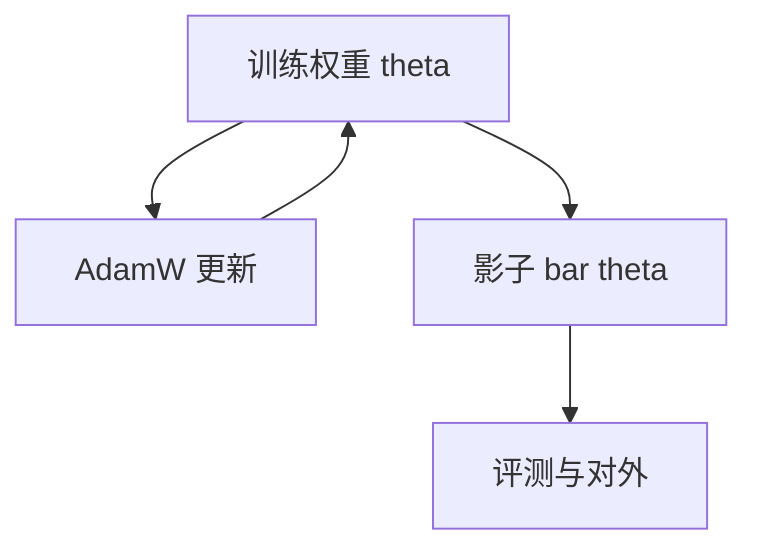

# EMA 与检查点平均

对权重做时间上的滑动平均，得到的是更宽盆地里的一点；训练损失未必最低，测试往往更稳。

<footer>—— Polyak & Juditsky, SIAM J. Control Optim., 1992；SWA 见 Izmailov et al., Averaging Weights Leads to Wider Optima, UAI 2018</footer>

[上一课](/llm/weight-decay-exemptions)把单步更新的参数分组钉住。缺口是时间轴：同一条轨迹上，后期权重在尖峰两侧抖动，任意一个 step 的检查点可能落在尖刺上。Polyak 平均与 Izmailov 等人的 SWA 把一段轨迹上的 $\theta_t$ 平均成 $\bar\theta$。EMA 是在线版：每步 $\bar\theta\leftarrow \tau\bar\theta+(1-\tau)\theta$。本课写训练期如何维护这条影子权重，下一课的模型汤才把**不同超参跑出来的模型**再平均。

## 问题

余弦尾或 WSD 的稳定段里，$\eta$ 仍非零，权重在盆地里走。验证 CE 的最佳点往往不是训练 CE 的最佳点，也不是最后一个 step。若只存最后一步，可能正好存到一次 $\beta_2$ 尖峰之后。平均把高频抖动滤掉，等价于在参数空间做低通。Izmailov 等人说明：平均解的 Hessian 更小（更宽），泛化更好。对 LLM，下游比训练 CE 更关心，EMA 检查点常作为对外权重。

代价：$\bar\theta$ 不在训练图上，不能用 $\bar\theta$ 的梯度去继续 Adam。EMA 是旁路。把训练切到 $\bar\theta$ 再继续，等于换了一套不再匹配 $m,v$ 的权重，需要重置优化器状态，本课默认不这么做。

$\tau$ 接近 1（如 0.999）时，EMA 半衰期很长，早期压熵段的权重会污染很久。应在 warmup 结束或进入幂律段之后再启动 EMA，或使用偏差修正。

## 方法

**EMA。** 选择 $\tau$（或等价的 decay）。每步在 `no_grad` 下更新影子。评测与对外保存用 $\bar\theta$，训练继续用 $\theta$。BF16 训练时影子建议 FP32，避免平均被舍入抵消。

**SWA / 检查点算术平均。** 在日程尾部每隔 $k$ 步存一个 $\theta$，最后均匀平均。不需要每步维护影子，但要磁盘。与 EMA 相比，SWA 明确「从哪一步开始进入平均窗口」，对余弦尾更好解释。

**Polyak 意义下的全程平均**对 LLM 通常太重：早期权重与后期不在同一盆地。窗口应限制在损失曲线阶段课里的幂律后段与衰减段。

不要把 EMA 当学习率衰减的替代：它不缩小更新，只平滑参数。$\eta$ 仍按日程走。

## 机制

若 $\theta_t=\theta^*+\xi_t$，$\xi$ 近零均值高频噪声，平均把 $\xi$ 压低。若尖峰把 $\theta$ 打到远处，EMA 会拖一条长尾巴——$\tau$ 很大时，一次尖峰污染半个半衰期。对策是：尖峰后从最近的干净检查点恢复 $\theta$，并**重置** EMA 为该检查点，或暂时降低 $\tau$。只恢复 $\theta$ 不重置 $\bar\theta$，影子仍含尖刺。

与 dropout：训练 $\theta$ 在噪声下更新，$\bar\theta$ 近似期望网络，和 inverted dropout 的推理动机同类，但作用在参数而不是激活。已关 dropout 的大模型预训练上，EMA 的收益主要来自滤尖峰与宽盆地，而不是滤 dropout 噪声。

## 边界

本课平均的是**同一条轨迹**。不同种子、不同 $\eta$、不同微调任务的平均是模型汤与任务向量，后两课。LoRA 只平均适配器时，基座必须相同。量化应在 $\bar\theta$ 上做，不要先量化再平均（非线性）。

分布式下每个 rank 维护本地影子再同步，必须与参数分片对齐，否则平均的是残缺向量。下一课把多条轨迹请进同一盆地方向的假设里。

## 小结

- EMA / SWA 滤的是同一轨迹上的高频抖动，得到更宽盆地里的点。
- 影子不进 Adam；尖峰恢复时要同时重置 EMA。
- 平均窗口避开压熵段；影子用 FP32。
- 不是学习率衰减，也不是跨模型汤。
- 出处：Polyak & Juditsky, 1992；Izmailov et al., UAI 2018。
