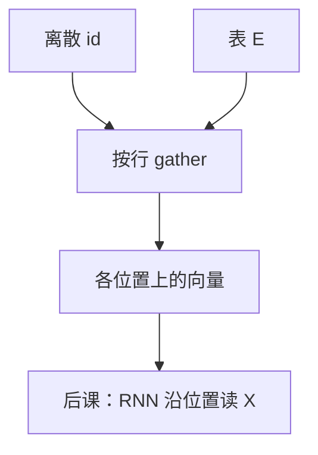

# 嵌入作为查找

编号没有度量；进入矩阵乘之前，每个 id 只是在一张表里选一行。那一次选择叫查找，不叫第一层稠密乘。

<footer>—— 据 Bengio et al., JMLR 2003；Mikolov et al., 2013 整理</footer>

[子词的动机](/llm/why-subword)把符号粒度收成有限片段。本课不重写切分。缺口是：id 仍是整数，不能做 $Wx$。方法是查找表 $E\in\mathbb{R}^{|V|\times d}$，$e_t=E[t]$。主干稍后的[Token 嵌入查找](/llm/embedding-lookup)会在 Transformer 宽度上再写一遍工程细节；本课在基础课里先把「离散 $\to$ 向量」的接口钉住，并交给循环网络去吃这些向量。不要在这里展开位置编码。

## 问题

分布假设与 skip-gram 已经把词当成向量来训，但接口常常被说成「one-hot 乘 $E$」。代数上对，实现上错：one-hot 长度为 $|V|$，不能物化。正确接口是 gather：用整数下标取出第 $t$ 行。缺口是把这一次取出写成所有序列模型的输入约定——RNN、稍后的注意力、分类头之前，看见的都是 $X\in\mathbb{R}^{n\times d}$，而不是 id 本身。

梯度是 scatter：只更新被点到的行。这与 NEG 的稀疏更新、与长尾行学不透，是同一机制。子词提高的是「哪些行会被点到」，不改变算子是查找。

### 查找不是把 id 当成标量特征

把编号除以 $|V|$ 送进网络，或把 id 嵌入成 $\sin(\mathrm{id})$，会把任意的词表次序当成度量。词表次序通常是频率或哈希，没有语义。任何对编号光滑的函数都在注入这份假几何。离散身份只能当下标。这与第一课「形状先于算子」并列：类型先于算子——id 是索引类型，不是 $\mathbb{R}$。

padding 也会查出一行。随后必须用掩码挡住损失与状态更新，否则 PAD 行会被学成「句末平均噪声」。特殊符号各占合法 id，不是越界。

## 方法

$T\in\{0,\ldots,|V|-1\}^{B\times n}$ 经查找得 $X\in\mathbb{R}^{B\times n\times d}$，$X_{b,i}=E_{T_{b,i}}$。同一 id 在不同位置取出同一行；位置之间的差异必须由后课的循环状态或位置编码提供。初始化 $E$ 用小方差高斯，避免初始向量过大。训练目标可以是 skip-gram、可以是下一词分类；查找层不关心下游损失的名字，只提供 $X$。越界 id 是协议错误，不是 UNK：UNK 有合法行。

## 机制

查找把监督按符号身份分开，几何由下游如何使用 $X$ 来塑造。若下游是窗口 softmax，$E$ 学成静态词型向量；若下游是 RNN 语言模型，$E$ 仍是静态行，但会被上下文相关的隐状态继续改写——改写发生在状态里，不发生在表内同一行随位置变化。一行一词型（或一子词型），这是本课的边界。上下文相关表示是注意力之后的事。

同一批里重复出现的 id 取出同一行，再沿位置复制进 $X$。这不是广播规则的新例子，而是「身份相同则向量相同」。要让同一符号在句首句末不同，必须靠后课的 $h_t$ 或位置通道去改写副本，不能指望 $E$ 为每个下标存一行——那张表按词表索引，不按时间索引。

批量里只出现一小撮 id，计算稀疏、存储稠密。优化器若为每一行存动量，内存按 $|V|d$ 乘系数。这是工程账，机制上记住即可。与负采样课衔接：NEG 每步只碰少数行，查找的反向本来就是 scatter，两者一致。

## 边界

本课不定义位置编码，不定义 SDPA，不与主干嵌入课抢写 tying、多语言模型。下一课[RNN 与长程依赖](/llm/rnn-long-range)假定输入已是向量序列，问状态如何沿时间走。后课默认：序列模型的输入是查找得到的 $X$，编号从不直接进入 GEMM。共享输入输出嵌入是主干课的缺口，本课的 $E$ 只负责输入侧。

## 小结

- 离散 id 通过 $E[t]$ 变成向量，实现是 gather 不是稠密 one-hot 乘。
- 编号无度量；对 id 的光滑函数会注入假几何。
- 梯度只更新被点到的行；PAD 必须掩掉。
- 表内一行不随位置改变；位置差异交给后课的状态或位置编码。
- 同一 id 取出同一行，再沿位置复制；身份相同则向量相同。
- 出处：Bengio et al., 2003；Mikolov et al., 2013。
