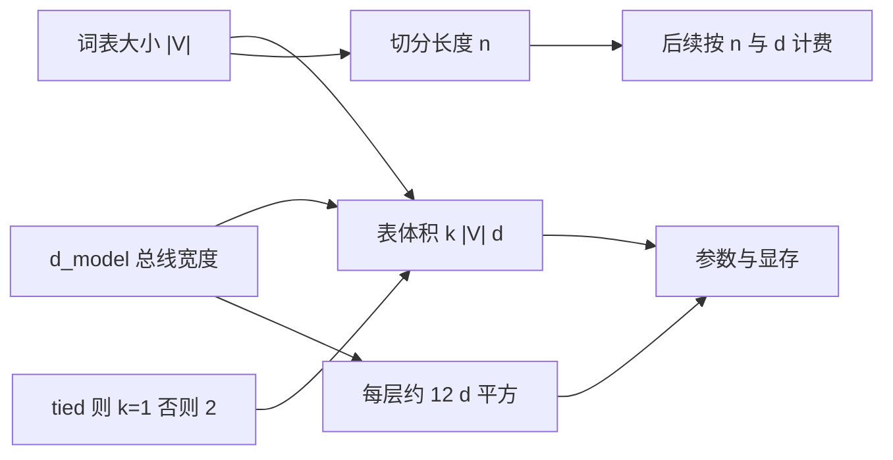

# 词表宽度与 d_model

嵌入把每个符号放到宽为 $d_{\mathrm{model}}$ 的向量里；这个宽度此后就是残差流的宽度，词表有多宽、模型有多宽，表的体积就是二者的乘积。

<footer>—— 据 Vaswani et al. 对 $d_{\mathrm{model}}$ 作为各层共享宽度的设定整理</footer>

[上一课](/llm/tied-untied-embedding)决定了输入表与输出表算一份还是两份。本课不重讲 tying 的几何。缺口是：这一份（或两份）的形状是 $|V|\times d_{\mathrm{model}}$，两个因子来自不同课序——$|V|$ 来自分词，$d_{\mathrm{model}}$ 是后面所有块必须对齐的总线宽度。嵌入单元的最后一课要把这笔内存账算清，并说明为什么不能把嵌入维单独设成与块宽度不同的数，除非再加一层投影。

## 问题

[Tied vs untied 嵌入](/llm/tied-untied-embedding)只回答共享。不共享时参数是 $2|V|d$，共享时是 $|V|d$（外加可选偏置）。$d$ 取多少？若只从查表出发，嵌入可以很窄，后面再升维；若从残差块出发，块内矩阵是 $d\times d$ 量级，希望一进网络就在工作宽度上。Vaswani 把嵌入维直接取成 $d_{\mathrm{model}}$，查找结果原样进入层。于是词表有多宽、模型有多宽，两者相乘就是嵌入占用的参数与显存，没法拆开优化其中一个而不碰到另一个。

小模型上这笔账很刺眼：$|V|=32\mathrm{k}$、$d=512$ 已是一千六百万参数；$|V|=128\mathrm{k}$、$d=4096$ 则是五亿量级，开始能在总参数里看见。大模型块内矩阵占主导，嵌入占比下降，但加载、分片、优化器状态仍然按整表走。本课的问题是容量分配：把参数花在更宽的 $V$（更短的序列、更少 UNK）还是更宽的 $d$（每层更强的通道），以及这两者如何通过长度再进入计算预算。

### 为什么嵌入维通常等于块宽度

残差相加要求被加的张量同形。若 $E[t]\in\mathbb{R}^{d_e}$、$d_e\neq d_{\mathrm{model}}$，必须立刻做一次 $d_e\to d_{\mathrm{model}}$ 的投影才能进入 [残差流](/llm/residual-stream)。这多一张矩阵，也多一次可以过拟合的线性。因式分解嵌入、自适应输入走的就是这条路：故意让 $d_e\lt d_{\mathrm{model}}$，用投影换表体积。默认架构不走，是为了少一个接口。本课以默认为主，把投影当成边界上的逃逸口。

$d_{\mathrm{model}}$ 不是「嵌入专属超参」。它是注意力头维之和、FFN 输入维、层归一化的特征维。改它等于改整网。只为了省嵌入表去减 $d$，会把每一层的容量一起砍掉。

## 方法

记嵌入参数 $P_E=k|V|d_{\mathrm{model}}$，$k=1$ 或 $2$ 由 tying 决定。对照一块 Transformer 里注意力与 FFN 的主导项：大约 $12\,d_{\mathrm{model}}^2$ 量级（具体系数随是否用 GLU、是否共享 KV 而变，后课再拆）。$L$ 层则约 $12 L d_{\mathrm{model}}^2$。比较 $P_E$ 与块参数，能看见嵌入在总账里的份额。增大 $|V|$ 只加 $P_E$ 和分类计算；增大 $d_{\mathrm{model}}$ 则 $P_E$ 与每一层一起涨，且序列计算按 $d$ 线性到平方变贵。

长度这边，[词表大小与 UNK](/llm/vocab-size-unk)已经说明：$|V|$ 变大通常缩短 $n$。注意力按 $n^2 d$ 计费时，更大的词表可能用嵌入参数换计算。比较方案应固定原文字节，同时看 $P_E$、层参数和实际 $n$，而不是只看「嵌入占百分之几」。

### 分片与优化器状态

表按行切很自然：id 路由到持有该行的设备。这与按 $d$ 切不同。优化器若存 Adam 的一二阶，嵌入相关内存再乘约两倍。训练步只更新出现过的行，但状态往往仍为整表预留，除非实现做稀疏状态。推理则只需一份 $E$（tied 时与输出共享同一存储，logits 用 $h E^\top$ 不必另存）。这些实现选择不改变公式 $P_E=k|V|d$，只改变系数和能否省状态。

把词表扩到十万以上时，先查 $P_E$ 再决定要不要 tying、要不要因式分解。不要先扩 $V$ 再惊讶嵌入「突然」成为内存瓶颈——乘积是本课已经写明的。

## 机制

$d_{\mathrm{model}}$ 是通信带宽。嵌入行必须活在这条带宽里，才能和后面各层的增量相加。于是词表宽度 $|V|$ 决定有多少个身份，模型宽度 $d$ 决定每个身份的通道数。身份多、通道窄：许多符号挤在低维里，几何容易叠在一起。身份少、通道宽：每个符号很丰满，但切分更碎，身份的一部分被推到层间组合上去完成。分词课序与嵌入课序在这里交账。

分类计算同样是 $|V|\times d$ 的点积。Tied 时它与查找共享存储，计算省不掉：每步仍要对全部类打分，除非用自适应 softmax 等近似。因此大词表的隐藏成本不只是存 $E$，还有每步 $|V|d$ 的 logits。小 $d$ 会减轻这项，但再次与整网宽度绑死。

### 容量该留给表还是留给层

经验分配没有闭式解。编码任务、多语言覆盖更吃 $|V|$；深度推理、上下文混合更吃 $d$ 与层数。能确定的只有会计恒等式和接口约束：默认 $d_e=d_{\mathrm{model}}$；改 $|V|$ 必改 $P_E$ 与 $n$；改 $d_{\mathrm{model}}$ 必改整网。下一单元的残差流将把 $d_{\mathrm{model}}$ 当成已经选定的总线宽度，不再回头问嵌入表为什么是这个形状。

因式分解嵌入把 $E$ 写成 $|V|\times r$ 与 $r\times d$， $r\ll d$。这是故意让身份先活在窄空间再升维，省的是 $P_E$，伤的是嵌入几何的直接带宽。它是逃逸口，不是默认。

## 边界

自适应输入按词频分桶用不同宽度，长尾用更窄的行再投影到 $d_{\mathrm{model}}$，打破「每行等宽」。它改变 $P_E$ 的斜率，不改变总线宽度。输出侧的自适应 softmax 同理，只省 logits 计算与输出矩阵，不省输入查找，除非两边一起做。这些变体出现在内存极度紧张或 $|V|$ 到百万时；主干默认仍是等宽整表。

嵌入单元到此结束。后面的残差块假定：每个位置上已经有一条宽为 $d_{\mathrm{model}}$ 的向量，来自查找（加位置，若有）。不再解释 $E[t]$ 是什么，也不再比较 tied 与否。若内存爆在词表上，回到本课改 $|V|$、$d$、tying 或因式分解，而不是去改注意力公式。

## 小结

- 嵌入表体积是 $k|V|d_{\mathrm{model}}$；$k$ 由 tying 决定，$d_{\mathrm{model}}$ 是整网总线宽度。
- 默认嵌入维等于块宽度，否则残差相加前必须投影。
- 增大 $|V|$ 主要加表与 logits，并通常缩短序列；增大 $d$ 则表与每一层一起涨。
- 比较方案要同时看参数、优化器状态和原文字节下的 $n$。
- 因式分解与自适应输入是窄嵌入再升维的逃逸口，不是默认。
- 出处：Vaswani et al., NeurIPS 2017；自适应输入见 Baevski & Auli, ICLR 2019。
