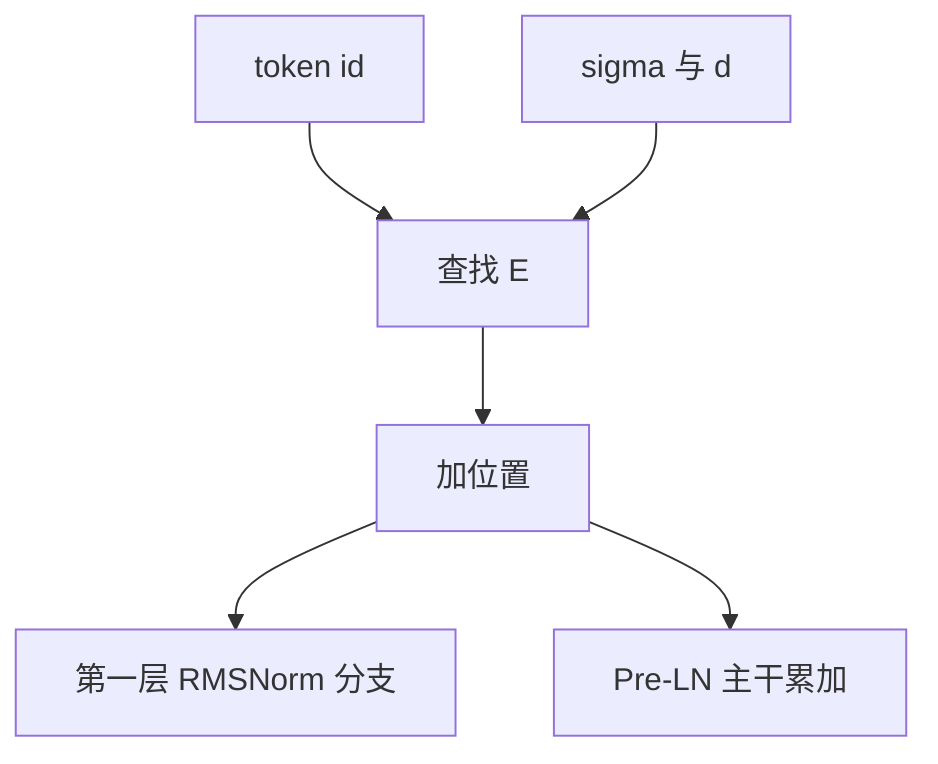

# 嵌入初始化与尺度

输入嵌入是查找表，不是以扇入计的 GEMM；它的行范数直接成为残差流的起点，也直接乘进词表 softmax 的 logits。

<footer>—— Vaswani et al., NeurIPS 2017 对嵌入乘 $\sqrt{d_{\mathrm{model}}}$；尺度随宽度的定标见 Yang 等，Tensor Programs V / μP</footer>

[上一课](/llm/depth-scaled-init)把残差分支按层数缩小。缺口转到流的**起点**： [嵌入查找](/llm/embedding-lookup) 的表 $E\in\mathbb{R}^{|V|\times d}$ 没有 fan-in 矩阵乘，Xavier 公式里的 $n_{\mathrm{in}}$ 不适用。行向量的 $\ell_2$ 范数决定第一步 LayerNorm 看见什么、注意力第一层的 $Q,K$ 从哪来。Vaswani 等人在表上再乘 $\sqrt{d_{\mathrm{model}}}$；μP 则把输入层当成「有限宽到无限宽」的边界，学习率与方差另表。本课只钉输入表，输出头下一课才接。

## 问题

token id 的前向是 gather： $x_t=E_{w_t}$。没有「扇入个独立项相加」，方差不会自动按 $d$ 平均掉。若每分量 $\mathcal{N}(0,\sigma^2)$，则行范数的期望大约 $\sigma\sqrt{d}$。$\sigma=1$ 时 $d=4096$ 的行范数已是几十，第一层 [RMSNorm](/llm/rmsnorm) 会把它们压回，但增益起步为 1 时，归一化前的动态范围已经进半精度的危险区；$\sigma=0.02$ 则行范数大约 $0.02\sqrt{d}$，在 $d=768$ 时约 0.55，在 $d=8192$ 时约 1.8——同一魔法数随宽度漂。

位置编码（绝对正弦或 RoPE 的基）与 token 表相加或相乘，会再改起点。本课不重讲 RoPE，只要求：**量初始尺度时，必须在「token + 位置」之后、第一层 LN 之前取范数**，不要只打印 $E$ 的直方图。

词表尾部的稀有 token 梯度稀疏，Adam 的二阶矩长期偏小，同样 $\sigma$ 下有效更新更大。初始化方差与 [AdamW](/llm/adamw) 的分词频率纠缠，这是稳定性课才会展开的「嵌入学习率」问题；本课先把 $\sigma$ 与 $d$ 的关系写对。

## 方法

三种常见挂法，选一种写进配方。

**固定小标准差。** GPT-2 / GPT-3 一类用 $\sigma\approx 0.02$，与残差投影同一数量级。宽度一变就必须重测行范数；它不是扇入公式。

**乘 $\sqrt{d_{\mathrm{model}}}$（Vaswani）。** 表内用较小方差，查找后再乘 $\sqrt{d}$，使嵌入进入后续层的幅度与 $d$ 同阶。这与 SDPA 的 $1/\sqrt{d_k}$ 不是同一处旋钮：一个抬输入，一个压点积。两者同时用时要在 coord check 里看第一层注意力 logits，而不是各自「看起来都像论文」。

**μP 输入列。** 输入嵌入的宽度维被当作 fan-out 增长：初始化方差与 Adam 学习率乘数跟隐藏层不同，避免加宽后第一步就把流放大。Yang 等人强调：把隐藏层的 $1/d$ 错贴到嵌入，会出现「宽模型 logits 消失或爆炸」。实现上用 `infshape` 标记哪一维是宽度，不要手写一套与库不一致的表。

[Tied 嵌入](/llm/tied-untied-embedding) 把 $E$ 与输出矩阵焊在一起，则本课的 $\sigma$ 同时决定初始 logits 幅度。untied 时可以输入小、输出更小（下一课）。先决定是否 tying，再选 $\sigma$，顺序不能反。

## 机制

RMSNorm 对每个位置做 $x/\mathrm{RMS}(x)$ 再乘 $\gamma$。$\gamma=1$ 时，**归一化后的**尺度被钉住，看似嵌入 $\sigma$ 无关。训练初期 $\gamma$ 几乎不动，但残差加法发生在 Pre-LN 的主干上：未归一的 $x$ 仍带着嵌入范数往上累加。所以「有 LN 就可以乱初始化嵌入」不成立——LN 管的是进 $F$ 的分支，不管主干范数（Pre-LN）。Post-LN 把 LN 放在加法后，嵌入尺度会被每层打回，但对梯度雅可比不友好，不能当初始化的借口。

嵌入行之间的点积决定「哪些 token 一开始就被当成近邻」。过大的 $\sigma$ 让点积饱和，词表 softmax 一开始就自信而错；过小的 $\sigma$ 让所有 token 几乎不可分，前几步只在学一个均匀先验。合理起点是：未训练模型的 CE 接近 $\log|V|$，略好或略差都可以，但不能差出一个数量级。

## 边界

本课不讨论 sentencepiece 词表大小——那是缩放单元的词表定律。也不讨论把嵌入从权重衰减里豁免：那是 [AdamW](/llm/adamw) 分组，稳定性课会单写。多模态把图像码与文本码拼进同一张表或并列两张表时，两套熵不同，Chameleon 一类工作用 QK-Norm 补点积，不是把文本 $\sigma$ 原样贴到图像码上。

## 小结

- 嵌入是 gather，没有 Xavier 的扇入平均；行范数 $\sim\sigma\sqrt{d}$ 随宽度漂。
- 量尺度要在 token+位置之后、第一层 LN 之前。
- 固定 0.02、乘 $\sqrt{d}$、μP 输入列三选一；tied 时输入 $\sigma$ 连着输出 logits。
- Pre-LN 的主干不被 LN 钉死，有归一化仍要管嵌入范数。
- 出处：Vaswani et al., NeurIPS 2017；Yang 等，Tensor Programs V。
