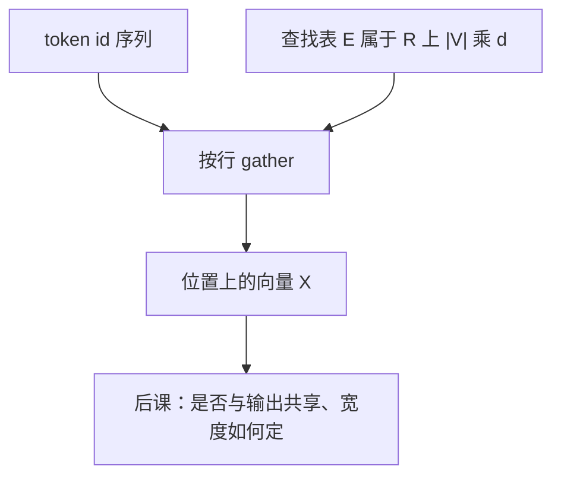

# Token 嵌入查找

我们用可学习的嵌入把输入符号与输出符号映成维度为 $d_{\mathrm{model}}$ 的向量，这是后续各层共享的宽度。

<footer>—— 据 Vaswani et al., Attention Is All You Need, NeurIPS 2017 整理</footer>

[上一课](/llm/detokenize-roundtrip)把 id 序列与字符串的往返协议钉死。本课不重讲切分、UNK 或空格元符号。缺口是：编号仍是离散的，网络的加减与非线性需要 $\mathbb{R}^{d}$ 里的向量。方法是一张查找表 $E$，把每个 token 映成一行：$e_t=E[t]\in\mathbb{R}^{d}$。这是「嵌入」单元的第一课；是否与输出层共享、表有多大，是后两课。

## 问题

[离散符号与词表](/llm/token-as-discrete-unit)给出的对象是 $t\in V$ 的整数。整数不能直接进入矩阵乘：编号的算术没有意义，相邻 id 不必相邻。若把 id 当成标量特征来用，模型会以为 17 比 16「大一点」。正确的接口是无度量的查找：每个编号对应一条独立的向量，向量之间的几何完全由训练决定。

查找表把离散问题变成「选一行」。选中的行成为该位置上残差流的初始内容（位置编码若存在，会加在这之上，那是后面位置课序的事）。没有这张表，后面的块没有可写的总线起点。本课只定义这一次查表，不定义层与层之间如何改写向量。

### 查找不是 one-hot 矩阵乘的实现细节

代数上 $e_t$ 等于 one-hot 向量乘 $E$。实现上从不物化 $|V|$ 维稀疏向量，而是一次 gather：用整数下标从连续内存里取出 $d$ 个数。梯度同样是 scatter：只更新被点到的行。把嵌入理解成「第一层线性」在数学上没错，在工程上会误导人去走稠密 GEMM、去给未出现的行分配计算。它是查表。

$d$ 在本课只是嵌入行的宽度。它稍后会等于残差流宽度 $d_{\mathrm{model}}$，那是为了让相加合法。本课不讨论为什么取 4096 而不是 512，那是 [词表宽度与 d_model](/llm/embedding-dmodel) 的账。

## 方法

设 $E\in\mathbb{R}^{|V|\times d}$，第 $t$ 行记为 $E_t$。一批序列 $T\in\{0,\ldots,|V|-1\}^{B\times n}$ 经过查找得到 $X\in\mathbb{R}^{B\times n\times d}$，其中 $X_{b,i}=E_{T_{b,i}}$。padding 位置仍会查出一个向量，通常紧接着被掩码乘零，或根本不参与后续注意力的键值。特殊符号各有自己的行：EOS 的向量会学成「这里该停」，PAD 的行往往接近任意，因为掩码挡掉了它的影响。

初始化常用较小的高斯或按 $1/\sqrt{d}$ 缩放，避免初始向量过大、把后面的层归一化推到奇怪的尺度。训练目标通过后续层的反传到达被点中的行。一个 token 若在语料里几乎不出现，它的行停留在初始化附近——这与上一单元「长尾行学不透」是同一现象，只是现在能指到具体的矩阵行。

### 位置上的加法尚未发生

本课的输出是「每个位置一个内容向量」。绝对位置嵌入会再查另一张长度为上下文上限的表，与 $X$ 相加；旋转位置则在注意力里改写查询键的相位。那些都还没发生。先保证内容查找本身是 gather，再谈位置，否则会把 $E$ 和位置表揉成一张说不清的「输入矩阵」。

共享词表的多语言系统里，同一行可能被许多语言点到，几何是混用的。这不是 bug，是容量分配：高频语言会主导这些行的更新方向。

## 机制

查找把监督信号按符号身份分开。梯度 $\partial L/\partial E_t$ 只含那些 $t$ 出现过的位置的贡献。这造成自然的频次加权：常见 token 的行被反复拉向有用的方向，罕见行噪声大。子词切分的一个作用，就是让罕见词形去点那些更新更勤的短符号行，而不是去点一条几乎不动的整词行。

因为行与行之间在表内没有耦合（除非后面用 tying、因式分解或自适应输入把表结构改掉），嵌入几何完全由它们在后续块里被如何读写来塑造。两行可以学成几乎平行，也可以学成正交。id 相近不提供归纳偏置。任何「相似词应靠近」都是损失与数据的结果，不是查找表的结构。

### 批量与稀疏更新

大词表时，$E$ 往往是模型里第一块连续的大矩阵，但一步训练只碰其中很小的行子集。优化器若为每一行维护动量与二阶统计，内存会按 $|V|\times d$ 再乘系数。实现可以选择对嵌入用更简单的优化器状态，或把表分片到多卡上按 id 路由。这些是内存课会再碰到的点；机制上只需记住：计算是稀疏的，存储是稠密的。

不要在查表前把 id 归一化或嵌入成浮点特征。任何对编号的光滑函数都会把任意的编号秩序注入模型。离散身份只能通过下标使用。

## 边界

查找表假定 id 在 $0\ldots|V|-1$ 内。越界是实现错误，不是 UNK：UNK 是合法编号，越界是协议被破坏。冻结嵌入、只训练后面的层，在领域适应里常见，等于声明「符号几何已经够用」。多模态里视觉切片也走查找或线性投影，但视觉侧通常不是一张 $|V|$ 行的离散表，而是补丁的线性映射；不要把两者叫成同一个算子。

本课之后，默认「输入已经是 $X\in\mathbb{R}^{n\times d}$」。下一课问这张 $E$ 要不要与分类头共用；再下一课把 $|V|$ 与 $d$ 的乘积写成内存预算。不在本课展开残差或注意力。

## 小结

- 离散 id 通过查找表 $E\in\mathbb{R}^{|V|\times d}$ 变成向量 $E[t]$，实现是 gather 不是稠密乘。
- 编号无度量；行与行的几何完全由训练决定。
- 梯度只更新被点到的行，故长尾行学不透、短符号行更新勤。
- 位置编码尚未加入；本课只提供内容向量。
- 后续块默认输入已是宽为 $d$ 的序列。
- 出处：Vaswani et al., NeurIPS 2017（学习嵌入作为 $d_{\mathrm{model}}$ 宽度的入口）。
