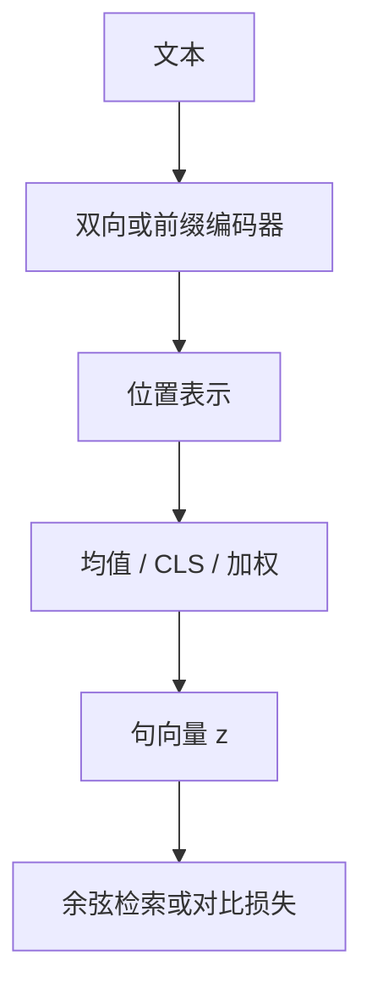

# 嵌入模型的池化

用孪生双向编码器分别编码句对，并以均值池化得到句向量，比拿 CLS 向量做余弦更适合语义检索。

<footer>—— Reimers &amp; Gurevych, Sentence-BERT, EMNLP 2019</footer>

[上一课](/llm/bidirectional-prefix-mask)让单栈也能给前缀双向表示，但输出仍是变长的隐状态序列。检索、聚类、路由要把一条文本收成固定维向量。本课补池化：在双向（或前缀）编码器的最后一层上，如何把 $m$ 个位置合成一个 $d$ 维句向量。单元到此结束；下一单元改注意力内部的门与共享，不再把编码器当主对象。

## 问题

[BERT 编码器](/llm/bert-encoder)把 `[CLS]` 训成分类查询，NSP 与句对分类会用它。直接拿 `[CLS]` 做余弦相似度，Reimers 与 Gurevych 观察到排序很弱：那个位置优化的是分类间隔，不是度量空间里的语义距离。缺口是：**句向量的训练目标与池化算子必须一起选**，不能假定编码器最后一层的某个特殊 token 已经是嵌入。

纯解码器末 token 或均值也可以凑句向量，但因果掩码让靠前的 token 从未看见全句，池化平均的是一串不对称的前缀表示。双向或前缀全可见，是池化有意义的前提。

本课的嵌入是语义向量，不是输入层的 token embedding，也不是量化课里的权重量化。

## 方法

记最后一层隐状态 $H\in\mathbb{R}^{m\times d}$，有效位置集合 $\mathcal{I}$（去掉 padding、常去掉 `[CLS]`/`[SEP]`）。均值池化

$$
z=\frac{1}{|\mathcal{I}|}\sum_{i\in\mathcal{I}} h_i,
$$

可选再乘一个线性 $W$ 降到嵌入维。最大池化取各维最大值，对短句噪声敏感。`[CLS]` 池化即 $z=h_{\mathrm{CLS}}$。加权均值用注意力或 IDF 当权。对比学习（NLI 句对、检索正负例）的损失加在 $z$ 的余弦或温度缩放点积上，反向传到整段双向栈。

Sentence-BERT 的默认实践：孪生双塔，两句独立过同一编码器，均值池化，用分类或回归头训 NLI；推理只保留编码器与池化，句向量可缓存。后课若说「嵌入模型」，默认是这种双塔加池化，不是交叉编码器逐对打分。

### 双塔与交叉编码器

交叉编码器把两句拼成一对，用双向注意力直接打相关分，准但不可预计算。池化嵌入把交互推迟到向量点积，准度通常略低，规模上可以先检索再交叉重排。本课只钉死池化这一侧。

## 机制

均值把每个位置当成一次对句向量的投票，梯度均匀回传到可见 token，迫使各位置都携带可加的语义，而不是把信息堆进 `[CLS]`。对比损失再把同一语义的 $z$ 拉近、不同的推远，池化后的空间才有余弦意义。若仍用 MLM 损失而不加对比，均值向量常常塌成各向近乎同质的表示，检索崩溃。

长度归一化 $1/|\mathcal{I}|$ 避免长文档仅仅因为项多而范数膨胀。有的配方再对 $z$ 做 $\ell_2$ 归一化，让下游只剩角度。

指令式嵌入会在前缀放「把下面的文档编成检索向量」一类提示。池化仍发生在提示加文档的双向段上；提示是条件，不是第二个句子的交叉注意力。

## 边界

池化丢掉词序与对齐，否定、数量、细粒度论元容易糊。需要字面匹配或重排时，应回到 token 级交叉注意力，而不是把均值向量做得更宽。因果解码器当嵌入模型，必须改掩码或只池化能看见全句的位置，否则前半句表示系统性偏弱。`[CLS]` 在分类微调后可以很好，迁移到检索仍应重训池化目标。

## 小结

- 句向量需要池化算子加度量目标；BERT 的 `[CLS]` 不是检索默认。
- 均值池化在全可见掩码上把各位置收成可加语义，对比学习赋予余弦意义。
- 双塔可缓存，交叉编码器更准但不可预计算；二者不要混成同一种「嵌入」。
- 因果栈未经掩码改造就均值，会平均一串不完整的前缀表示。
- 出处：Reimers & Gurevych, *Sentence-BERT*, EMNLP 2019。
