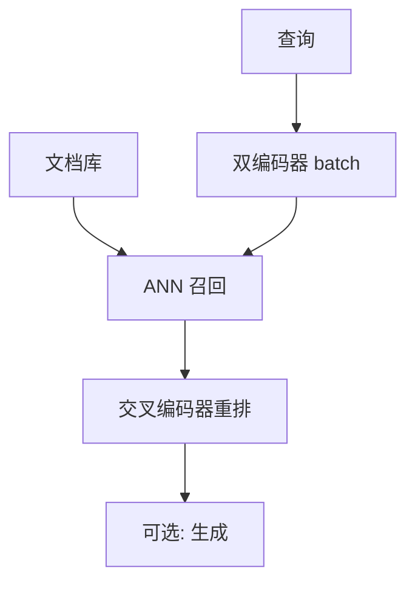

# 嵌入与重排模型服务

双编码器一次前向吐向量，没有逐步 decode，也没有 KV 墙；批处理回到普通 BERT 式 GEMM，调度却仍常被误套成自回归引擎。

<footer>—— Reimers & Gurevych, Sentence-BERT, EMNLP 2019；重排器是交叉编码器，计算随候选对数涨</footer>

[上一课](/llm/vision-encoder-pipeline)仍接到自回归 LLM。检索栈里还有嵌入模型与重排模型：Sentence-BERT 把句子映到向量，用余弦召回；交叉编码器把 (查询, 文档) 一起编码打分。本课写服务画像差异：无 KV 缓存、无 TPOT、吞吐随 batch 与序列长度走普通屋顶线。用 vLLM 的连续批去套嵌入，会买一套用不上的分页 KV。Hugging Face TEI 一类专用服务才对症。

## 问题

嵌入请求是一次 prefill 式前向，输出 $d$ 维向量，可大批、可padding。重排是对每个候选一次交叉编码，$k$ 候选就是 $k$ 次（或拼 batch）。缺口是不要用 decode 会计：这里没有 $\mathrm{KV}(n)$ 随生成增长，有的是短序列的高 QPS。延迟 SLA 是 p99 毫秒级向量，不是 TPOT。把嵌入与 LLM 放同一连续批，形状与掩码都不同，核融合也不同。

动态 padding：批内按最长序列 pad，过长尾巴浪费。应按长度分桶，与训练不同，这是服务分桶。

重排器的 FLOPs 随候选数线性，召回 $k=200$ 再重排 50 是典型。成本模型应写在检索路径上，不要记进「每个用户问题一个 LLM token」。RAG 的隐藏账单往往在这里。

## 方法

嵌入：静态或半静态形状，CUDA Graph 友好，`torch.compile` 收益比 LLM decode 更干净。大 batch 直到拐点。多卡用数据并行复制模型，不必 TP——模型往往放得进单卡。重排：候选 batch 维，注意注意力掩码。与 LLM 协同：异步队列，不要在 LLM 的 GPU 上同步插一条嵌入前向（打乱 decode 池工作点）。

向量维与归一化是契约（是否 L2），服务端必须与训练一致，否则检索静默变差。

## 机制

算术强度随 $B$ 与 $n$ 升，容易 compute-bound，MFU 可比 LLM decode 高一个数量级。这解释了为什么同一张卡跑嵌入「看起来利用率很好」、跑聊天 decode「利用率很差」——不是嵌入实现更强，是工作点不同。成本 $C$ 按请求或按 token 计都可以，但不要用 LLM 的 $C_{\mathrm{tok}}$ 乘嵌入 token。

## 边界与工程取舍

不要为嵌入建 KV 池。不要把交叉编码器当双编码器用（QPS 会垮）。下一课回到 LLM：权重如何加载与流式进 GPU，这才是自回归服务启动的账单。

出处：Reimers & Gurevych, EMNLP 2019。TEI 等为工程实现。不发明 arXiv。

## 小结

- 嵌入无 decode KV；服务画像是短序列高 QPS GEMM。
- 重排成本随候选数线性，是 RAG 隐藏账单。
- 长度分桶；CUDA Graph / compile 比 LLM decode 更适用。
- 与 LLM 分池，避免打乱 $B^\star$。
- 归一化与维是检索契约。
- 下一课：权重加载与流式。
- 出处：Reimers & Gurevych, 2019。
