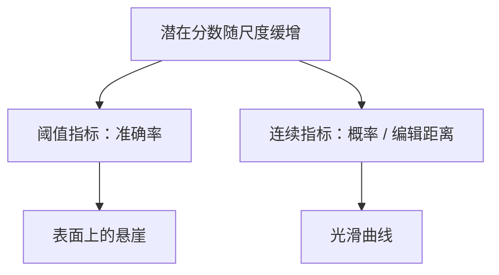

# 涌现能力争论

有些下游指标在某一尺度上近乎从零跳到可用；换成分数式度量之后，同一能力往往早已随损失光滑上升，所谓涌现可以是指标的非线性，而不是损失面的相变。

<footer>—— Wei et al., Emergent Abilities of Large Language Models, TMLR 2022；Schaeffer, Miranda & Koyejo, Are Emergent Abilities of Large Language Models a Mirage?, NeurIPS 2023</footer>

[上一课](/llm/scaling-law-fitting)禁止用下游准确率去拟合幂律。缺口正是 Wei 等人称作 **emergent abilities** 的现象：某些任务在小模型上近随机，到某一 $N$ 或 $C$ 突然变好。Schaeffer 等人争辩：若指标是阶跃的（完全匹配、多选对错），光滑的对数似然改善会被折成悬崖；换用连续度量，悬崖消失。本课站在缩放实践里：规划预算时，不要把「涌现点」当成和 Chinchilla 谷底同级的可拟合对象。

## 问题

Wei 等人收集了若干任务，在对数尺度的参数轴上呈现非线性跳变，并讨论是否需要新的理论。这对产品叙事很强：「不到某规模就没有某能力」。对拟合很危险：你会去找那个拐点并外推它，而拐点依赖题数、提示、以及是否允许部分分。

Schaeffer 等人把同一模型输出改成连续分数（如 token 级概率、编辑距离、Brier），许多悬崖变成平滑曲线。结论不是「没有质变」，而是：**先排除指标非线性，再谈相变**。真正的回路形成（induction 在小模型上也可突然出现）是训练动态，与「70B 才涌现」不是同一命题。

多选题准确率在模型把正确选项 logit 从第 4 抬到第 1 时才动，之前的校准改善全部看不见。这是度量的阈值，不是能力在那一步才被创造。

## 方法

报告能力随尺度变化时：

1. 同时打损失 / BPB 与下游。损失应光滑（拟合课已洗过）；下游若悬崖，先换连续度量复画。
2. 固定提示与解码（贪婪 vs 采样），多种子。悬崖若随提示移动，那是提示敏感不是尺度相变。
3. 不要对准确率做对数横轴上的分段回归来「预测涌现点」并据此买卡。
4. 把训练动态里的突变（阶段课、Olsson）与评测规模曲线分开：前者是某次训练的 step 轴，后者是模型家族的 $N$ 轴。

若连续度量也出现急剧弯曲，再讨论数据覆盖、回路、或任务是否需要某深度——那是深度对宽度课的表示墙，仍不是准确率拟合出的魔法规模。

## 机制

设潜在能力 $s$ 随 $N$ 缓增，指标 $1[s>t]$。在 $s$ 过 $t$ 时准确率跳变。$t$ 由评分规则决定。改变 $t$（部分分、pass@k）会移动悬崖位置，这是 Schaeffer 的核心机制解释。它解释了大量「涌现」图，但不声称所有非线性都是假的：softmax 饱和、离散程序突然可执行，也可以产生真弯曲。实践态度是怀疑指标，保留对真弯曲的检验，而不是先验取消质变语言。

## 边界

本课不评判哪一篇「赢了」。规划上：计算最优与推理最优用损失与 FLOPs；产品能力用多种度量与提示鲁棒性，不用单一涌现点。把「某规模才突然会某题」写进里程碑，会迫使你买训练最优的大 $N$，即使连续度量显示小模型过度训练已经够用。

下一课把「训练计算最优」改成计入**推理**次数的最优——那会把谷底推向更小、训更久的模型，与涌现叙事里「必须更大」进一步分开。

## 小结

- Wei 等人记录了下游指标的尺度非线性；Schaeffer 等人指出阈值度量可把光滑改善折成悬崖。
- 先复画连续度量与提示鲁棒，再谈相变；禁止用准确率拟合涌现点来定 $N$。
- 训练动态突变与家族尺度曲线是两根轴。
- 规划仍以损失与 FLOPs 为主，能力用多度量。
- 把准确率悬崖写进买卡里程碑，会与过度训练的较小模型抢预算。
- 出处：Wei et al., TMLR 2022；Schaeffer, Miranda & Koyejo, NeurIPS 2023。
