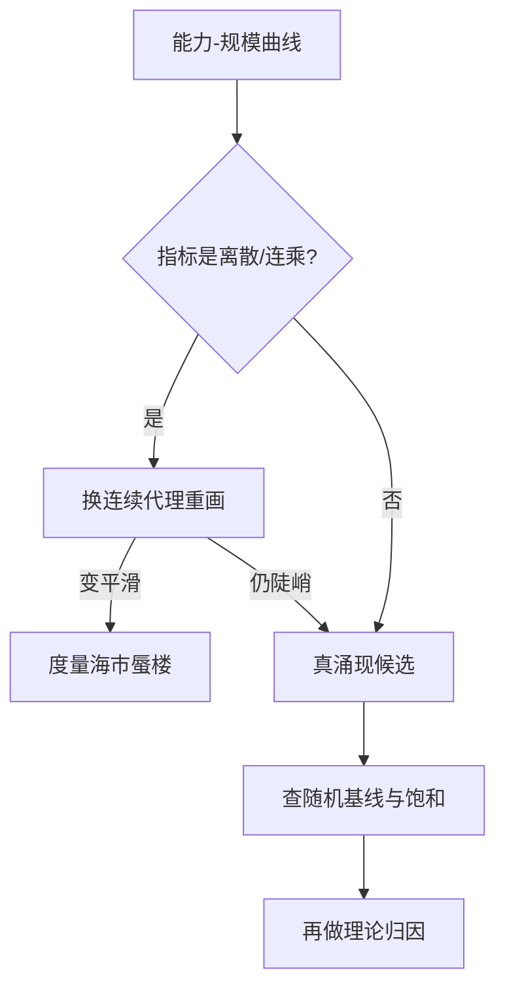
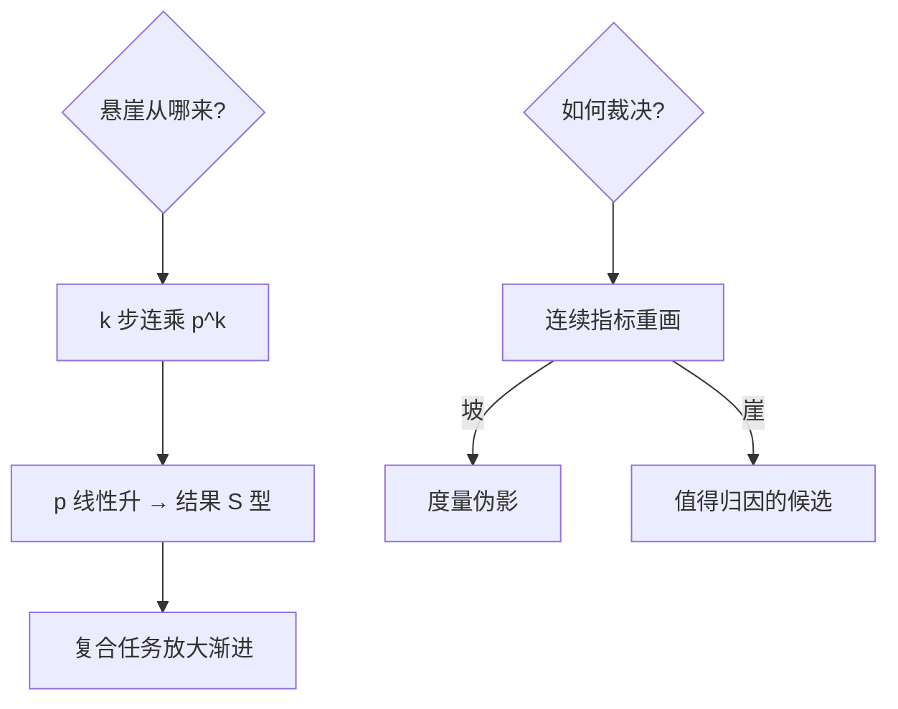

# 能力涌现之争

能力在某个规模「突然」出现？先看坐标轴：换一把非线性尺子，涌现的悬崖常被抹成斜坡。

<footer>—— 据 Wei et al.「Emergent Abilities of Large Language Models」(2022)；Schaeffer et al.「Mirage」NeurIPS 2023</footer>

[注意力掩码](/llm/attention-mask-padding)管训练正确性，本课管如何解读 scaling 的成果：能力是否随规模「相变」。缺口是**涌现之争**——Wei 等的「突现」叙事 vs Schaeffer 等的「度量海市蜃楼」。这一课决定你读 scaling 曲线的眼力。本课不进缩放律拟合本身。

## 问题

Wei et al. (2022) 收集多任务：多数任务性能随规模缓升，少数任务（多步算术、词序辨识）在某个规模前停在随机水平、之后陡升——「涌现」。Schaeffer et al. (2023) 反驳：把指标从 Exact Match 换成 Token Edit Distance，同一批陡升变平滑斜坡。缺口：**突兀是能力的属性，还是度量的属性？**

术语翻译：涌现（emergence）= 小模型无此能力、大模型不可预测地获得；海市蜃楼（mirage）= 阶跃由非线性/不连续的评测指标人为制造；Brier score = 概率化连续指标，把「对错」还原为「置信度离真值的距离」。

数字实例：3 位数乘法，参数 10⁹ 之前 Exact Match 恒 0%，10¹⁰ 后跳到 40%——「涌现」。同一模型换 token-level edit distance：0.9 → 0.7 → 0.5 平滑下降。原因：多步乘法答对需要 10+ 个 token 全对，EM 是这些子步骤的**连乘**，子能力线性提升 × 连乘 = 悬崖。

## 方法

读曲线的三步体检。第一步**查指标**：是离散/非线性（EM、accuracy、pass@k）还是连续/线性（edit distance、log-likelihood、Brier）？第二步**查随机基线**：k 选一任务的基线是 1/k，模型「停在随机水平」可能只是指标 saturate 的另一面；第三步**查平滑替代**：同一能力找连续代理重画一遍——陡崖消失即为度量伪影，陡崖保留才值得理论解释。

直觉类比：考试只报「及格/不及格」——补课从 59 分涨到 61 分像「突然开窍」；改报分数，成绩是从 40 到 85 的斜坡。涌现之争一半是「只发及格证」的度量选择问题。

## 机制

数学机制：**连乘指标的阶跃是子任务可靠性的几何效应**——若答案需要 $k$ 步全对，单步正确率 $p$ 线性升时最终正确率 $p^k$ 呈 S 型陡升；$k$ 越大（任务越长越复合），悬崖越峭。这不是模型能力的相变，是「复合任务把渐进提升非线性放大」。真正的涌现候选（如果存在）应满足：换连续指标后仍陡、且在预训练损失（而非任务指标）上无先兆。Schaeffer 的判语「emergence is a mirage」针对的多数是第一类；Grokking 之类的训练动力学相变则是另一回事——别混为一谈。

常见误区：把「涌现」当投资/立项依据——「能力随时可能出现」的叙事不可证伪；工程上应按连续指标做外推预算。反向误区：全盘宣布「涌现皆幻影」——度量伪影解释陡崖，不解释「为什么这段基线如此低」，能力本身的存在性是另一问题。

## 边界

适用判定矩阵：任务复合度越高（多步推理、代码一次通过），连乘效应越强，「涌现」叙事越可疑；单步感知任务（翻译质量）从来都是平滑的。跨模型比较的坑：不同家族的 tokenizer/预训配比不同，「同规模」不可比，涌现点本身不可迁移。实践守则：报告能力曲线时同时给离散指标与连续代理；用缩放律外推时用连续量；立项叙事避免「突然出现」而用「在 X 预算下达到 Y 可靠性」。与[语义熵与幻觉检测](/llm/semantic-uncertainty)的衔接：连续化的置信度量不仅平反涌现，也是幻觉检测的原料——同一把尺子。

直觉类比：多米诺骨牌推倒 100 张——「能不能全倒」是 0/1 的悬崖，但每张骨牌的稳定性是连续变量；先问「有多少张其实没立稳」（连续代理），再惊叹「为什么第 87 张一倒全倒」（连乘放大）。

## 小结

- 陡崖 = 连乘指标 $p^k$ 对线性提升的几何放大，多为度量伪影。
- 三步体检：查指标离散性、换连续代理、查随机基线。
- 「涌现」叙事不可作立项依据；连续指标才是外推语言。
- 出处：Wei et al. 2022；Schaeffer–Miranda–Koyejo「Mirage」NeurIPS 2023；Ganguli et al. 可预测性讨论。
