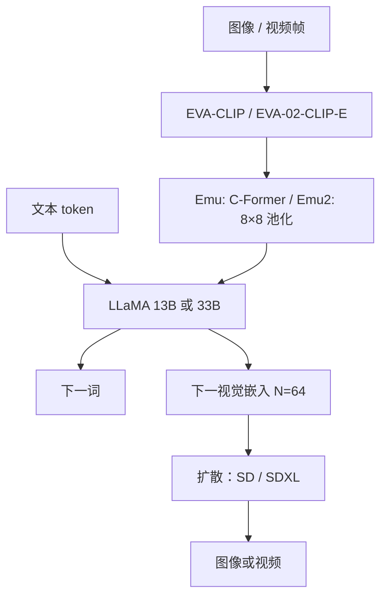

# Emu / Emu2

在交错多模态序列上预测下一个元素——无论它是文本 token 还是视觉嵌入——再把回归出的连续视觉码交给扩散解码器变成图；把规模拉到 37B 之后，少样本视觉提示会从「能做」变成「像在上下文里推理」。

<footer>—— Sun 等，Emu，arXiv:2307.05222；Emu2，arXiv:2312.13286</footer>

北京智源（BAAI）的 **Emu** 线要做的是生成式多模态预训练，而不是只在冻结 LLM 上接一层字幕头。第一代（ICLR 2024，*Generative Pretraining in Multimodality*）把 EVA-CLIP 视觉塔、LLaMA-13B 与扩散解码器接到约 **14B** 的统一自回归目标上。第二代 **Emu2**（CVPR 2024）把骨干换成 EVA-02-CLIP-E-plus + LLaMA-33B，合计约 **37B**，视觉解码器换成 SDXL，并去掉第一代的 C-Former，改成每图 **8×8 均值池化**再线性投影。本篇写两代共用的「下一多模态元素」目标，以及 2 相对 1 简化了什么；不把后续未写入这两篇的 Emu3 离散码本倒填进来。

## 问题

CLIP 对比学习给出对齐的图文空间，但不生成图，也不在交错文档里预测下一句。扩散模型生成图，却不读长文本上下文、不做少样本 VQA。Flamingo 能少样本看图说话，默认不负责出图。[Chameleon](/llm/chameleon) 把图离散化进词表，量化误差直接限制 OCR 与重建。Emu 选第三条：视觉在语言模型里以**连续嵌入**存在，自回归预测下一段视觉向量，再用扩散当 detokenizer。这样理解与生成共享同一条 Transformer，又不必让像素级细节走分类词表。

第一代仍重：C-Former 把视觉特征收成因果视觉 token，训练视觉解码器时每步还要跑语言模型的自回归推断，耦合贵。少样本多模态——用几对示范做视觉提示、物体级生成——在 14B 上只是苗头。Emu2 的问题因此是：把连接器变笨、把解码器解耦、把容量拉到 33B 级语言骨干之后，上下文学习会不会从「格式模仿」变成「当场推理」。

### 下一元素，不是两个独立损失的拼接

统一目标是：交错序列里既有离散文本 $w$，也有连续视觉向量 $v$，模型对文本做分类似然，对视觉做回归（下一嵌入）。图像在输入端由视觉编码器变成固定长度的连续码，与文本 token 交错；输出端若采样到视觉段，就把回归的 $N$ 个嵌入交给扩散。Emu2 取 $N=64$。损失掩码必须覆盖两种元素，只训文本侧就退回「看图说话」，只训视觉侧就退回「条件生成」，都不是这篇的主张。

Emu 表里的 14B 含视觉连接，不要和「LLaMA-13B 纯文本」混成同一服务显存。Emu2 的 37B 是视觉编码器、33B 语言骨干与投影的合计口径，SDXL 解码器还要另算推理显存。

## 方法

Emu：EVA-CLIP 编码 → **C-Former**（因果 Transformer）→ LLaMA-13B 自回归 → 扩散解码图像。数据含图文对、交错图文、视频，使「下一元素」在时间维上也能走。Emu2：编码器换成更强的 EVA-02-CLIP-E-plus；连接器退化成均值池化到 $8\times 8$ 再线性层，不再训练一只重 C-Former；语言骨干 LLaMA-33B；视觉解码器 SDXL，并且**可以脱离语言模型单独训成自编码器**——编码、解码构成连续码的 tokenizer / detokenizer，训练步不再依赖 LM 前向。推理时 LM 吐出 64 个嵌入，再现场解码成图或视频帧。

### 指令微调与少样本协议

Emu2 在预训练后再做指令微调，面向 LMM 问答与主体驱动生成。少样本评测沿用 Flamingo / Emu 的 RICES：按检索挑示范，示范之间用分隔符拼在测试样本前。零样本要把提示改成「一词或短语」，否则 37B 生成式模型会写整句，和短答案基准对不上——这是解码格式，不是能力突然消失。论文强调视觉提示、物体接地生成等需要当场看示范的任务，在规模上去之后才稳定出现。

## 机制

连续码让语言模型工作在 CLIP 空间的线性投影里：相邻 patch 的语义在均值池化后仍在，但空间分辨率被故意压到 64。理解任务够用「全局+粗网格」；要像素级编辑，必须靠扩散解码器读这 64 个条件，而不是靠 LM 直接写像素。C-Former 曾把视觉序列因果化，使「从左到右的视觉 token」与文本同构；Emu2 认为规模上去之后，固定 64 码加更强编码器就够，省掉的是训练稳定性与显存，不是一种新的注意力。

视觉解码器解耦的机制是：自编码器只要求 $v\mapsto \hat I$ 重建，不要求每步与语言损失联合。联合训练时扩散吃到的是带语言噪声的嵌入；解耦后 detokenizer 更干净，论文用 COCO 上 CLIP-I 约 0.907 说明重建，并对照 SEED / Emu 一代。这不自动等于「生成与理解已经对齐」——对齐仍靠 LM 在交错序列上同时预测 $w$ 与 $v$。

### 和离散早期融合、和只理解的 LMM

Chameleon 采样图像码是分类；Emu 采样的是回归向量，温度与分类 softmax 不是同一旋钮。只理解的 LLaVA / InternVL 通常不对视觉 token 计生成损失，不能当出图接口。Emu2 的少样本叙事对标的是 Flamingo 的 in-context，但 Flamingo 冻 LLM、交叉注意；Emu2 是解冻的大解码器吃连续视觉前缀。不要把「少样本 VQA 第一」写成「已经替代指令微调」。

Emu2 论文标题是能力声明：生成式多模态模型可以是上下文学习者。评测数字随示范检索、提示词和是否指令调而变。引用 few-shot 表时写明 RICES 与 shot 数，不要和零样本指令模型的 OpenCompass 总分混成一行。

## 边界与工程取舍

64 个连续码不是高分辨率 OCR 配方；文档理解应另看切格派。扩散解码延迟远高于「再写 32 个文本 token」，交互式混生要把预览分辨率当产品旋钮。LLaMA 权重许可与 BAAI 放出的 Emu 检查点叠加，再分发前逐张读。不要把 14B 的 C-Former 超参抄到 37B 的线性层上。视频是「帧级视觉元素」的延伸，不是单独的时空 Transformer 论文。

服务上应区分三条路径：纯理解（不跑扩散）、文生图（只跑 detokenizer 条件于文本）、交错混生（LM 与扩散交替）。把三条合成一次前向会把延迟打满。连续嵌入的数值尺度要在训练与推理之间钉死，否则 SDXL 条件漂移表现为「能出图但主体错」。主体驱动生成依赖指令数据里的身份一致性，不是预训练目标自动涌现的保脸。

Emu 一代训练解码器时绑 LM 前向，复现成本高于读摘要；要以 Emu2 的离线 detokenizer 为默认实现故事。对比 SEED 等离散/连续混合方案时，对齐的是「视觉码是否可逆」，不是参数量。

出处：Sun 等，*Generative Pretraining in Multimodality*，arXiv:2307.05222（Emu）；Sun 等，*Generative Multimodal Models are In-Context Learners*，arXiv:2312.13286（Emu2，CVPR 2024）。代码与权重见 baaivision/Emu。不要把智源后续 Emu3 的离散 tokenizer 写进 14B/37B 结构表。

## 小结

- Emu / Emu2 在交错序列上预测文本 token 或连续视觉嵌入，再用扩散解码图像。
- Emu 用 C-Former + 13B + SD；Emu2 用 8×8 池化 + 33B + SDXL，解码器可独立当 detokenizer。
- 规模到 37B 后强调少样本视觉提示与物体接地生成；指令微调是另一阶段。
- 与离散词表早期融合、与只理解的投影派账单不同。
- 出处：Sun 等，arXiv:2307.05222 与 arXiv:2312.13286。
