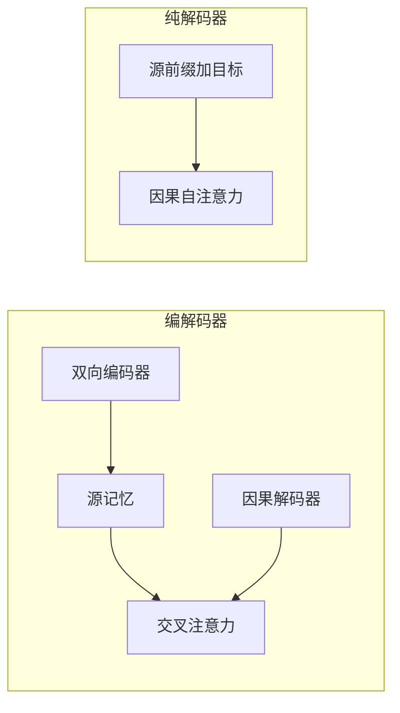

# 编码器-解码器对纯解码器

若把所有任务都写成文本进、文本出，编码器–解码器与纯解码器都能做；差别在源是否值得单独做一次双向编码。

<footer>—— 综合 Raffel et al., T5, JMLR 2020；Radford et al., Language Models are Unsupervised Multitask Learners, 2019</footer>

[上一课](/llm/bart-denoising)给出去噪编解码：源完整且常被损坏，目标自回归写出。主干从 GPT 一路下来却把条件也塞进同一条因果前缀。本课不发明第三种注意力，只把两种计算图并排，问什么时候值得付编码器的双向平方代价与交叉注意力槽位。后课的前缀掩码是折中，嵌入池化则站在编码器一侧；本课先把分界画清。

## 问题

[编码器–解码器注意力](/llm/encoder-decoder-attention)假定源 $y_{1:m}$ 一次给齐、适合双向；[因果自注意力](/llm/causal-self-attention)假定只有一条从左到右的序列。条件生成可以把源当前缀拼在目标左边，用块状掩码让前缀内部双向、目标仍因果——但那是下一课。本课的缺口更粗：在还没有前缀掩码的工具箱里，**两套独立栈**对 **一套因果栈**，算力、表示、微调接口各付出什么。

T5 把翻译、摘要、问答都收成编解码；GPT-2 把同样的任务收成提示续写。后课不能一会儿假设有交叉注意力、一会儿假设没有。

「纯解码器也能做翻译」不是本课要反驳的命题。本课要写清：能做不等于源侧表示相同。前缀里的源 token 从未以双向方式互相看见，除非掩码特意打开。

## 方法

编解码器：编码器 $L$ 层双向，复杂度 $\Theta(L m^2 d)$；解码器 $L$ 层因果自注意力 $\Theta(L n^2 d)$ 加交叉注意力 $\Theta(L n m d)$。源在训练与推理都完整可见。纯解码器：单栈 $L$ 层，序列长度 $m+n$，因果掩码，复杂度 $\Theta(L(m+n)^2 d)$。推理时源前缀的 KV 可以缓存，之后每步只增长目标。

参数上，编解码器常有两套（或共享的）层权重，交叉注意力还多一组 $W^Q,W^K,W^V$。纯解码器参数更整齐，和训练基础课里的合并、任务向量更同构——这也是为何补层第一课之前默认解码器只。

### 何时源值得双向

源内部的约束是双向的（句子是否通顺、指代在后面才消解、文档级一致性），且源在推理时确实齐，双向编码器一次写记忆，交叉注意力反复读，比让源 token 只能看见自己的左边更省「源内交互」。源极短或源就是「请继续写」这类提示，双向的边际收益小，纯解码器少一套模块。

## 机制

编解码器把对齐从自注意力里拆出来：目标前缀混合与源检索不是同一张分数矩阵。纯解码器把两者挤在同一张下三角里，源与目标的相对位置、分隔符、提示模板必须承担分界。长源短目标时，编解码器的 $nm$ 交叉项往往小于 $(m+n)^2$ 的自注意力；长目标短源时，纯解码器更简单。

微调接口：编解码器天然是「改源、改目标」；纯解码器是「改提示、改续写」。BART 去噪、T5 的 text-to-text 站在前者；指令微调、思维链站在后者。任务向量算术在两套栈之间不能直接加减。

共享编码器与解码器权重（有的 T5 变体）能减小参数，但不能把交叉注意力消掉。消掉交叉注意力，就不再是本课所说的编解码器。

## 边界

本课比较的是标准全注意力实现，不计稀疏、线性核、MoE。前缀掩码会把纯解码器的源段改成双向，分界会移动——那是下一课的补差，不是本课已经把纯解码器升级成编码器。检索、嵌入模型需要句向量，编解码器的编码器端现成，纯解码器往往要另做池化或双向微调。

## 小结

- 编解码器为「源齐、目标自回归」付双向编码加交叉注意力；纯解码器把条件写进同一条因果前缀。
- 长源短目标时 $nm$ 交叉常比 $(m+n)^2$ 便宜，且源内双向是真交互。
- 参数与检查点形状不同，任务向量不能跨架构加减。
- 前缀掩码尚未引入；不要把本课的纯解码器当成已经能双向读源。
- 出处：Raffel et al., *T5*, JMLR 2020；Radford et al., *GPT-2*, 2019。
