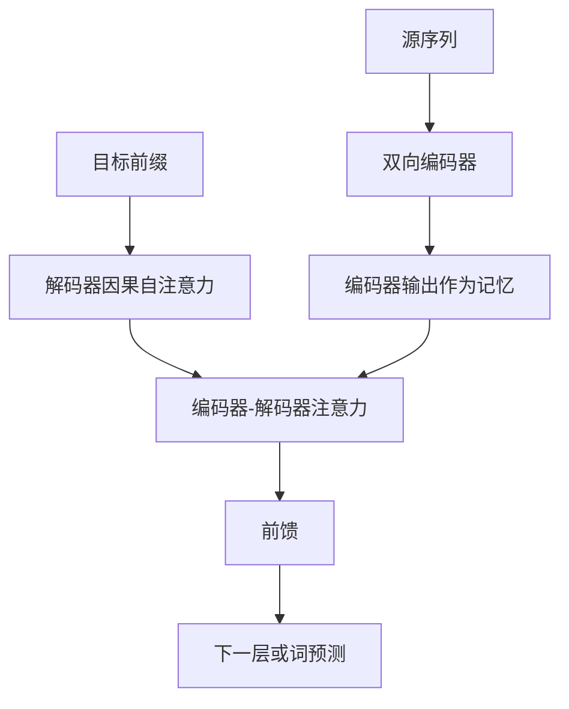

# Encoder-Decoder Attention

在编码器-解码器注意力层中，查询来自上一层解码器，键和值来自编码器的输出；解码端每个位置都可以读完整的源端记忆。

<footer>—— Vaswani et al., Attention Is All You Need, NeurIPS 2017</footer>

交叉注意力是算子，编码器-解码器注意力是 Transformer 序列到序列里给这个算子安排的固定槽位。Vaswani 等人的解码器每一层有三块：带因果掩码的自注意力、读编码器输出的注意力、前馈网络。第二块专门把源端记忆注入目标端残差流，论文称之为 encoder-decoder attention。它不是一种新的打分公式，而是一次架构承诺：源句先被双向编码器写成记忆，再被自回归解码器按层读取。本篇只讨论这个槽位的接口、信息流和工程边界，不把一般交叉注意力或自注意力再讲一遍。

## 问题

序列到序列需要两个条件分布上的结构。源序列 $y_{1:m}$ 在翻译、语音识别、摘要里通常已经完整给出，适合双向编码：每个源位置看见整句，得到上下文源表示 $H^{\mathrm{enc}}$。目标序列 $x_{1:n}$ 必须按从左到右分解，解码器内部只能用因果自注意力。两边算完之后，仍缺少一条合法的读通路——解码器位置 $t$ 如何访问 $H^{\mathrm{enc}}$，且不破坏对 $x_{<t}$ 的因果约束。

若只用编码器最后一层的句向量，长源句会被压成一个点，对齐无从谈起。若把源与目标拼成一条做自注意力，源端的双向与目标端的因果要靠复杂块状掩码维持，位置编码也要分两套下标。编码器-解码器注意力把读通路单独成子层：查询只从解码器来，键值只从编码器来，源端默认全部可见。这样，对齐成为该子层的主业，而不是掩码矩阵上的边角。

### 槽位在解码器层内的位置

标准顺序是：先做掩码自注意力，让目标端前缀混合；再做编码器-解码器注意力，把源端信息读进已经混合过的查询；最后前馈。顺序有含义。若先读源再做目标自注意力，目标端还没对齐自己的前缀，查询更「浅」。原论文的安排让查询先成为「当前要写什么」的内部上下文，再去源端找依据。Pre-LN 变体改变的是归一化位置，一般不调换这两个注意力子层的相对顺序。

不是所有生成模型都需要这一槽位。解码器只语言模型把条件文本写进同一条因果前缀，「源」和「目标」在自注意力里一起出现。编码器-解码器注意力是为「源完整、目标自回归」这种不对称而设的。删掉它，模型就不再是经典 Transformer 翻译架构，而是另一种条件化方式。

## 方法

记编码器输出 $H^{\mathrm{enc}}\in\mathbb{R}^{m\times d}$，解码器某层自注意力之后的状态为 $H^{\mathrm{dec}}\in\mathbb{R}^{n\times d}$。该子层计算

$$
Q=H^{\mathrm{dec}}W^Q,\qquad K=H^{\mathrm{enc}}W^K,\qquad V=H^{\mathrm{enc}}W^V,
$$

$$
H'=\mathrm{softmax}\left(\frac{QK^\top}{\sqrt{d_k}}\right)V,
$$

再经输出投影与残差、归一化写回解码器流。源端 padding 沿键维屏蔽；目标端因果约束已经由前一个自注意力子层执行，这一层对源位置 $1\ldots m$ 通常全部开放。多头方式与 MHA 相同，头数常与自注意力子层对齐，但投影矩阵是独立的一套。

### 记忆一次性编码、多层重复读取

$H^{\mathrm{enc}}$ 在编码阶段算一次，之后每一层解码器、每一个解码步都读它。训练时目标全长已知，各层可以并行读同一份 $K,V$；推理时编码器先跑完，把各层或共享的源端 $K,V$ 放入缓存，解码逐步只更新查询侧。注意：若每一层有自己的 $W^K,W^V$，缓存里要存 $L$ 份源端键值，或存 $H^{\mathrm{enc}}$ 再现场投影。共享投影可以减缓存，但会削弱「浅层读局部、深层读语义」的分化。

## 机制

这一子层是源端获得生成损失的主梯度通路。解码器交叉熵对 $H'$ 求导，经 $V$ 与注意力权重回到 $H^{\mathrm{enc}}$，再回到编码器参数。没有它，编码器只能靠其他辅助损失学习，或根本不参与生成。权重矩阵 $A\in\mathbb{R}^{n\times m}$ 常被解释为对齐：第 $t$ 个目标位置在源位置上的分布。解释有用，但不严格——深层的 $H^{\mathrm{enc}}$ 已经不是词，多头还会把对齐拆成多张表，$W^O$ 随后又混合。

与解码器自注意力的关键差别是可见集合。自注意力的键随 $t$ 增长，且禁止未来目标词；编码器-解码器注意力的键集合固定为整段源，与 $t$ 无关。因此源端不存在「未来泄漏」问题：源在任务定义里就全部给定。语音、OCR 里源是整段信号的编码，同样适用。若源是流式到达的，记忆集合随时间变长，槽位还在，只是 $m$ 在变。

教师强制下，训练用的 $H^{\mathrm{dec}}$ 来自真实前缀，推理来自模型自己的前缀。编码器-解码器注意力会放大这种差距：读源的查询分布一偏，对齐就偏。这是曝光偏差在交叉子层上的表现，不是公式错误。scheduled sampling、对解码前缀加噪声，针对的是查询侧分布，不是源端记忆。

### 与通用交叉注意力的边界

代数上它就是交叉注意力。架构上它被钉死为：记忆必须是编码器输出、查询必须是解码器状态、出现在每层的固定位置、源端默认全可见。视觉语言模型里「文本查询读 ViT token」也是交叉注意力，但往往没有对称的双向文本编码器，也未必每层都读。检索增强里记忆甚至不是当前模型算出来的。那些实例不应称作编码器-解码器注意力，以免把槽位和算子混名。

## 边界与工程取舍

编码器与解码器深度可以不对称。深编码器、浅解码器在延迟敏感的翻译里常见：源只编码一次，解码每步更便宜。反过来，深解码器、浅编码器则把容量放在生成侧。无论怎样，这一槽位的 $m$ 仍是源长，长源句的 $n\times m$ 项会主导解码前缀尚短时的算力。

共享源端 KV、对源做层间蒸馏、只在部分解码层设置该子层，都是在减读取次数或减缓存。删掉全部编码器-解码器注意力、改用前缀拼接的解码器只模型，能简化推理栈，但失去了源端双向编码的归纳偏置，需要更多数据来补。两种条件化方式都成立，选择取决于延迟、源是否完整、以及是否要独立预训练编码器。

束搜索、长度惩罚、覆盖率惩罚等解码启发式，经常显式用到这一子层的注意力质量，以减轻重复翻译或漏译。那是把 $A$ 当成可监控的对齐信号。换到解码器只模型后，对等信号分散在前缀自注意力里，同一套启发式不能原样搬迁。

## 小结

- 编码器-解码器注意力是解码器层中的固定子层：查询来自解码器，键值来自编码器输出。
- 它服务于「源完整且宜双向、目标自回归」的不对称，而不是发明新的打分函数。
- 源端默认全可见；目标端因果由同层的掩码自注意力保证，两套约束不要写进同一张方阵里硬凑。
- 源端记忆编码一次、各层重复读取；推理缓存的是固定长度 $m$ 的源 KV，不是增长的目标 KV。
- 该子层是生成损失回流编码器的主要通路，也是传统对齐可视化的来源。
- 通用交叉注意力可以出现在没有编码器栈的系统里；没有编码器槽位就不应沿用这个名字。
- 出处：Vaswani et al., *Attention Is All You Need*, NeurIPS 2017。
