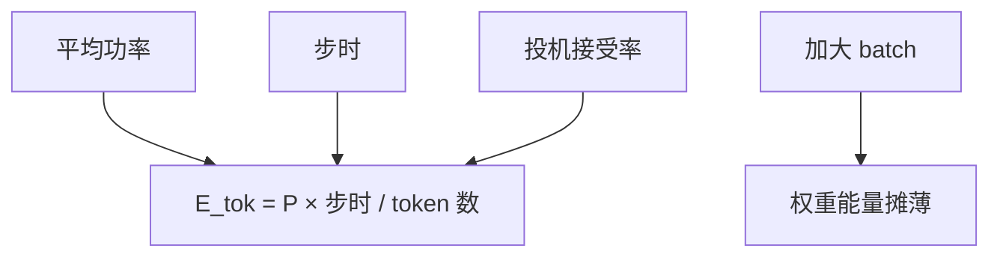

# 每 token 能耗

搬一次字节的能量和算一次乘加不在一个量级；decode 既然活在带宽屋顶下，每 token 的焦耳就主要由读出权重与 KV 决定。

<footer>—— Horowitz, Computing's Energy Problem (and what we can do about it), ISSCC 2014；NLP 训练能耗见 Strubell et al., ACL 2019</footer>

[上一课](/llm/batch-roofline-knee)用时间谈拐点。本课把同一工作点换成能量：逐步墙钟乘平均功率，再除以本步产出的 token 数（投机可能 $\gt 1$）。Horowitz 给出片上算术相对 DRAM 访问的能量差；decode 每步扫 HBM 上的权重，能量画像接近「内存系统」而不是「满负荷 Tensor Core」。后课把焦耳与 GPU 租金收成服务成本；这里先避免用 FLOPs 去估电费。

## 问题

时间最优不等于能量最优。过拐点后 TPOT 上升，GPU 仍接近满功率，每 token 焦耳上升；带宽区加大 $B$，墙钟几乎不变、吞吐上升，每 token 焦耳下降——因为同一份权重搬运摊到更多 token。缺口是：产品若只盯 TPOT，可能把工作点停在 $B=1$ 的「最快单用户」，电费与碳排按最差的每 token 走。Strubell 等人写的是训练；推理的持续功耗在服务上往往是更长的积分。

投机：一轮若接受 $k$ 个 token，能量是草稿 $+$ 校验，摊到 $k$ 上。接受率低时每 token 焦耳比普通 decode 更差。宣传加速比必须同时报能量，否则是在用热换时。

功率仪表含空闲与散热。应用 $P_{\mathrm{GPU}}$ 应扣掉空载基线，或明确报「插座」。数据中心 PUE 再乘一截，不在模型内核里，但在后课美元模型里。

## 方法

对稳态 decode：

$$
E_{\mathrm{tok}}\approx\frac{\bar P\cdot T_{\mathrm{step}}}{\mathbb{E}[\text{本步 token 数}]}.
$$

$\bar P$ 用板载功率或 NVML。$B$ 扫描同时记 $E_{\mathrm{tok}}$ 与 TPOT：常见形状是 $E_{\mathrm{tok}}$ 随 $B$ 下降直到拐点，之后回升或变平。量化减字节，带宽区 $T_{\mathrm{step}}$ 下降，若功率下降不多，$E_{\mathrm{tok}}$ 仍降。长上下文 $\mathrm{KV}$ 增大，$T_{\mathrm{step}}$ 与能量一起涨。

不要用「总 FLOPs × 某 pJ/FLOP」估 decode： Horowitz 的算术 pJ 会严重低估，因为主项是 DRAM。Prefill 可以更接近算力项，必须分阶段报。

## 机制

HBM 访问能量随字节走；Tensor Core 在带宽区经常「闲着也耗静态与时钟」。所以减字节（量化、GQA、MLA）同时降时间和能量；加 FLOPS 卡在带宽区既不降时间也不降能量。碳排还要乘电网因子，Luccioni 等人讨论过推理足迹——本课不把某一克 CO₂ 写成常数，只要求测量链完整：焦耳 → 电网 → PUE。

## 边界与工程取舍

不要把训练论文的 MWh 直接除以 token 当推理成本。不要在加速比表格里省略草稿模型的能量。移动端后课再谈；数据中心 GPU 的 $E_{\mathrm{tok}}$ 不能外推到手机 NPU。后课把 $E_{\mathrm{tok}}$ 与租时、利用率收成美元。

出处：Horowitz, ISSCC 2014；Strubell et al., ACL 2019。推理足迹的后续测量以 Luccioni 等公开工作为准，不编造编号。

## 小结

- $E_{\mathrm{tok}}$ 是功率×步时再摊 token；decode 主项是搬字节。
- 带宽区加大 $B$ 通常降每 token 焦耳；过拐点后不一定。
- 用 DRAM 能量直觉，不要用 pJ/FLOP 估 decode 电费。
- 投机必须按接受率摊；低接受率更耗。
- 分阶段报 prefill 与 decode。
- 下一课：把时间、能量接到服务成本。
- 出处：Horowitz, 2014；Strubell et al., 2019。
