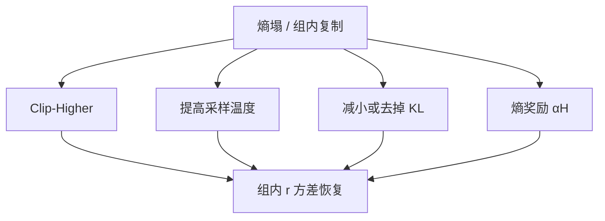

# 熵塌缩与熵正则

组内回复互为复制时，相对优势消失；熵不是装饰项，是群体方法还能否学习的前提。

<footer>—— 对照 DAPO 用熵曲线诊断 clip；Schulman PPO 可选的熵奖励；R1 训练中的探索依赖采样温度</footer>

[上一课](/llm/length-normalization-bias)把长而重复的链部分归因于损失测度。更常见的死因是：**策略熵塌到近零，温度 1 也采不出新轨迹。** 本课写塌缩的机制与熵正则，以及为何 Clip-Higher、温度、KL 都在抢同一条探索预算。不重推 [PPO](/llm/ppo-llm) clip。

## 问题

[GRPO](/llm/grpo) 需要组内 $r_i$ 有方差。熵塌后，$G$ 条完成几乎相同，全对或全错，优势为零。DAPO 把朴素复现停在 AIME 30 分的第一条诊断写成熵崩溃。PPO 有 critic，仍需要探索才能见到新的高奖励完成。熵正则 $+\alpha H(\pi(\cdot\mid s))$ 是古典补丁，但 $\alpha$ 过大会变成胡言，过小则挡不住塌缩。

塌缩的驱动：对称 clip 卡住低频词、KL 把策略钉在短答 SFT、学习率过大一步把分布拧尖、重复惩罚在训练期缺失。只加熵项而不改 clip / KL，常常失败。

### 监控哪一种熵

应对回答段的平均逐 token 熵，而不是含提示的序列熵。还要看组内独特 n-gram 率、平均编辑距离。熵数字还行但组内互抄，说明条件熵在「同一题」上塌了，无条件熵被题间差异撑住。

评测温度 0 与训练熵不是一回事。训练必须保持探索；评测可以 greedy。不要用评测准确率下降反推「熵太大」而不看训练曲线。

## 方法

先结构性放探索：Clip-Higher、足够温度（后课）、去掉或减小对参考的 KL（推理 RL）。再考虑 $\alpha H$。$\alpha$ 可按目标熵做 PID：低于阈值加大，高于则关。不要与逐步 KL 的 $\beta$ 对着加——一个拉向参考，一个推开，净效果不明。可验证域参考分布往往是短 SFT，KL 本身在制造塌缩。

重复 n-gram 惩罚可当塑形，但会改变最优语言；优先当诊断，而不是长期写进 $R$。

## 机制

熵是局部随机性。任务需要的探索往往是**语义分叉**（换证法），不是每个 token 都均匀。$\alpha H$ 鼓励后者，可能加长胡话。Clip-Higher 针对「罕见高优势 token」放行，更接近语义分叉。这就是 DAPO 把 clip 放在熵项前面的原因。R1-Zero 能长出反思，依赖的是可验证奖励下的采样多样性，而不是大 $\alpha$。

全对组熵可以不低（都在正确写法里换词），但优势仍为零。熵是必要条件不是充分条件；动态采样处理的是后者。

## 边界与工程取舍

开放偏好上高熵会伤害流畅，产品更怕胡言。推理竞赛更怕塌缩。$\alpha$ 不能跨域抄。下一课过长过滤处理的是另一头：探索变成无尽重复直到截断。熵与长度要同图看：长度涨、熵掉，多半是重复；长度涨、熵稳，才像真在搜索。

## 小结

- 熵塌导致组内无相对信号，群体 RL 停止学习。
- 先改 clip / 温度 / KL，再加 $\alpha H$；熵项鼓励的是局部随机而非语义分叉。
- 监控回答段熵与组内独特率，不要只看含提示的数。
- 熵必要、不够；全对全错仍要动态采样。
- 出处：Yu 等 DAPO；Schulman PPO 熵奖励；Shao / DeepSeek-AI 的探索实践。
