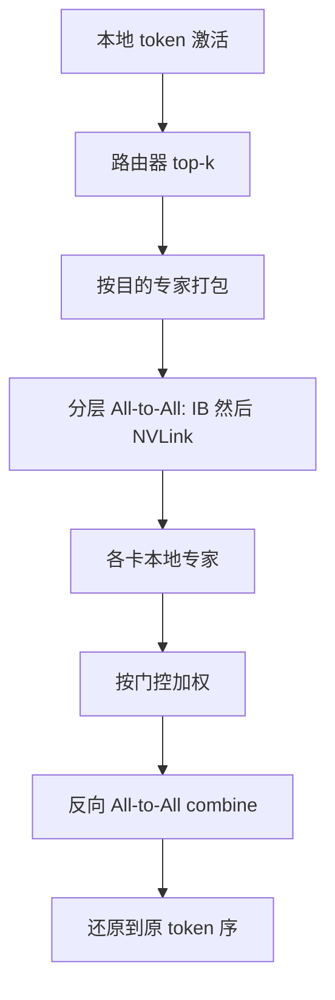

# EP All-to-All

    
专家并行的通信不是对称 All-Reduce：每个 token 只去 top-$k$ 个目的地，回来还要按门控权重化简；拓扑上往往先走 InfiniBand 再走 NVLink，而不是一次均匀置换。

<footer>—— Lepikhin 等 GShard 把专家维映到 mesh 置换；DeepSeek-V3 把它写成跨节点 dispatch/combine 核</footer>

数据并行的梯度同步是 All-Reduce：每张卡既有完整副本的一份差分，又要一份全局和。专家并行（EP）相反：专家权重切开，token 激活必须**按路由下标**送到持有该专家的设备，算完再**按原顺序收回**。这两次不规则交换就是 EP 的 All-to-All，习惯上叫 dispatch 与 combine。GShard（Lepikhin 等，arXiv:2006.16668）在 TPU mesh 上把它做成沿专家轴的置换；GPU 集群上变成 NVLink 域加 InfiniBand 的分层转发。本篇写语义、体积与拓扑；DeepSeek 的实现见 [DeepEP](/llm/deepep)，落地 GEMM 见 [DeepGEMM](/llm/deepgemm)。

## 问题

设 $E$ 个专家铺在 $R$ 张卡上，每 token 选 $k$ 个专家。一步里激活要搬的字节大约正比于

$$
\#\mathrm{tokens}\times k \times d_{\mathrm{hidden}}\times \mathrm{sizeof}(\mathrm{dtype}).
$$

$k=8$、$d=7168$、FP8 dispatch 时，通信量可以与一层 MLP 的计算同量级。若专家均匀、路由均匀，这是规则 All-to-All；若热专家塌缩，变成多对一拥塞，冷卡在等。Switch Transformer 把 $k$ 收到 1 以简化；GShard 用 $k=2$ 加容量因子把缓冲定死。V3 用 $k=8$ 加节点限制（每 token 最多 4 个节点）控制 IB 跳数。同一「All-to-All」词，三种系统的消息图不同。

通用 NCCL All-to-All 假设每对 rank 交换固定长度。MoE 需要：变长、按 `topk_idx` permute、FP8 缩放因子同行、combine 侧对多专家输出加权求和。用规则 All-to-All 加 padding，带宽付给空槽。EP 的核必须把门控输出当成通信计划。

### Scale-up 与 scale-out 两截

节点内 NVLink 带宽高于节点间 IB（V3 报告约 160 GB/s vs 50 GB/s）。Token 的最终专家若在别的节点，应先 IB 到该节点的入口 GPU，再 NVLink 分发，而不是每条专家边都打 IB。这就是 V3「同号 GPU 中转」的原因，也是 DeepEP 的默认故事。GShard 在 TPU 上选哪一维当专家轴，是同一原则：专家维必须落在高带宽 mesh 轴上，否则稀疏 FLOPs 优势被置换吃掉。

不要把 EP All-to-All 写成「MoE 版的 Tensor Parallel」。TP 切的是同一张稠密矩阵的列/行，通信是 All-Gather 或 Reduce-Scatter，每个 token 都参与同一模式。EP 的目的地随 token 变，有的 rank 对之间可以是零消息。

## 方法

### Dispatch 计划

路由器在本地（权重复制）算出 top-$k$ 与权重。每张卡统计要发给每个专家的 token 数，做一次小的元数据 All-to-All 或前缀和，以便对端预留槽位。然后把激活按目的专家打包发出。容量因子或 `num_max_tokens_per_rank` 给出槽位上限；超容量的 token 在 GShard 里可能被丢，在 V3 服务里更常见的是冗余专家与在线重排，而不是静默丢 token。对齐（`expert_alignment`）让随后 grouped GEMM 的 $M$ 满足 Tensor Core 倍数。

### Combine 与精度

专家输出乘以门控权重，按源 token 累加。数值上 combine 常保 BF16/FP32，即使 dispatch 是 FP8——V3 明确这样做。累加发生在哪一跳（NVLink 侧还是 IB 侧）决定慢网上看见的是已化简向量还是 $k$ 份原向量。Warp 特化把发送、转发、接收拆开，并与计算流重叠：训练用 DualPipe 把 attention / dispatch / MLP / combine 与反向切块重排，使 All-to-All 与 PP 通信藏进计算；推理预填充用双微批交叉，解码用点对点 IB + IBGDA 降延迟。

## 机制

### 为什么它不是集合通信教科书里的 All-to-All

教科书 All-to-All 是完全交换：$R$ 个 rank 每对都有等长消息，延迟项 $O(R)$ 或按实现 $O(\log R)$。EP 的消息图稀疏、长度由路由决定，延迟项更接近「热专家入度」和「触及的节点数」。节点限制路由把 IB 对度数从 $O(\min(k,R_{\mathrm{node}}))$ 的坏情况压到常数（V3 取 4）。冗余专家把热门目的地复制多份，等于在通信图上给热点加边，降低 combine 前的排队。

算术上，dispatch 是 `gather` 到专家槽，combine 是 `scatter-add`。实现可以写成 permute + 局部分组 GEMM，而不出现名为 `ncclAllToAll` 的调用；语义仍是 All-to-All。GShard 的编译器置换、Megatron-LM MoE 的 token dispatcher、DeepEP 的 ElasticBuffer，都是这一对 gather/scatter-add。元数据交换（每对 rank 要发多少 token）必须在大数据搬运之前完成，否则对端无法预留槽位；这一小步常被 microbenchmark 忽略，却在解码小消息时占延迟的可观比例。

训练与解码的 EP 宽度可以差一个数量级：V3 训练 EP64，解码最小单元 EP320。通信算法同名，消息大小差很多，核也要换（吞吐 vs 低延迟）。不要用训练的 busbw 去承诺解码 TPOT。

### DualPipe 藏住的是什么

报告把一个 chunk 切成 attention、dispatch、MLP、combine（反向再拆输入/权重梯度）。重排后，All-to-All 与流水线点对点可以和另一段 GEMM 同时进行。这要求通信核占用的 SM 可调：占满全部 SM 的「很快」All-to-All 会让重叠失败。EP All-to-All 的性能因此是「有效带宽 × 可重叠比例」，不是单项 microbenchmark。

## 边界与工程取舍

没有 NVLink 的跨 PCIe 八卡，分层转发的前提不成立，应缩小 EP、把专家留在节点内，或接受 IB 上更密的点对点网。$k$ 越大，体积线性涨，质量收益必须能付这笔带宽；GShard 的 $k=2$、Switch 的 $k=1$、V3 的 $k=8$ 对应三条完全不同的通信预算。负载不均时核再快也堵：辅助损失、专家偏置、容量因子、冗余专家是同一问题的不同旋钮，不要在 DeepEP 的 issue 里当通信 bug 报。

TP 与 EP 同时开时，先分清哪次通信是张量并行的 All-Gather / Reduce-Scatter，哪次是专家并行的 dispatch。日志里不要都叫 All-to-All。V3 训练强调可以不用昂贵 TP、靠 EP 与 DualPipe 撑起来，那是他们的内存优化叙事；推理预填充仍用了小 TP（TP4）来切注意力。复制配置时不要把训练并行度表直接贴到解码最小单元（40 机 EP320）上。

出处：Lepikhin 等，*GShard*，arXiv:2006.16668；Fedus 等 Switch Transformer；DeepSeek-AI，*DeepSeek-V3 Technical Report*，arXiv:2412.19437，§3.2.2 与部署；实现库 DeepEP。GShard 的 TPU permute 与 GPU IB 转发不要画成同一张物理图。

「All-to-All」在 NCCL 测试里常报 busbw。MoE 的有效带宽应在真实 `topk` 与真实 hidden 上测，含元数据交换与 combine 累加。只跑均匀 All-to-All 会高估。

## 小结

- EP All-to-All = 按路由的 dispatch gather + 按门控的 combine scatter-add，不是梯度 All-Reduce。
- 体积 $\propto \mathrm{tokens}\times k\times d$；拓扑上应让专家维落在 NVLink 一类高带宽域，IB 只做节点入口。
- 变长、FP8、可配 SM、与 GEMM 重叠，是专用核存在的理由。
- 训练吞吐核与解码低延迟核共享语义，不共享屋顶线。
- 出处：GShard；DeepSeek-V3；DeepEP。
