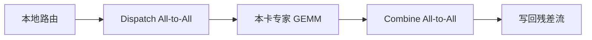

# 专家并行

    
专家沿设备维切开，token 用 All-to-All 去找自己的专家，算完再 All-to-All 按原顺序回来。稀疏计算能放大，是因为通信语义先被定义清楚。

    <footer>—— Lepikhin et al., GShard, 2020；Fedus et al., Switch Transformers, 2021</footer>

预训练里的专家并行（Expert Parallelism, EP）不是又一种切隐藏维的办法。稠密 FFN 的参数对每个 token 都要算一遍，切分单位是矩阵的行或列；MoE 把 FFN 换成一组专家，切分单位是专家本身。GShard 在 TPU mesh 上把「专家维」映射成一次跨设备置换，Switch Transformer 在同一语义上把路由收到 $k=1$，容量桶和通信缓冲区变得更好预分配。两边共用的集体操作都是 All-to-All：先按专家所在设备把 token 发出去，本地 GEMM，再把激活收回来。本篇只讲这条预训练通信原语，不重写路由公式，也不把推理期的专家复制方案展开。

## 问题

万亿参数的 MoE 放不进单卡，数据并行又会在每张卡复制全部专家，显存按专家数线性爆炸，稀疏的好处只剩下计算、存不住。张量并行能切单个专家内部的宽矩阵，却回答不了「九十几个专家分别住在哪」。必须单独开一维：设备的划分单位是专家，通信的单位是 token。

预训练的 batch 很大，这个问题才变得可解。训练步里一次可以看到成千上万个 token，All-to-All 的 payload 足够填满链路；若只有解码期那种每卡几个 token，启动开销会压过有效带宽。所以 EP 首先是预训练策略：用大 batch 把置换通信摊薄，换来「总参数远大于活跃参数」的容量。

### 置换，不是归约

张量并行前后的 All-Reduce 是对同一份激活或梯度求和；EP 的 All-to-All 是按专家编号做置换，没有求和语义。实现若写成 All-Reduce，专家输入会被搅成所有 token 的混合物。GShard 用的跨设备分发、Switch 的容量桶，本质都是：在已知每卡专家布局的前提下，把 token 重新打包成各专家的本地 batch。All-to-All 要求每张卡事先知道自己要发给每个对端多少 token。容量因子把这件事变成静态缓冲区：槽位先定，超容量的 token 在分发前丢掉，而不是发过去再丢。空槽会进入通信，容量过大等于给空气付带宽。

## 方法

记专家总数为 $N$，参与 EP 的设备数为 $E$，通常 $N$ 能被 $E$ 整除，每卡放 $n=N/E$ 个专家。前向四段固定：

1. 本地计算路由，得到每个 token 的专家编号。
2. **Dispatch All-to-All**：按专家所在设备重排 token。
3. 各卡只跑自己拥有的专家 FFN。
4. **Combine All-to-All**：按原 token 顺序把输出送回，若 $k>1$ 再加权求和。

GShard 允许 $k=2$，每个 token 可能去两张卡；Switch 取 $k=1$，一次分发、一次合并，通信体积大约减半，实现路径也更直。容量因子 $c$ 决定每个专家的槽位数 $C=\lceil c\cdot T/N\rceil$，其中 $T$ 是这一层看到的 token 数。预训练配置里 $c$ 略大于 1，用来吸收路由的自然波动，而不把链路打满。

### 预训练里如何选 EP 度

EP 度不是越大越好。度升高，每卡专家变少、本地 GEMM 变轻，但对端变多，跨节点跳数上升。实践上先让单卡放得下本卡专家与优化器状态，再检查 All-to-All 是否仍能被 GEMM 盖住。细粒度小专家（中间维很窄、每卡很多个）容易通信受限，往往把多个小专家绑在同一卡上做 batched GEMM，EP 度小于专家总数。肥专家则相反，计算更容易盖住置换。

同一层里 EP 常与张量并行叠用：专家内部的门控线性仍可按列切，专家之间走 All-to-All。数据并行则复制「同一专家的副本」——不同专家之间不同步梯度。流水线并行把 MoE 层当作普通层切到不同阶段，EP 组通常落在同一流水线阶段内部，避免把 All-to-All 再跨阶段耦合。

## 机制

一次双向 All-to-All 对每张卡的通信量近似为

$$
\mathrm{bytes}\approx 2\cdot k\cdot \frac{T}{E}\cdot d\cdot s,
$$

$d$ 是隐状态宽度，$s$ 是每元素字节（BF16 为 2），因子 2 来自分发与合并。均匀路由时每卡收发 $T/E$ 量级；热专家所在卡会收到远多于平均值的 token，step time 由最慢的那张卡决定。负载不均因此同时伤害计算和网络，这是预训练 MoE 必须认真做均衡的系统原因，而不只是模型质量原因。

反向再走两次 All-to-All，把输出梯度置换回专家、把输入梯度置换回原 token。路由线性层通常随数据并行复制，梯度在本地算完再 All-Reduce。专家权重的梯度只在拥有该专家的设备上累积；仅当同一个专家因数据并行有多份副本时，才对那一份权重做 All-Reduce。「专家之间做 All-Reduce」是配错通信域的典型症状。EP 组里每张卡的专家是不同参数，没有可加的公共梯度。能加的只有同一专家的 DP 副本。Switch 式每专家一份、不复制时，专家权重甚至可以不做数据并行同步。

### 计算通信比随专家形态变化

本地专家的 FLOPs 随中间维 $d_{\mathrm{ff}}$ 和每专家分到的 token 数增长。$d_{\mathrm{ff}}$ 大时，GEMM 算术强度高，All-to-All 容易被盖住；专家又碎又多时，算术强度下降，同一条 NVLink 或 InfiniBand 链路上通信占比上升。预训练因此不能只报「用了 MoE」，必须同时报专家宽度、每卡专家数、EP 组是否跨节点。GShard 在 TPU 上把专家维对齐 mesh 的一条轴，Switch 在同类轴上减少 $k$，都是在为这条 roofline 服务。

节点拓扑会再乘一个系数。同一节点内 NVLink 的带宽比跨节点 InfiniBand 高一个数量级。若 EP 组跨了太多节点，All-to-All 的短消息会被跳数拖死。一种常见约束是限制每个 token 路由到的节点数，把通信域收进更小的 EP 组；代价是路由自由度下降，需要用负载策略把热专家打散到不同节点。

## 边界与工程取舍

EP 假定路由结果在 All-to-All 之前已经变成整数专家编号，并且容量槽可以静态分配。动态插入专家、推理期专家卸载、以及按 token 实时迁移权重，都不在这条原语里。小 batch 的自回归解码会让 All-to-All 的启动延迟压过计算，服务系统常常改为复制热专家或做连续 batch，那是另一篇文章的范围。

不要把 EP 写成「把 FFN 按行切到多卡」。后者是张量并行，通信是 All-Reduce 或 Reduce-Scatter；前者是按专家 ID 的置换。配置里应分开写并行度，检查点也要按专家切分保存。恢复时若设备数变了，必须做专家到设备的重映射，否则权重会对错卡。空槽、drop 的 token、以及被容量截断的梯度，都会让「名义 FLOPs」和「有效 FLOPs」分家。看预训练曲线时，除了损失，还要看每专家接收直方图和 All-to-All 耗时。平均算力好看、尾部卡堵住，仍是失败的 EP。

GShard 与 Switch 给出的是并行语义，不是某一种 NCCL 调用顺序。TPU 上是 mesh 上的 permute，GPU 上是 NCCL All-to-All 或点对点拼出来的等价物。语义稳定的是：专家不住在每张卡上，token 去找专家，而不是专家来找 token。

## 小结

- 预训练专家并行把不同专家放到不同设备，用 Dispatch / Combine 两次 All-to-All 运送 token。
- 这是置换不是归约；与张量并行的 All-Reduce 通信语义不同，配置必须分开。
- GShard 用跨设备分发支撑 $k\ge 1$ 的 MoE，Switch 把 $k=1$ 后容量与缓冲区更好预分配。
- EP 度、每卡专家数、专家宽度共同决定计算通信比；细粒度小专家更容易通信受限。
- 负载不均会同时打满热专家的计算与网络，step time 由尾部设备决定。
- 大 batch 预训练让 All-to-All 可摊薄；小 batch 解码往往不再坚持纯 EP。
- 出处：Lepikhin et al., *GShard: Scaling Giant Models with Conditional Computation and Automatic Sharding*, 2020；Fedus, Zoph, Shazeer, *Switch Transformers*, 2021。
