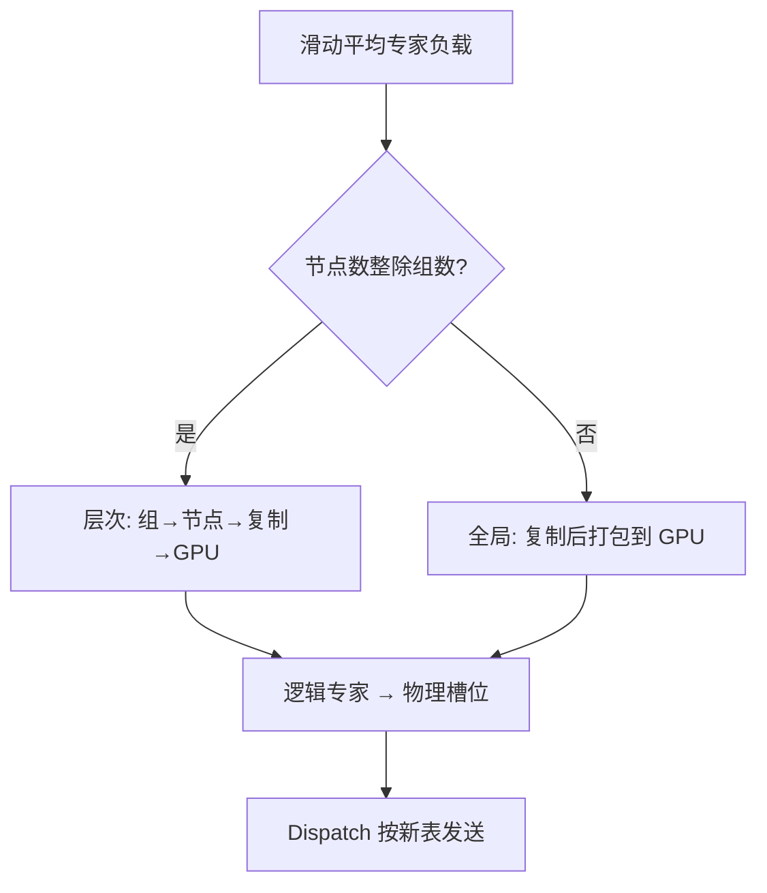

# EPLB 专家负载均衡

我们采用冗余专家策略，复制高负载专家，再启发式地把副本打包到 GPU 上，使各卡负载均衡。

<footer>—— DeepSeek-AI，EPLB 仓库说明，对应 DeepSeek-V3 技术报告的部署节，arXiv:2412.19437</footer>

训练期的负载均衡损失约束的是 **路由把 token 分给谁**；服务期的 Expert Parallelism Load Balancer（EPLB）约束的是 **专家副本放在哪张卡上**。DeepSeek-V3 用无辅助损失的偏置调训练负载，但线上请求的领域会漂：代码高峰、中文高峰、长思维链，都会让某几个专家持续过热。EP 下热专家所在 GPU 既算得慢又收得多，step time 由它决定。EPLB 的做法不是改 $W_r$，而是按观测到的专家负载，复制热专家、重排放置，让每张卡处理的 token 数接近。算法开源在 `deepseek-ai/EPLB` 的 `eplb.py`；vLLM 后来把同一套思想接进 `--enable-eplb`。

## 问题

MoE 训练通常假设各专家长期接近均匀。V3 的无辅助损失策略进一步减少了对路由的均匀先验，专家可以更专。专了之后，**在线负载不再均匀**。LMSYS 在 96 张 H100 上复现大规模 EP 时写过：多数专家闲、少数极忙，且 prefill 与 decode 的忙碌集合并不相同。若仍按训练时的「每卡 $N/E$ 个逻辑专家、各一份」放置，热卡的 dispatch 接收队列和 GEMM 都会成为尾延迟。

复制权重能摊热，但复制是有限资源。V3 预填部署在 32 卡 EP 上设 **32 个冗余专家**：每卡除原有 8 个专家外再放 1 个副本。解码最小单元是 40 节点 320 卡、EP320，其中 64 卡专门承载冗余专家与共享专家。问题变成：给定一份「每个逻辑专家的估计负载」，如何决定 **复制份数** 和 **物理槽位**，使得各 GPU 的预计 token 数尽量接近，并且尽量尊重 group-limited routing——同一组专家尽量留在同一节点，以免跨节点 All-to-All 变宽。

### 预测负载不在算法合同里

EPLB 仓库写得很清楚：输入是估计的专家负载，如何预测超出范围。常见做法是历史统计的滑动平均。窗口太短，一次异常 batch 就会触发大搬家；太长，领域切换后仍按旧热点复制。vLLM 文档里的默认是 `window_size=1000` 步、`step_interval=3000` 步再重平衡一次。搬家本身要传专家权重，频率是吞吐税。

EPLB 不替代训练期的 aux loss 或专家偏置。那些塑造 $W_r$；EPLB 在 $W_r$ 已冻结之后搬副本。推理时若丢掉 V3 的偏置 $b_i$，负载会先歪，EPLB 再去追，两者叠加上去会把「训练均衡」和「部署均衡」搅成一笔糊涂账。

## 方法

主入口是 `eplb.rebalance_experts`。它吃负载向量，吐出逻辑专家到物理副本的映射。仓库给出两种策略，由「节点数是否整除专家组数」切换。

**层次均衡（hierarchical）**：先把专家组打包到节点，使节点级负载接近；再在节点内决定复制；最后把副本打包到各 GPU。这利用了 V3 的 group-limited routing：token 本来就被限制在少数节点上选专家，组与节点对齐能减少跨节点流量。仓库建议预填、EP 度较小时用这条。V3 报告里预填确实在节点内重排专家，并写明「尽量不增加跨节点 all-to-all」。

**全局均衡（global）**：在全集上复制，再打包到所有 GPU，不再先按节点切组。解码 EP 度很大、每卡往往只有一个专家时，节点内已经没有「同卡多专家可打包」的自由度，全局策略更合适。V3 解码「不必再在节点内重排，因为每卡只放一个专家」，与这条一致。

### 冗余份数是容量，不是算法魔法

设逻辑专家 $N$，物理槽位 $N+R$。$R=0$ 时 EPLB 只能重排，不能复制，热专家仍然独占一张卡的全部算力。$R$ 增大，最热的专家可以占多张卡，dispatch 把打向该逻辑 id 的 token 在副本间分流。vLLM 对大规模建议 `num_redundant_experts=32`，与 V3 预填的 32 个冗余同量级。分流规则必须确定：同一逻辑专家的多份副本之间，按 token 哈希、按 rank 轮转、或按当前队列长度，都会改变瞬时均衡。算法仓库算的是 **放置**；运行时还要一张逻辑 id → 多个物理 rank 的查找表，供 dispatch 使用。

V3 还写过动态冗余：每卡常驻更多专家（例如 16），每步只激活 9 个，在 All-to-All 前现场算全局最优路由。预填算力大，这点开销可藏；解码要与 dispatch 核融合才划算。EPLB 开源的是周期重平衡，不是这一步的在线最优路由。

## 机制

目标函数可以直观写成：最小化各 GPU 预计负载的最大值。这是装箱（bin packing）加复制。热专家复制 $r_e$ 份后，每份预计负载约为 $\ell_e / r_e$（若 dispatch 均匀分流）。装箱启发式把「大件」先放进当前最空的箱子，避免一个热专家和一个次热专家挤在同一张卡上。层次策略多了一层箱子：节点是大箱，GPU 是小箱。组级约束相当于某些物品必须放进同一大箱。

均衡度常用 $\mathrm{avg}/\mathrm{max}$ 的 token 数来报。vLLM 的 `log_balancedness` 就是这个比。1 表示完美；预填长序列时由于 $T$ 大，统计稳定，EPLB 的收益主要是抬吞吐。解码每步 $T$ 小、方差大，同一套放置的瞬时 $\mathrm{avg}/\mathrm{max}$ 会抖，但周期平均仍能避免某几张卡长期打满。LMSYS 的大规模 EP 实验把「理想 EPLB」（按 group-limited 语义随机选专家）当作预填上界，并报告相对不均衡基线，预填约 **1.9×**、解码约 **2.59×** 的吞吐差——数字绑定他们的 96×H100 与模拟分布，不能当成所有集群的 SLA。

共享专家在 V3 解码里被当成「永远被选中的重负载路由专家」。EPLB 的负载向量里应给它高权重，否则装箱会把它和另一个热专家叠在同一物理卡上。训练图里共享支路与路由专家分开；部署图里它可以占一个物理槽位。

### 搬家的代价必须进账

重平衡要把专家权重拷到新卡。FP8 专家仍有上百 MB 量级；NVFP4 更轻，但仍是同步点。`step_interval` 太小，带宽花在搬权重上；太大，热点已经换了还在用旧图。异步 EPLB（vLLM 的 `use_async`）把传输从关键路径挪开，但存在「表已换、权重未到」的窗口，dispatch 必须仍指向旧物理槽，或对新槽做版本号。没有版本协议，会出现静默算错专家。

Prefill 与 decode 的忙碌集合不同，是 PD 分离的一条独立理由：两套放置、两套冗余预算。把预填的层次放置抄到 EP320 的解码集群，组对齐的那一层箱子可能根本不存在。

## 边界与工程取舍

EPLB 假设 dispatch 能按逻辑专家找到 **全部** 物理副本。自己写的 All-to-All 若写死 `expert_id % E`，复制没有入口，算法白算。必须把放置表下发到每一层 MoE。量化检查点、LoRA 热更新、专家卸载与 EPLB 搬家抢同一条拷贝引擎时，要排队，否则 HBM 暂时会出现「新旧两份专家」。

不要用训练日志里的 $f_i$ 直接当线上负载。训练 microbatch 的领域和产品流量不同；aux-loss-free 模型的 $f_i$ 更专，线上漂移更大。应以服务端计数为准，并分 prefill / decode 两套直方图。

整除条件不满足时不要强行层次策略。组被拆到两个节点，group-limited routing 仍可能把 token 送到「组内但不在本节点」的专家，跨节点流量不降，装箱还多了一层错误约束。仓库用整除来切换，是这个原因，不是风格问题。

出处以 V3 报告部署节与 `deepseek-ai/EPLB` 为准。不要把 Switch 的 $\mathcal{L}_{\mathrm{aux}}$ 或 V3 训练偏置写成 EPLB。前者训路由，后者放副本。vLLM 的接入是第三方集成，参数名会变，算法语义仍是冗余专家加装箱。

小规模 Mixtral 8 专家通常整卡复制，没有 EP 热度问题，上 EPLB 只增加映射复杂度。百专家以上、EP 跨节点、且流量领域会变，这套方法才有明确的分母：热卡 token 数与冷卡 token 数的差。

## 小结

- EPLB 在推理期按观测负载复制热专家并重新装箱，均衡的是 GPU 上的 token 数，不是再训路由器。
- 层次策略对齐专家组与节点，适合预填、较小 EP；全局策略适合解码、每卡一个专家。
- 冗余份数 $R$ 是物理容量；dispatch 必须认识逻辑专家的多副本。
- 负载用滑动平均估计；搬家频率与异步拷贝是系统税，要单独记账。
- Prefill 与 decode 热点不同，宜分放置；LMSYS 的倍速是特定集群上的对照，不是硬件保证。
- 出处：DeepSeek-AI，*DeepSeek-V3*，arXiv:2412.19437；`deepseek-ai/EPLB`；vLLM Expert Parallel Deployment 文档中的 EPLB 参数。
