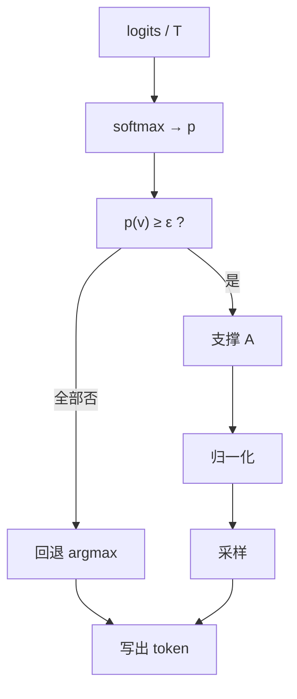

# Epsilon sampling

    
把低于固定地板 $\varepsilon$ 的原子概率视作训练时摊上去的平滑噪声，删掉后再归一化：截断是在推理期做去平滑，而不是另一种温度。

    <footer>—— Hewitt, Manning & Liang, Truncation Sampling as Language Model Desmoothing, 2022</footer>

词表上的语言模型几乎总把正概率分给每一个 token。这是 softmax 与训练平滑的直接后果，不等于模型「认为」每个续写都合理。Hewitt 等人把 truncation sampling 解释为去平滑：选定绝对地板 $\varepsilon$，丢掉 $p(v)<\varepsilon$ 的原子，在剩余支撑上恢复一个更尖的分布。$\varepsilon$-sampling 是该框架里最简单的一条规则；同文的 $\eta$-sampling 让地板随熵变，见 [Min-p / $\eta$](/llm/minp-typical)。Holtzman 的 nucleus 切的是累计质量，没有绝对噪声地板。本篇只把 $\varepsilon$ 这条水平线写清楚：它何时等价于几乎不截断，何时会切空，以及为什么不能用验证集最小概率去「估」$\varepsilon$。

## 问题

温度不改变支撑。$T\to 0$ 在数值上接近贪心，但任何 $T>0$ 仍给长尾留着正质量，长序列里总会抽到一次。Nucleus 保证核上有质量 $\tau$，却不保证核内每个原子都大于某绝对量：为了凑满 $\tau$，可以纳入大量 $10^{-5}$ 量级的碎片。开放生成的胡话往往来自这些碎片，而不是来自核外交界处的某个中等词。需要一条与排序无关的规则：概率已经小到可以当成数值噪声的，直接为零。

绝对地板的困难是尺度。不同模型、不同温度、不同前缀下，$p_{\max}$ 可以差一个数量级，同一 $\varepsilon$ 在尖峰步只切尾巴，在平坦步可能把全部 token 判为噪声。Hewitt 用去平滑来给 $\varepsilon$ 一个故事：训练相当于在真实的稀疏后续上加了一层平滑，推理把小于平滑幅度的质量当作人为添加而删掉。故事给出数量级直觉（$\varepsilon$ 应像平滑强度），并不给出可从验证 PPL 反解的公式。$\varepsilon$ 仍是超参。

### 去平滑而不是 MAP

删小概率原子之后归一化，得到的仍是一个分布，采样仍是随机的。它不是束，也不是贪心。MAP 要的是最大联合概率串；$\varepsilon$ 只是把逐步分布的支撑变薄。若真实后续本身就有很多近乎等概率的合法词，去平滑不应把它们删光——那要求 $\varepsilon$ 小于这些合法词的典型质量。若 $\varepsilon$ 大于合法次优项，算法会退化成近贪心，多样性指标变好看，任务覆盖变差。这是绝对阈值相对 nucleus 更「脆」的原因。

$\varepsilon$ 作用在概率上，不是 logits 上。先温度再 softmax 再比 $\varepsilon$。对 logits 做 `max(logit, c)` 没有去平滑解释，也不与论文定义等价。

## 方法

令 $p=\mathrm{softmax}(z/T)$。支撑

$$
A=\{v:p(v)\ge\varepsilon\},
$$

若 $A$ 为空（整个分布都低于 $\varepsilon$），回退到 $\{ \arg\max p\}$ 或临时降低 $\varepsilon$。然后

$$
\tilde p(v)=\frac{p(v)\mathbf{1}_{v\in A}}{\sum_{u\in A}p(u)},
$$

从 $\tilde p$ 采样。$\eta$-sampling 把 $\varepsilon$ 换成 $\min(\varepsilon,\sqrt{\varepsilon}\,\mathrm{e}^{-H})$，平坦时少切、尖峰时至少切 $\varepsilon$。Min-$p$ 把绝对地板换成 $p_{\mathrm{base}}p_{\max}$。三者实现同为掩码加归一化，差别只在门槛是否依赖 $H$ 或 $p_{\max}$。

与 nucleus 组合时，最终支撑是交集。常见安全做法是只开一种截断。若必须组合，应定义次序：先 $\varepsilon$ 再按质量取核，或先核再 $\varepsilon$。先核再 $\varepsilon$ 可能把核内碎片再删一遍，核质量不再是 $\tau$；先 $\varepsilon$ 再核，质量预算是在已去平滑的分布上算的，更符合「先去噪再取核」。

## 机制

softmax 把任意 logits 变成满支撑。标签平滑、大词表、多义续写，都会让真实上接近零的项变成 $10^{-6}$–$10^{-8}$。在长度为几百的序列上，每步哪怕只有 $10^{-4}$ 的机会抽到噪声 token，累积后几乎必然出现一次明显跑题。$\varepsilon$ 把单步噪声机会打到零（在门槛以上的支撑内）。它不处理「噪声其实概率为 $0.02$」这种情况——那已经不是平滑尾巴，而是模型真的不确定，应留给温度或 $\eta$。

去平滑解释的形式侧面是：存在一个稀疏的「未平滑」分布 $p^*$，观测到的 LM 分布是 $p^*$ 与均匀或其它核的混合。当混合权重小时，小于某 $\varepsilon$ 的原子更可能来自混合而不是 $p^*$。该模型是启发式的，真实 LM 并不是均匀混合。它的用处是禁止把 $\varepsilon$ 调到 $10^{-2}$ 还声称「只是去噪」——那已经在删合法质量。数量级上，$10^{-4}$–$10^{-3}$ 更符合「尾巴」；再大就要当明确的截断强度来扫，并与 nucleus 的 $\tau$ 对照着看重复率与胡话率。

### 温度把 $\varepsilon$ 变成另一条曲线

$T>1$ 把质量从峰推向尾，$p(v)\ge\varepsilon$ 的集合变大，截断变弱。$T<1$ 相反，同一 $\varepsilon$ 更狠。因此 $\varepsilon$ 与 $T$ 强耦合，不能分开抄社区默认值。Nucleus 的 $\tau$ 在温度变化时仍保证核质量，更稳；$\varepsilon$ 保证的是原子下限，不保证核质量。这是 Hewitt 同时提出 $\eta$ 的动机：用熵把地板拉回与当前尺度匹配的地方。若坚持纯 $\varepsilon$，温度扫描必须重扫 $\varepsilon$。

验证集上最小的 next-token 概率几乎总是远小于任何可用的 $\varepsilon$，因为它包含长尾标签。用验证最小概率定 $\varepsilon$ 会得到 $10^{-12}$ 一类废值，等于关闭截断。

## 边界与工程取舍

### 空支撑、子词尺度与协议对齐

空支撑必须有定义。高 $\varepsilon$ 加低温度加很大的重复惩罚，可以让所有未惩罚 token 仍低于 $\varepsilon$。回退贪心比抛异常更适合服务。词表含大量不可解码字节时，$\varepsilon$ 比 top-$k$ 干净：无需猜 $k$。中文单字与英文多子词混排时，绝对概率尺度本就不统一，同一 $\varepsilon$ 对两种片段的相对狠度不同——这是子词模型用绝对地板的固有缺陷，$\eta$ 与 min-$p$ 相对好一些。

投机无损：草稿与目标必须用同一 $\varepsilon$ 与同一温度产生 $p,q$。CFG 混合后再比 $\varepsilon$，因为用户以为的分布是引导后的。Stop 与 EOS 应尽量留在支撑内，否则 $\varepsilon$ 会系统性延长序列直到 `max_tokens`。不要把检索停用词的频率阈值当成 $\varepsilon$；那是另一套统计。

评测开放生成时同时报：支撑平均大小、空核回退率、重复 $n$ 元、以及人工胡话。只报困惑度没有意义——截断后的样本对 *截断后分布* 的交叉熵会下降，这是同义反复。Hewitt 的论点要用「像人写的程度 / 退化」来检验去平滑是否找对了那一层噪声。

出处是 Hewitt et al., 2022。Holtzman nucleus 是质量预算基线；Meister typical 按熵距离排序。$\varepsilon$ 是水平线，不是典型集。

## 小结

- $\varepsilon$-sampling 丢掉 $p(v)<\varepsilon$ 的原子再归一化，把截断解释为对 LM 过度平滑的反向操作。
- 它保证原子下限，不保证核质量；与 nucleus 的 $\tau$ 不是同一旋钮。
- 温度强烈改变有效支撑，必须与 $\varepsilon$ 联合扫描；空核要回退到 $\arg\max$。
- $\eta$ 与 min-$p$ 是自适应地板，用来缓解绝对阈值在平坦步切空、在尖峰步切不够的问题。
- 不能用验证集最小 token 概率来标定 $\varepsilon$。
- 投机、CFG、重复惩罚都要在最终用来采样的那个 $p$ 上施加同一 $\varepsilon$。
- 出处：Hewitt, Manning & Liang, *Truncation Sampling as Language Model Desmoothing*, 2022。Nucleus 对照 Holtzman et al., ICLR 2020。
