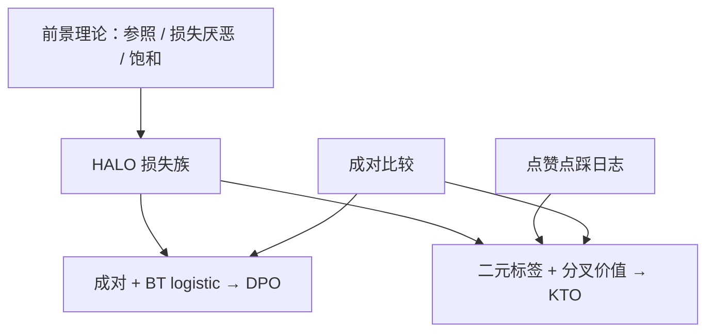

# KTO 原文

    
人不是按 Bradley–Terry 的对称 logistic 来感受得失；把前景理论的价值函数写成对齐损失，监督就可以是单条合意或不合意，而不必先配成对。

    <footer>—— Ethayarajh, Xu, Muennighoff, Jurafsky, Kiela，KTO: Model Alignment as Prospect Theoretic Optimization，2024</footer>

已有 [KTO](/llm/kto) 篇写落地：二元标签、隐含奖励 $r=\log(\pi_\theta/\pi_{\mathrm{ref}})$、参考点 $z_0$、$\lambda_D/\lambda_U$。本篇钉 Ethayarajh 等人原文（arXiv:2402.01306）真正贡献的理论包装：把 Kahneman–Tversky 前景理论做成 HALO（human-aware loss）族，DPO 被解释为其中需要成对样本的特例，KTO 是去掉成对约束、保留损失厌恶与参照依赖的成员。实验声称的是数据形态与样本效率，不是「前景理论定理保证超过 BT」。实现超参见前一篇。

## 问题

RLHF 与 DPO 默认比较是人类反馈的自然单位。产品与众包里更常见的是点赞、点踩、被编辑、被举报——一条 $(x,y)$ 一个符号，没有同时存在的对照。硬配对照要另采样再假装人比过，噪声进 logistic；丢掉不成对则样本量塌缩。第二条裂缝在效用形状：BT 对「比参照好一点」和「比参照差很多」对称处理；前景理论的三条经验是参照依赖、损失侧更陡、增益侧凹。若对齐损失不编码这三条，模型会把踩与赞当成幅度相同的正负 logistic，和现场代价不匹配。

作者把满足若干人类决策性质的损失统称为 HALO。问题不是再找一个成对 logistic 的变体，而是：能否在只看见二元标签时，仍用相对参照策略的隐含奖励，写出具备损失厌恶与饱和的价值函数，并在配对数据并非必需的基准上与 DPO 对照。

### 成对似然不是人类效用

DPO 最大化的是「模型给的成对胜率」与标签的似然，目标变量是序，不是人对单条输出的价值。人在日志里很少同时看见两条完整回答再打勾；他们相对期望（产品里的「还行」）标记这一条。把序当作唯一监督，等于扔掉所有单边反馈，也强迫效用差必须能写成 $r_w-r_l$。HALO 把监督定义在价值 $v(x,y)$ 上，成对只是可选项。

原文的「人类感知」是前景理论的定性移植，不是新做的心理学实验。$\lambda_U\gt \lambda_D$ 来自损失厌恶的经典形态，不是从标注者反应时里估出来的。把它写成已经测过人的效用曲线，会过读。

## 方法

隐含奖励与 DPO 同族：$r_\theta(x,y)=\log\pi_\theta(y\mid x)-\log\pi_{\mathrm{ref}}(y\mid x)$。参照点 $z_0$ 取相对参照策略的 KL 估计，实践为 batch 内 $r_\theta$ 均值，使价值相对近期平均，而不是绝对零。价值按标签分叉，经 $\sigma$ 饱和：

$$
v=
\begin{cases}
\lambda_D\,\sigma\bigl(\beta(r_\theta-z_0)\bigr), & \text{合意},\\
\lambda_U\,\sigma\bigl(\beta(z_0-r_\theta)\bigr), & \text{不合意}.
\end{cases}
$$

损失最小化 $\mathbb{E}[\lambda_y-v]$，即把价值推向该类的上限。$\beta$ 约束离参照的步长；两个 $\lambda$ 补偿正负比例，并实现损失厌恶（通常 $\lambda_U\ge\lambda_D$）。同一 $x$ 可以只有正、只有负、或两者都有；两者都有时也不把它们绑进同一个 $\sigma(r_w-r_l)$。

### HALO 族里 DPO 站在哪

若强制每条提示都有成对 $(y_w,y_l)$，并把价值取成 BT 的 logistic 差，HALO 退化到 DPO 一类目标。原文的论点是：成对是数据约束，不是人类效用的必要形式。KTO 保留参照、保留饱和、加上不对称权重，去掉对照边。因此「KTO 是不成对的 DPO」只说对了一半——不成对是标签形态，不对称价值才是前景理论那一半。ORPO / SimPO 删的是参照，与这篇正交。

### 原文怎么评样本效率

实验覆盖约 1B–30B 量级模型与标准偏好基准（具体表以论文为准）。核心叙事有三条。第一，只用不成对标签时，KTO 能工作，DPO 不能直接写项。第二，把成对数据拆成两条二元标签喂 KTO，往往匹配或超过同一成对集上的 DPO，说明对照边不是信息的唯一载体。第三，正负比例失衡时，调 $\lambda$ 比假装配随机负例更有效。这些是数据形态上的优势，不是所有聊天榜上的第一名声明。干净、平衡、大规模成对集上，DPO 仍然经常够用——原文自己也把这一点当作对照，而不是回避。

## 机制

$z_0$ 实现参照依赖：整批策略上移时，合意样本要超过新的平均才继续得高价值，避免「绝对 $r$ 已经大就停止」。$\sigma$ 的钟形导数实现敏感性递减：略好于参照点的区域梯度最大，已经极好的输出收益递减，对应增益凹。不合意侧在掉到 $z_0$ 以下时仍然陡，再叠加 $\lambda_U$，同等偏离的踩比赞拉得更狠。$z_0$ 必须停梯度，否则模型会操纵 KL 估计而不是改 $r_\theta(x,y)$。

### 不成对并不创造正例

只有踩时，价值函数会压低坏区域，却没有样本指出「往哪走」。策略可能整体降低似然，或逃向未被踩过的另一种坏输出。原文用真实合意/不合意覆盖，而不是用随机序列当负例——随机 $y$ 的 $r_\theta$ 极低，价值饱和、梯度近零，还会污染 $z_0$。实践含义写在前一篇：保留一小桶高质量回答当合意类。论文贡献是把这条覆盖问题放进前景理论的参照点语言里，而不是发明新的采样环。

HALO 不是评测协议。它不规定如何把用户行为映射成合意标签。长度、礼貌、界面按钮位置造成的假正，会按价值函数被认真学习。标签定义仍在系统边界上，损失形状不能洗数据。

## 边界与工程取舍

每条样本仍要跑 $\pi_\theta$ 与 $\pi_{\mathrm{ref}}$，显存与 DPO 单边相近，并不比无参照方法便宜。前景理论被用作损失设计的类比，其实验心理学条件（赌局、金钱得失）与 token 似然不是同一随机变量；不要把 KTO 写成已经证实「LM 用户服从 1979 年价值函数」。$\beta$、$\lambda$、 $z_0$ 窗口耦合，迁移数字无意义。

若已经有干净成对且两类平衡，原文并不要求改用 KTO。若没有参照检查点，这篇的隐含奖励定义不成立。若标签是答案对错而不是偏好，那是结果监督，把正确答案标成合意会把事实与文风缠死。后续把 KTO 接到特定产品日志的工作，属于数据工程，不是这篇的定理。

作者单位是 Contextual AI 与斯坦福。出处钉 Kawin Ethayarajh、Winnie Xu、Niklas Muennighoff、Dan Jurafsky、Douwe Kiela，arXiv:2402.01306。价值函数的心理学来源必须同时引 Kahneman & Tversky 1979，以免把 HALO 说成全新效用理论。

### 何时只读落地篇即可

实现损失、调 $\lambda$、处理 $z_0$ 抖动，读 [KTO](/llm/kto)。需要把新损失登记进 HALO、需要引用「不成对即可对齐」的实验叙事、需要和 DPO 的成对假设做理论对照，再读原文。

## 小结

- KTO 原文把前景理论写成 HALO：参照点、损失厌恶、饱和价值，监督可以是单条二元标签。
- DPO 是需要成对的 HALO 成员；KTO 去掉对照边，不去掉参照策略。
- 实验强调样本形态与效率，不是普遍替代 BT。
- 不成对省对照，不省正例覆盖；随机负例会破坏 $z_0$。
- 心理学是类比，标签质量仍是系统问题。
- 出处：Ethayarajh et al.，*KTO: Model Alignment as Prospect Theoretic Optimization*，2024，arXiv:2402.01306；落地对照见 [KTO](/llm/kto)。
